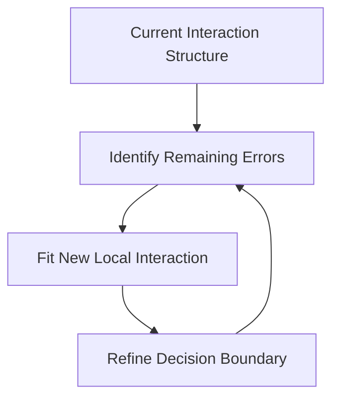

# Boosting and Random Forest


## Introduction: Ensemble method

In earlier chapters we studied single decision trees. Trees are powerful because they automatically capture nonlinear relationships and interactions among variables. Unlike linear models, trees do not assume a global linear relationship between predictors and the response. Instead, they partition the predictor space into regions and make predictions within each region.

However, although trees are flexible, a single tree is often not very stable. Small changes in the data may produce a very different tree. In addition, shallow trees may underfit the data, while deep trees may overfit badly. As a result, a single tree is often not the best predictive model, even with careful tuning of hyperparameters like `ccp_alpha`.

Ensemble methods improve prediction by combining many trees together. Instead of relying on one tree, ensemble methods aggregate information from multiple trees to produce a stronger model.

There are two major ensemble philosophies.

- The first philosophy is averaging. Methods such as bagging and random forests build many trees independently and then average their predictions. The main goal is to reduce variance.
- The second philosophy is boosting. Boosting builds trees sequentially. Each new tree is trained to improve the errors made by earlier trees. The main goal is to reduce bias by gradually improving the model.


# Ensemble methods

After we get some relatively simple classifiers (sometimes also called *weak classifiers*), we might put them together to form a more complicated classifier. This type of methods is called an *ensemble method*. The basic way to ``ensemble'' classifiers together to through the voting machine.

There are mainly two ways to generate many classifiers.

- `bagging`: This is also called *bootstrap aggregating*. The idea is 
  - First we randomly pick samples from the original dataset to form a bunch of new trainning datasets;
  - Then we apply the same learning methods to those trainning datasets to get a bunch of classifiers;
  - Finally apply all these classifiers to the data we are interested in and use the most frequent class as the result.
- `boosting`: There are a bunch of classifiers. We assign weights to each of the classifiers and change the weights adaptively according to the results of the current combination.


## Bootstrap aggregating

### Basic bagging
One approach to get many estimators is to use the same training algorithm for every predictor and train them on different random subsets of the training set. When sampling is performed with replacement, this method is called *bagging* (short for *bootstrap aggregating*). When sampling is performed without replacement, it is called *pasting*.

Consider the following example. The dataset is the one we used in Chpater 3: `make_moon`. We split the dataset into training and test sets.


```{python}
from sklearn.datasets import make_moons
import matplotlib.pyplot as plt
from sklearn.model_selection import train_test_split

X, y = make_moons(n_samples=10000, noise=0.4, random_state=42)
plt.scatter(x=X[:, 0], y=X[:, 1], c=y)
X_train, X_test, y_train, y_test = train_test_split(X, y, test_size=0.15)
```


We would like to sample from the dataset to get some smaller minisets. We will use `sklearn.model_selection.ShuffleSplit` to perform the action. 

The output of `ShuffleSplit` is a generator. To get the index out of it we need a `for` loop. You may check out the following code. 

Note that `ShuffleSplit` is originally used to shuffle data into training and test sets. We would only use the shuffle function out of it, so we will set `test_size` to be `1` and use `_` later in the `for` loop since we won't use that part of the information.

What we finally get is a generator `rs` that produces indexes of subsets of `X_train` and `y_train`. 


```{python}
from sklearn.model_selection import ShuffleSplit
n_trees = 1000
n_instances = 100
rs = ShuffleSplit(n_splits=n_trees, test_size=1, train_size=n_instances).split(X_train)
```


`sklearn` provides `BaggingClassifier` to directly perform bagging or pasting. The code is as follows.


```{python}
from sklearn.ensemble import BaggingClassifier
from sklearn.tree import DecisionTreeClassifier

bag_clf = BaggingClassifier(DecisionTreeClassifier(),
                            n_estimators=1000,
                            max_samples=1.0,
                            bootstrap=True)
```


In the above code, `bag_clf` is a bagging classifier, made of 500 `DecisionTreeClassifer`s, and is trained over subsets of size `1.0`. The option `bootstrap=True` means that it is bagging. If you would like to use pasting, the option is `bootstrap=False`.

This `bag_clf` also has `.fit()` and `.predict()` methods. It is used the same as our previous classifiers. Let us try the `make_moon` dataset.


```{python}
from sklearn.metrics import accuracy_score

bag_clf.fit(X_train, y_train)
y_pred_bag = bag_clf.predict(X_test)
accuracy_score(y_pred_bag, y_test)
```

### `max_samples`
The original bagging algoithm requires the "subset" has the same number of datapoints as the original set. Since duplicates are allowed, we are expected to use 63% of the data from the original dataset.


<details>
<summary>Click to expand for more details.</summary>
Let the original dataset have $N$ elements. The probability to pick any specific data is $1/N$, and therefore the probability not to pick it is $1-1/N$. If we pick $N$ elements with replacement, the probability that we never pick a specific element is 
$$
(1-\frac1N)^N\rightarrow \mathrm e^{-1},\quad \text{when }N\rightarrow\infty.
$$
Therefore when $N$ is large, the probability for each element not to be picked is approximately $\mathrm e^{-1}$, and then the probability for it to be picked is approximately $1-\mathrm e^{-1}$. 

Let $I_i$ be the random variable representing whether the element $i$ is picked or not. So
$$
I_i=\begin{cases}1&i \text{ is picked}\\
0&i\text{ is not picked}\end{cases}.
$$
So
$$
 P(I_i=1)=1-\mathrm e^{-1},\quad P(I_i=0)=\mathrm e^{-1},\quad \text{ and }E[I_i]=1\cdot(1-\mathrm e^{-1})+0\cdot(\mathrm e^{-1})=1-\mathrm e^{-1}.
$$
The expectation of the final sample size proportion is
$$
E[\frac1N\sum_{i=1}^NI_i]=\frac1N\sum_{i=1}^IE[I_i]=1-\mathrm e^{-1}\approx 0.63.
$$

With similar calculation, if we pick $\alpha N$ data, the expectation of the final sample size proportion is $1-\mathrm e^{-\alpha}$.
<hr>
</details>

In `sklearn`, the requiremnt is relaxed, that you may have any number of data in each sample. This gives more flexiblity to adjust your model, that the sample size may affect the performance of the model. It is set by the argument `max_samples`. 

- If it is float that between 0 and 1, it will be used as the proportion. The default value is $1.0$ which means that we use the original size as the sample size.
- IF it is an integer that is bigger than $1$, it will be used as the fixed sample size, no matter what the orginal data size is.


### OOB score
When we use `bagging`, it is possible that some of the training data are not used. In this case, we could record which data are not used, and just use them as the test set, instead of providing extra data for test. The data that are not used is called *out-of-bag* instances, or *oob* for short. The accuracy over the oob data is called the oob score.

We could set `oob_score=True` to enable the function when creating a `BaggingClassifier`, and use `.oob_score_` to get the oob score after training. 


```{python}
bag_clf_oob = BaggingClassifier(DecisionTreeClassifier(),
                                n_estimators=1000,
                                bootstrap=True,
                                oob_score=True)
bag_clf_oob.fit(X_train, y_train)
bag_clf_oob.oob_score_
```


### Random Forests
When the classifiers used in a bagging classifier are all Decision Trees, the bagging classifier is called a `random forest`. `sklearn` provide `RandomForestClassifier` class. It is almost the same as `BaggingClassifier` + `DecisionTreeClassifer`.


```{python}

from sklearn.ensemble import RandomForestClassifier

rnd_clf = RandomForestClassifier(n_estimators=1000, random_state=1)
rnd_clf.fit(X_train, y_train)
rnd_clf.score(X_test, y_test)
```


When we use the Decision Tree as our base estimators, the class `RandomForestClassifier` provides more control over growing the random forest, with a certain optimizations. If you would like to use other estimators, then `BaggingClassifier` should be used.


### Extra-trees
When growing a Decision Tree, our method is to search through all possible ways to find the best split point that get the lowest Gini impurity. Anohter method is to use a random split. Of course a random tree performs much worse, but if we use it to form a random forest, the voting system can help to increase the accuracy. On the other hand, random split is much faster than a regular Decision Tree. 

This type of forest is called *Extremely Randomized Trees*, or *Extra-Trees* for short. We could modify the above random forest classifier code to implement the extra-tree algorithm. The key point is that we don't apply the Decision Tree algorithm. Instead we perform a random split: select a random feature, and split at a random value. In `sklearn` there is an `ExtraTreesClassifier` to create such a classifier. 

Note that for Extra-Tree, we use the whole dataset instead of samples, because the random split already ensures diversity so we need to reduce variance from resampling. So technically Extra-Tree is not a Bagging method in the standard way, although it looks like one.


```{python}
from sklearn.ensemble import ExtraTreesClassifier

ext_clf = ExtraTreesClassifier(n_estimators=1000, random_state=1)
ext_clf.fit(X_train, y_train)
ext_clf.score(X_test, y_test)
```


In the above example, `RandomForestClassifier` and `ExtraTreesClassifier` get similar accuracy. However from the code below, you will see that in this example `ExtraTreesClassifier` is much faster than `RandomForestClassifier`.


```{python}
from time import time

t0 = time()
rnd_clf = RandomForestClassifier(n_estimators=1000, random_state=1)
rnd_clf.fit(X_train, y_train)
t1 = time()
print("Random Frorest: {}".format(t1 - t0))

t0 = time()
ext_clf = ExtraTreesClassifier(n_estimators=1000, random_state=1)
ext_clf.fit(X_train, y_train)
t1 = time()
print("Extremely Randomized Trees: {}".format(t1 - t0))
```


### Gini importance
After training a Decision Tree, we could look at each node. Each split is against a feature, which decrease the Gini impurity the most. In other words, we could say that the feature is the most important during the split.

Using the average Gini impurity decreased as a metric, we could measure the importance of each feature. This is called *Gini importance*. If the feature is useful, it tends to split mixed labeled nodes into pure single class nodes. 

In the case of random forest, since there are many trees, we might compute the weighted average of the Gini importance across all trees. The weight depends on how many times the feature is used in a specific node.

Using `RandomForestClassifier`, we can directly get access to the Gini importance of each feature by `.feature_importance_`. Please see the following example.


```{python}
rnd_clf.fit(X_train, y_train)
rnd_clf.feature_importances_
```


In this example, you may see that the two features are relavely equally important, where the second feature is slightly more important since on average it decrease the Gini impurity a little bit more.

<!-- 


# Ensemble methods


## Bagging Bagging = 降方差

## Random Forest decorrelation


## Boosting reduce bias


Linear → high bias
Tree → high variance
RF → reduce variance
Boosting → reduce bias


🎯 你可以这样总结整门课
Part 1: simple models + regularization
Part 2: flexible models + aggregation


👉 我会改成：

上半最重要是 “regularization（ridge + lasso）”

因为：

Ridge → 稳定性
Lasso → 稀疏性

👉 两个一起才完整


week 1: ols+ridge
week 2: lasso+pcr/pls
week 3 logistic/lda + knn
week 4 tree+ bagging
week 5 boosting
week 6 clustering


Week 1：bias–variance
Week 2：sparsity vs latent
Week 5：RF vs boosting -->


## Bagging

Bagging is short for bootstrap aggregation. Bootstrap is a resampling method. The basic idea is to repeatedly draw subsets from the original training set with replacement, train a model on each subset, and then aggregate the predictions from all models to form the final result.

For regression, the predictions are usually averaged. For classification, the final prediction is usually determined by majority vote.


::: {.callout-note}
Bootstrap sampling means sampling with replacement. This is an essential part of bagging. If the subsets are sampled without replacement, the method is sometimes called pasting.
:::


Bagging can be used with any base estimators. The default training set size is the same as the original one; therefore it is highly possible that the training set for an individual model contains duplicates. We could use it 
3. 

An ensemble method combines many relatively simple models into one stronger model.

A general ensemble has the form
$$
F_T(x)=\sum_{t=1}^T \alpha_t f_t(x),
$$
where

- $f_t(x)$ is the $t$-th base learner,
- $\alpha_t$ is its weight,
- $T$ is the number of learners.

For tree-based ensembles, each $f_t$ is usually a decision tree.

The main motivation is that a single tree is often unstable. A small change in the data can lead to a different tree. Ensemble methods reduce this instability by combining many trees.

::: {.callout-note}
## Main idea

A single tree is easy to interpret but has high variance.

An ensemble sacrifices some interpretability to improve prediction.
:::

## 2. Two main strategies

There are two major ways to build tree ensembles.

| Method | How trees are built | Main effect |
|---|---|---|
| Bagging | independently and in parallel | reduce variance |
| Random forest | bagging + random feature selection | reduce variance and decorrelate trees |
| Boosting | sequentially, each tree corrects previous errors | reduce bias, often also variance |

The key distinction is whether the trees are built independently or sequentially.

## 3. Bagging

Bagging means bootstrap aggregating.

The algorithm is:

1. Draw $B$ bootstrap samples from the training data.
2. Fit one tree to each bootstrap sample.
3. Average the predictions for regression.

For regression,
$$
\hat f_{\text{bag}}(x)
=
\frac{1}{B}\sum_{b=1}^B \hat f_b(x).
$$

For classification, we usually use majority vote.

### Why bagging works

Bagging mainly reduces variance.

If $\hat f_1(x),\ldots,\hat f_B(x)$ are noisy but approximately unbiased estimators, then averaging them stabilizes the prediction.

If the base learners were independent and each had variance $\sigma^2$, then
$$
\operatorname{Var}\left(
\frac{1}{B}\sum_{b=1}^B \hat f_b(x)
\right)
=
\frac{\sigma^2}{B}.
$$

In practice, trees are not independent. If the correlation between tree predictions is $\rho$, then approximately
$$
\operatorname{Var}\left(
\frac{1}{B}\sum_{b=1}^B \hat f_b(x)
\right)
=
\rho\sigma^2+\frac{1-\rho}{B}\sigma^2.
$$

As $B$ becomes large, the second term goes to zero, but the first term remains. Therefore, reducing correlation between trees is important.

This is the motivation for random forests.

## 4. Random forests

A random forest improves bagging by adding randomness to the splitting process.

For each tree:

1. Draw a bootstrap sample.
2. Grow a large tree.
3. At each split, randomly select only $m_{\text{try}}$ predictors.
4. Find the best split only among those selected predictors.
5. Do not prune the tree.

For regression, the final prediction is
$$
\hat f_{\text{RF}}(x)
=
\frac{1}{B}\sum_{b=1}^B \hat f_b(x).
$$

### Role of `mtry`

The parameter `mtry` controls how many variables are considered at each split.

- Large `mtry`:
  - each tree is stronger
  - splits are more greedy
  - trees become more correlated

- Small `mtry`:
  - trees are less correlated
  - individual trees may be weaker
  - may miss important variables at some splits

Thus `mtry` controls a bias-variance tradeoff.

### Other tuning parameters

Important tuning parameters include:

- `n_estimators`: number of trees
- `max_features`: number of predictors considered at each split
- `max_samples`: sample size for each bootstrap sample
- `min_samples_leaf`: minimum leaf size
- `max_depth`: maximum depth of each tree

For random forests, trees are usually grown deep. The ensemble controls variance by averaging, rather than by pruning each tree.

## 5. Random forest as adaptive local averaging

A random forest can also be viewed as an adaptive kernel estimator.

For one tree, two points are close if they fall in the same terminal node.

Let $K_{\mathcal T_b}(x,x_i)$ indicate whether $x$ and $x_i$ fall in the same leaf of tree $b$.

Then a random forest induces a similarity measure:
$$
K_{\text{RF}}(x,x_i)
=
\sum_{b=1}^B K_{\mathcal T_b}(x,x_i).
$$

This counts how many trees place $x$ and $x_i$ in the same terminal node.

Thus, a random forest prediction can be viewed as a weighted average:
$$
\hat f_{\text{RF}}(x)
=
\sum_{i=1}^n w_i(x)y_i,
$$
where observations that often share leaves with $x$ receive larger weights.

::: {.callout-note}
## Adaptive neighborhood

KNN defines neighborhoods by Euclidean distance.

A random forest defines neighborhoods by tree leaves.

Therefore, the neighborhood is learned from the response and can adapt to important variables.
:::

## 6. Variable importance

Random forests provide measures of variable importance.

Two common ideas are:

1. Impurity-based importance  
   Measures how much a variable reduces node impurity or RSS across the forest.

2. Permutation importance  
   Randomly permute one variable and measure how much prediction performance decreases.

Permutation importance is often easier to interpret:

- if permuting $x_j$ greatly worsens prediction, then $x_j$ is important;
- if performance barely changes, then $x_j$ may not be useful.

::: {.callout-caution}
## Caution

Impurity-based importance can be biased toward variables with many possible split points.

Permutation importance is usually more directly connected to predictive performance.
:::

## 7. Extra-trees

Extremely randomized trees, or extra-trees, add even more randomness.

Compared with random forests:

- random forest chooses the best split among random features;
- extra-trees often choose split thresholds more randomly.

This usually increases bias but can reduce variance and speed up computation.

## 8. Boosting

Boosting builds an additive model sequentially:
$$
F_T(x)=\sum_{t=1}^T \alpha_t f_t(x).
$$

Unlike random forests, the models are not built independently. Each new learner is chosen to improve the current ensemble.

The general idea is:

1. Start with a simple model $F_0(x)$.
2. Find what the current model is doing wrong.
3. Fit a weak learner to correct those errors.
4. Add it to the model with a small step size.
5. Repeat.

For tree boosting, each $f_t(x)$ is usually a small regression tree.

## 9. Gradient boosting for regression

For squared error loss,
$$
L(y,F(x))=(y-F(x))^2.
$$

The derivative with respect to $F(x)$ is
$$
\frac{\partial L(y,F(x))}{\partial F(x)}
=
-2(y-F(x)).
$$

Therefore, the negative gradient is proportional to the residual:
$$
r_i
=
y_i-F_{t-1}(x_i).
$$

The gradient boosting algorithm for regression is:

1. Initialize
$$
F_0(x)=\bar y.
$$

2. For $t=1,\ldots,T$:

   Fit a regression tree $h_t(x)$ to the residuals
$$
r_i^{(t)}=y_i-F_{t-1}(x_i).
$$

   Update
$$
F_t(x)=F_{t-1}(x)+\eta h_t(x).
$$

Here $\eta$ is the learning rate, also called shrinkage.

::: {.callout-note}
## Key point

For squared-error regression, gradient boosting fits trees to residuals.

More generally, it fits trees to negative gradients of the loss function.
:::

## 10. Learning rate and number of trees

The learning rate $\eta$ controls how much each tree contributes.

- Small $\eta$:
  - slower learning
  - usually needs more trees
  - often better generalization

- Large $\eta$:
  - faster learning
  - higher risk of overfitting

The number of trees $T$ is also a tuning parameter.

The pair $(\eta,T)$ must be considered together.

A common practical strategy is:

- use a small learning rate;
- tune the number of trees by validation or cross-validation.

## 11. Tree depth in boosting

In boosting, each tree is often shallow.

- depth 1: decision stump, captures main effects
- depth 2 or 3: captures simple interactions
- larger depth: more complex interactions

Unlike random forests, boosting does not need each tree to be strong. It builds strength by adding many weak learners sequentially.

## 12. Stochastic gradient boosting

Many implementations also use subsampling.

At each iteration, fit the next tree using only a random subset of observations.

This adds randomness and can improve generalization.

Important parameters include:

- `subsample`
- `learning_rate`
- `n_estimators`
- `max_depth`
- `min_samples_leaf`

## 13. AdaBoost

AdaBoost is a classical boosting method for binary classification.

Here the response is coded as
$$
y_i\in\{-1,+1\}.
$$

AdaBoost builds
$$
F_T(x)=\sum_{t=1}^T \alpha_t f_t(x),
$$
and classifies by
$$
\operatorname{sign}(F_T(x)).
$$

The algorithm is:

1. Initialize observation weights:
$$
w_i^{(1)}=\frac{1}{n}.
$$

2. For $t=1,\ldots,T$:

   Fit a classifier $f_t(x)\in\{-1,+1\}$ using weights $w_i^{(t)}$.

   Compute weighted error:
$$
\epsilon_t
=
\sum_{i=1}^n w_i^{(t)}
I(y_i\neq f_t(x_i)).
$$

   Compute learner weight:
$$
\alpha_t
=
\frac{1}{2}\log\frac{1-\epsilon_t}{\epsilon_t}.
$$

   Update observation weights:
$$
w_i^{(t+1)}
=
\frac{1}{Z_t}
w_i^{(t)}
\exp\{-\alpha_t y_i f_t(x_i)\}.
$$

3. Output:
$$
F_T(x)=\sum_{t=1}^T \alpha_t f_t(x).
$$

### Interpretation

If observation $i$ is correctly classified, then
$$
y_i f_t(x_i)=1,
$$
and its weight decreases.

If it is misclassified, then
$$
y_i f_t(x_i)=-1,
$$
and its weight increases.

So AdaBoost forces later learners to focus more on difficult observations.

## 14. Gradient boosting for classification

For classification, there is no ordinary residual $y-\hat y$ in the same sense as squared-error regression.

Instead, boosting uses the negative gradient of a classification loss.

For binary logistic boosting, we model
$$
p(x)=P(Y=1\mid X=x)
=
\frac{1}{1+\exp\{-F(x)\}}.
$$

Using negative log-likelihood loss, the pseudo-residual becomes
$$
r_i=y_i-p_i.
$$

Thus classification boosting can be understood as fitting the next learner to the current probability errors.

## 15. XGBoost and modern boosting

XGBoost is not a fundamentally different statistical idea from gradient boosting.

It is a powerful engineering implementation of gradient boosted trees, with many practical improvements such as:

- regularization on tree complexity
- efficient split search
- shrinkage
- subsampling
- column subsampling
- handling sparse data
- fast implementation

For a statistical learning course, the core idea is still gradient boosting:

$$
\text{add weak learners sequentially to reduce a loss function}.
$$

::: {.callout-note}
## Teaching point

XGBoost is best understood as an optimized implementation of gradient boosted trees.

The central statistical concept is boosting, not XGBoost itself.
:::

## 16. Bagging vs boosting

| Feature | Bagging / Random Forest | Boosting |
|---|---|---|
| Construction | parallel | sequential |
| Main purpose | reduce variance | reduce bias, often variance |
| Base trees | usually deep | usually shallow |
| Tree dependence | independent | each depends on previous model |
| Overfitting risk | relatively robust | sensitive to tuning |
| Key parameters | number of trees, `mtry`, leaf size | learning rate, number of trees, depth |

## 17. Minimal Python examples

### Random forest regression

```python
from sklearn.ensemble import RandomForestRegressor
from sklearn.model_selection import GridSearchCV
from sklearn.metrics import mean_squared_error

rf = RandomForestRegressor(
    random_state=0,
    n_estimators=500,
)

param_grid = {
    "max_features": ["sqrt", 0.5, 1.0],
    "min_samples_leaf": [1, 5, 10],
    "max_depth": [None, 5, 10],
}

grid = GridSearchCV(
    rf,
    param_grid=param_grid,
    cv=5,
    scoring="neg_mean_squared_error",
)

grid.fit(X_train, y_train)

best_rf = grid.best_estimator_
y_pred = best_rf.predict(X_test)

test_mse = mean_squared_error(y_test, y_pred)

print(grid.best_params_)
print(test_mse)
```

### Gradient boosting regression

```python
from sklearn.ensemble import GradientBoostingRegressor
from sklearn.model_selection import GridSearchCV
from sklearn.metrics import mean_squared_error

gbr = GradientBoostingRegressor(random_state=0)

param_grid = {
    "n_estimators": [100, 300, 500],
    "learning_rate": [0.01, 0.05, 0.1],
    "max_depth": [1, 2, 3],
    "subsample": [0.8, 1.0],
}

grid = GridSearchCV(
    gbr,
    param_grid=param_grid,
    cv=5,
    scoring="neg_mean_squared_error",
)

grid.fit(X_train, y_train)

best_gbr = grid.best_estimator_
y_pred = best_gbr.predict(X_test)

test_mse = mean_squared_error(y_test, y_pred)

print(grid.best_params_)
print(test_mse)
```

### AdaBoost classification

```python
from sklearn.ensemble import AdaBoostClassifier
from sklearn.tree import DecisionTreeClassifier

base_tree = DecisionTreeClassifier(max_depth=1, random_state=0)

ada = AdaBoostClassifier(
    estimator=base_tree,
    n_estimators=200,
    learning_rate=0.1,
    random_state=0,
)

ada.fit(X_train, y_train)
```

## 18. Summary

Ensemble methods improve prediction by combining many weak or unstable learners.

Bagging averages many independently fitted trees and mainly reduces variance.

Random forests improve bagging by selecting random subsets of variables at each split, which reduces correlation among trees.

Boosting builds an additive model sequentially. Each new learner corrects the current model, often by fitting residuals or negative gradients.

The main conceptual summary is:

$$
\text{single tree}
\quad\longrightarrow\quad
\text{high variance}
\quad\longrightarrow\quad
\text{ensemble trees}
\quad\longrightarrow\quad
\text{strong prediction}.
$$


# Tree


A decision tree is a nonparametric method. Instead of assuming a global linear form such as 
$$
f(x)=\beta_0+\beta_1x_1+\cdots+\beta_px_p,
$$ 
a tree learns a collection of simple if-then rules from the data. A very typical example is shown below.

::: {#exm-}
## Classification Tree example
```{python}
#| echo: false
from sklearn.datasets import load_iris
from sklearn.tree import DecisionTreeClassifier
import matplotlib.pyplot as plt
from sklearn.tree import plot_tree


iris = load_iris()
X = iris.data[:, 2:]
y = iris.target

clf = DecisionTreeClassifier(random_state=40, max_depth=2)
clf.fit(X, y)

plt.figure(figsize=(3, 3), dpi=200)
plot_tree(clf, filled=True, impurity=True, node_ids=True)
```
This is a classficiation tree. In this example there are 3 classes, and we just check the feature `x[1]`. The first time if `x[1]<=0.8`, the data will be classified as orange. If not, the tree will check `x[1]` again and compare it with 1.75. If this time it is `<=1.75`, the data is classified as green, otherwise purple.

:::


In general, a tree learns a collection of simple if-then rules from the data. A tree is called "adaptive" because the regions are learned from the data. If a predictor is useful, the tree may split on it many times. If a predictor is not useful, the tree may ignore it.

There are many algorithms for constructing decision trees. In this chapter, we focus on Classification and Regression Trees (usually called CART).

:::{.callout-note}

# Algorithm: Split the Dataset

**Inputs** Given a dataset $S=\{[features, target]\}$.

**Outputs** A best split $(k, t_k)$.

1. For each feature $k$:
    1. For each value $t$ of the feature:
        1. Split the dataset $S$ into two subsets, one with $k\leq t$ and one with $k>t$.
        2. Compute the cost function $J(k,t)$. 
        3. Compare it with the current smallest cost. If this split has smaller cost, replace the current smallest cost and pair with $(k, t)$.
2. Return the pair $(k,t_k)$ that has the smallest cost function.
:::


We then use this split algorithm recursively to get the decision tree.

:::{.callout-note}
# Classification and Regression Tree, CART

**Inputs** Given a labeled dataset $S=\{[features, label]\}$ and a maximal depth `max_depth`.

**Outputs** A decision tree.

1. Starting from the original dataset $S$. Set the working dataset $G=S$.
2. Consider a dataset $G$. If the cost function $J(G)\neq0$, split $G$ into $G_l$ and $G_r$ to minimize the cost function. Record the split pair $(k, t_k)$.
3. Now set the working dataset $G=G_l$ and $G=G_r$ respectively, and apply the above two steps to each of them.
4. Repeat the above steps, until `max_depth` is reached, or each subset is pure that is impossible to split further.
:::


 CART has the following features:

- It creates only binary splits.
- For classification, common splitting criteria include Gini impurity and entropy.
- For regression, common splitting criteria include mean squared error or sum of squared errors.


## Classification Tree 


### Gini impurity

To split a dataset, we need a metric to tell whether the split is good or not. The two most popular metrics that are used are Gini impurity and Entropy. The two metrics don't have essential differences, that the results obtained by applying each metric are very similar to each other. Therefore we will only focus on Gini impurity since it is slightly easier to compute and slightly easier to explain.

<!-- ### Motivation and Definition -->
Assume that we have a dataset of totally $n$ objects, and these objects are divided into $k$ classes. The $i$-th class has $n_i$ objects. Then if we randomly pick an object, the probability to get an object belonging to the $i$-th class is

$$
p_i=\frac{n_i}{n}
$$

If we then guess the class of the object purely based on the distribution of each class, the probability that our guess is incorrect is 

$$
1-p_i = 1-\frac{n_i}{n}.
$$

Therefore, if we randomly pick an object that belongs to the $i$-th class and randomly guess its class purely based on the distribution but our guess is wrong, the probability that such a thing happens is 

$$
p_i(1-p_i).
$$

Consider all classes. The probability at which any object of the dataset will be mislabelled when it is randomly labeled is the sum of the probability described above:

$$
\sum_{i=1}^kp_i(1-p_i)=\sum_{i=1}^kp_i-\sum_{i=1}^kp_i^2=1-\sum_{i=1}^kp_i^2.
$$

This is the definition formula for the *Gini impurity*. 


::: {#def-gini}
The **Gini impurity** is calculated using the following formula

$$
Gini = \sum_{i=1}^kp_i(1-p_i)=\sum_{i=1}^kp_i-\sum_{i=1}^kp_i^2=1-\sum_{i=1}^kp_i^2,
$$
where $p_i$ is the probability of class $i$.
:::

The way to understand Gini impurity is to consider some extreme examples. 


::: {#exm-}

Assume that we only have one class. Therefore $k=1$, and $p_1=1$. Then the Gini impurity is

$$
Gini = 1-1^2=0.
$$
This is the minimum possible Gini impurity. It means that the dataset is **pure**: all the objects contained are of one unique class. In this case, we won't make any mistakes if we randomly guess the label.

:::


::: {#exm-}
Assume that we have two classes. Therefore $k=2$. Consider the distribution $p_1$ and $p_2$. We know that $p_1+p_2=1$. Therefore $p_2=1-p_1$. Then the Gini impurity is

$$
Gini(p_1) = 1-p_1^2-p_2^2=1-p_1^2-(1-p_1)^2=2p_1-2p_1^2.
$$
When $0\leq p_1\leq 1$, this function $Gini(p_1)$ is between $0$ and $0.5$. 
- It gets $0$ when $p_1=0$ or $1$. In these two cases, the dataset is still a one-class set since the size of one class is $0$. 
- It gets $0.5$ when $p_1=0.5$. This means that the Gini impurity is maximized when the size of different classes are balanced.
:::


::: {.callout-tip}
## Entropy
Other than Gini impurity, entropy is also a popular choice for classification tree. However its performance is very similar to the Gini impurity while the formula for entropy is a little bit more complicated, therefore we only discuss the Gini impurity in this notes.
:::


<!-- ### Algorithm


::: {.callout-note}
# Algorithm: Gini impurity

**Inputs** A dataset $S=\{data=[features, label]\}$ with labels. 

**Outputs** The Gini impurity of the dataset.

1. Get the size $n$ of the dataset.
2. Go through the label list, and find all unique labels: $uniqueLabelList$.
3. Go through each label $l$ in $uniqueLabelList$ and count how many elements belonging to the label, and record them as $n_l$.
4. Use the formula to compute the Gini impurity:

   $$
    Gini = 1-\sum_{l\in uniqueLabelList}\left(\frac{n_l}{n}\right)^2.
   $$
:::
 -->


Suppose the tree divides the feature space into $M$ terminal regions:
$$
R_1,R_2,\ldots,R_M.
$$

These regions are also called leaves or terminal nodes.

For a new observation $x$, the fitted regression tree has the form
$$
\hat f(x)=\sum_{m=1}^M c_m I(x\in R_m),
$$
where $c_m$ is the prediction assigned to region $R_m$.

For squared error loss, the best constant in each region is the sample mean:
$$
\hat c_m
=
\frac{1}{N_m}
\sum_{x_i\in R_m}y_i,
$$
where $N_m$ is the number of training observations in region $R_m$.

Therefore,
$$
\hat f(x)
=
\sum_{m=1}^M
\bar y_{R_m} I(x\in R_m).
$$

This is a piecewise constant approximation to the regression function $f(x)=E(Y\mid X=x)$.

Inside a leaf, every point receives the same prediction. Across a split boundary, the prediction can jump.

## 3. A single split

At a node $\mathcal A$, a binary split is determined by:

- a variable index $j$
- a cutoff value $c$

The split creates two child nodes:
$$
\mathcal A_L(j,c)=\{x\in \mathcal A: x_j\le c\},
$$
and
$$
\mathcal A_R(j,c)=\{x\in \mathcal A: x_j>c\}.
$$

For regression, a good split makes the responses inside each child node more homogeneous.

One way to write the split criterion is the weighted post-split variance:
$$
\frac{N_L}{N_{\mathcal A}}\operatorname{Var}(\mathcal A_L)
+
\frac{N_R}{N_{\mathcal A}}\operatorname{Var}(\mathcal A_R).
$$

We want this quantity to be small.

Equivalently, we maximize the variance reduction:
$$
\operatorname{score}(j,c)
=
\operatorname{Var}(\mathcal A)
-
\left[
\frac{N_L}{N_{\mathcal A}}\operatorname{Var}(\mathcal A_L)
+
\frac{N_R}{N_{\mathcal A}}\operatorname{Var}(\mathcal A_R)
\right].
$$

The best split is
$$
(\hat j,\hat c)
=
\arg\max_{j,c}\operatorname{score}(j,c).
$$

The same idea can be written using residual sum of squares:
$$
\sum_{x_i\in \mathcal A_L}(y_i-\bar y_L)^2
+
\sum_{x_i\in \mathcal A_R}(y_i-\bar y_R)^2.
$$

The split with the smallest post-split RSS is chosen.

## 4. Recursive binary splitting

A regression tree is built greedily.

At each node:

1. Try each predictor $x_j$.
2. Try candidate cutoffs $c$.
3. Compute the split criterion.
4. Choose the split with the largest reduction in RSS.
5. Repeat the same procedure on the two child nodes.

This is called recursive binary splitting.

The procedure is greedy because the best split is chosen locally at each step. The algorithm does not search over all possible trees globally.

This matters because an early split affects all later splits below it. A split that looks best now may not be part of the globally best tree.

Still, recursive binary splitting is fast, simple, and usually effective.

## 5. Candidate cutoffs

For a continuous predictor $x_j$, candidate cutoffs are usually chosen between sorted observed values.

If the unique observed values of $x_j$ are
$$
v_1<v_2<\cdots<v_K,
$$
then possible cutoffs can be taken as midpoints:
$$
c_k=\frac{v_k+v_{k+1}}{2},
\qquad k=1,\ldots,K-1.
$$

For each candidate cutoff, the data in the current node are divided into a left group and a right group.

For categorical predictors, a split divides the categories into two groups. In practice, software handles this differently depending on the implementation. Some implementations require one-hot encoding first.

::: {.callout-note}
## Practical detail

Trees do not require variables to be on the same scale.

A split only compares one variable to one cutoff, so standardization is usually not needed for ordinary tree models.
:::

## 6. Prediction

Once the tree is fitted, prediction is simple.

For a new point $x_0$:

1. Start at the root node.
2. Follow the splitting rules.
3. Drop $x_0$ into a terminal node $R_m$.
4. Predict by the average response in that leaf:

$$
\hat f(x_0)=\bar y_{R_m}.
$$

Equivalently,
$$
\hat f(x_0)
=
\sum_{m=1}^M
\left(
\frac{\sum_{i=1}^n y_i I(x_i\in R_m)}
{\sum_{i=1}^n I(x_i\in R_m)}
\right)
I(x_0\in R_m).
$$

This expression shows that a regression tree is a local averaging estimator.

The neighborhood of $x_0$ is not a ball or a nearest-neighbor set. It is the leaf containing $x_0$.

## 7. Adaptive kernel view

KNN also predicts by local averaging, but its neighborhood is usually determined by distance.

A tree also predicts by averaging nearby training responses, but the neighborhood is defined by the learned terminal node.

Let $R(x_0)$ be the terminal node containing $x_0$.

For a point $x_0$, the tree gives positive weight only to observations that fall in the same terminal node:
$$
w_i(x_0)
=
\frac{I(x_i\in R(x_0))}
{\sum_{l=1}^n I(x_l\in R(x_0))}.
$$

Then
$$
\hat f(x_0)=\sum_{i=1}^n w_i(x_0)y_i.
$$

The important difference is that the tree neighborhood is adaptive.

If only $x_1$ is important, the tree may split mostly on $x_1$ and ignore irrelevant directions. This helps trees avoid some problems of ordinary distance-based local methods.

::: {.callout-note}
## Key idea

KNN uses a fixed notion of distance.

A tree learns the neighborhood from the data.
:::

## 8. Geometry

A regression tree partitions the feature space into axis-aligned rectangles.

For example, in two dimensions, a split such as
$$
x_1\le c
$$
creates a vertical boundary, and a split such as
$$
x_2\le c
$$
creates a horizontal boundary.

After several splits, the feature space becomes a collection of rectangles.

Inside each rectangle, the fitted value is constant:
$$
\hat f(x)=\bar y_R.
$$

Therefore, trees can model nonlinear patterns and interactions, but the fitted function is not smooth.

The function is flat inside each region and jumps across split boundaries.

This is why a single tree often looks rough.

## 9. Interactions

Trees handle interactions naturally.

An interaction means the effect of one variable depends on the value of another variable.

For example, suppose the tree first splits on $x_1$:
$$
x_1\le c_1.
$$

Then, inside the left branch, the tree may split on $x_2$:
$$
x_2\le c_2.
$$

This means the role of $x_2$ is different depending on whether $x_1\le c_1$ or $x_1>c_1$.

No explicit interaction term such as $x_1x_2$ needs to be added.

This is one reason trees are useful exploratory models.


## CART Algorithms 

### Ideas
Consider a labeled dataset $S$ with totally $m$ elements. We use a feature $k$ and a threshold $t_k$ to split it into two subsets: $S_l$ with $m_l$ elements and $S_r$ with $m_r$ elements. Then the cost function of this split is

$$
J(k, t_k)=\frac{m_l}mGini(S_l)+\frac{m_r}{m}Gini(S_r).
$$
It is not hard to see that the more pure the two subsets are the lower the cost function is. Therefore our goal is find a split that can minimize the cost function.


## Decision Tree Project 1: the `iris` dataset

We are going to use the Decision Tree model to study the `iris` dataset. This dataset has already studied previously using k-NN. Again we will only use the first two features for visualization purpose.

### Initial setup

Since the dataset will be splitted, we will put `X` and `y` together as a single variable `S`. In this case when we split the dataset by selecting rows, the features and the labels are still paired correctly. 

We also print the labels and the feature names for our convenience.


```{python}
from sklearn.datasets import load_iris
import numpy as np

iris = load_iris()
X = iris.data[:, 2:]
y = iris.target
y = y.reshape((y.shape[0],1))
S = np.concatenate([X,y], axis=1)

print(iris.target_names)
print(iris.feature_names)
```


### Use package `sklearn`

Now we would like to use the decision tree package provided by `sklearn`. The process is straightforward. The parameter `random_state=40` will be discussed {ref}`later<note-random_state>`, and it is not necessary in most cases.


```{python}
from sklearn.tree import DecisionTreeClassifier

clf = DecisionTreeClassifier(random_state=40, min_samples_split=2)
clf.fit(X, y)
```


`sklearn` provide a way to automatically generate the tree view of the decision tree. The code is as follows. 


```{python}
import matplotlib.pyplot as plt
from sklearn.tree import plot_tree

plt.figure(figsize=(3, 3), dpi=200)
plot_tree(clf, filled=True, impurity=True, node_ids=True)
```


<details>
<summary>Visualize decision boundary is optional.</summary>


Similar to k-NN, we may use `sklearn.inspection.DecisionBoundaryDisplay` to visualize the decision boundary of this decision tree.


```{python}
from sklearn.inspection import DecisionBoundaryDisplay
DecisionBoundaryDisplay.from_estimator(
    clf,
    X,
    cmap='coolwarm',
    response_method="predict",
    xlabel=iris.feature_names[0],
    ylabel=iris.feature_names[1],
)

# Plot the training points
plt.scatter(X[:, 0], X[:, 1], c=y, s=15)
```


</details>


### Tuning hyperparameters


Building a decision tree is the same as splitting the training dataset. If we are alllowed to keep splitting it, it is possible to get to a case that each end node is pure: the Gini impurity is 0. This means two things:

1. The tree learns too many (unnecessary) detailed info from the training set which might not be applied to the test set. This is called *overfitting*. We should prevent a model from overfitting.
2. We could use the number of split to indicate the progress of the learning.

In other words, the finer the splits are, the further the learning is. We need to consider some early stop conditions to prevent the model from overfitting.

Some possible early stop conditions:

- `max_depth`: The max depth of the tree. The default is `none` which means no limits.
- `min_samples_split`: The minimum number of samples required to split an internal node. The default is 2 which means that we will split a node with as few as 2 elements if needed.
- `min_samples_leaf`: The minimum number of samples required to be at a leaf node. The default is 1 which means that we will still split the node even if one subset only contains 1 element.

If we don't set them (which means that we use the default setting), the dataset will be split untill all subsets are pure.


::: {#exm-}
# ALMOST all end nodes are pure

In this example, we let the tree grow as further as possible. It only stops when (almost) all end nodes are pure, even if the end nodes only contain ONE element (like #6 and #11).

```{python}
clf = DecisionTreeClassifier(random_state=40)
clf.fit(X, y)
plt.figure(figsize=(3, 3), dpi=200)
plot_tree(clf, filled=True, impurity=True, node_ids=True)
```


In this example there is one exception. #13 node is not pure. The reason is as follows.

```{python}
X[(X[:, 0]>0.8) & (X[:, 1] >1.75) & (X[:, 0]<=4.85)]
```
All the data points in this node has the same feature while their labels are different. They cannot be split further purely based on features.


:::


Therefore we could treat these hyperparameters as an indicator about how far the dataset is split. The further the dataset is split, the further the learning goes, the more details are learned. Since we don't want the model to be overfitting, we don't want to split the dataset that far. In this case, we could use the learning curve to help us make the decision.

In this example, let us choose `min_samples_leaf` as the indicator. When `min_samples_leaf` is big, the learning just starts. When `min_samples_leaf=1`, we reach the far most side of learning. We will see how the training and testing accuracy changes along the learning process.


```{python}
from sklearn.model_selection import train_test_split
import matplotlib.pyplot as plt

X_train, X_test, y_train, y_test = train_test_split(X, y, test_size=0.15, random_state=42)
num_leaf = list(range(1, 100))
train_acc = []
test_acc = []
for i in num_leaf:
    clf = DecisionTreeClassifier(random_state=42, min_samples_leaf=i)
    clf.fit(X_train, y_train)
    train_acc.append(clf.score(X_train, y_train))
    test_acc.append(clf.score(X_test, y_test))
plt.plot(num_leaf, train_acc, label='training')
plt.plot(num_leaf, test_acc, label='testing')
plt.gca().set_xlim((max(num_leaf)+1, min(num_leaf)-1))
plt.legend()
```

From this plot, the accuracy has a big jump at `min_sample_leaf=41`. So we could choose this to be our hyperparameter.


### Pruning
Other than tuning hyperparameters, we also want to prune our tree in order to reduce overfitting further. The pruning algorithm introduced together with CART is called **Minimal-Cost-Complexity Pruning** (MCCP). 

The idea is to use the cost-complexity measure to replace Gini impurity to grow the tree. The cost-complexity measure is gotten by adding the total number of end nodes with the coefficent `ccp_alpha` to the Gini impurity. The parameter `ccp_alpha>=0` is known as the **complexity parameter**, and it can help the tree to self-balance the number of end nodes and the Gini impurity.


In `sklearn`, we use `cost_complexity_pruning_path` to help us find the effective alphas and the corresponding impurities. 

```{python}
clf = DecisionTreeClassifier(random_state=42)
ccp_path = clf.cost_complexity_pruning_path(X_train, y_train)
ccp_alphas, impurities = ccp_path.ccp_alphas, ccp_path.impurities
```

The list `ccp_alphas` contains all important `ccp_alpha`s. We could train a model for each of them. We could use the argument `ccp_alpha` to control the value when initialize the model. After we train all these tree models for each effective `ccp_alpha`, we evaluate the model and record the results.


```{python}
clfs = []
for ccp_alpha in ccp_alphas:
    clf = DecisionTreeClassifier(random_state=42, ccp_alpha=ccp_alpha)
    clf.fit(X_train, y_train)
    clfs.append(clf)

node_counts = [clf.tree_.node_count for clf in clfs]
depth = [clf.tree_.max_depth for clf in clfs]
train_acc = [clf.score(X_train, y_train) for clf in clfs]
test_acc = [clf.score(X_test, y_test) for clf in clfs]
```
We would like to visualize these info.

```{python}
fig, ax = plt.subplots(3, 1)
ax[0].plot(ccp_alphas, node_counts, marker="o", drawstyle="steps-post")
ax[0].set_xlabel("alpha")
ax[0].set_ylabel("number of nodes")
ax[1].plot(ccp_alphas, depth, marker="o", drawstyle="steps-post")
ax[1].set_xlabel("alpha")
ax[1].set_ylabel("depth of tree")
ax[2].plot(ccp_alphas, train_acc, marker="o", drawstyle="steps-post", label='train')
ax[2].plot(ccp_alphas, test_acc, marker="o", drawstyle="steps-post", label='test')
ax[2].set_xlabel("alpha")
ax[2].set_ylabel("accuracy")
ax[2].legend()
```
Based on the plot, it seems that the fourth dot 0.01534424 is a good fit. So this is the complexity parameter we are going to use.


<details>
<summary>We could combine all the code above into a function.</summary>

```{python}
from sklearn.base import clone
def eval_ccp_alphas(clf, X, y):
    ccp_path = clf.cost_complexity_pruning_path(X, y)
    ccp_alphas, impurities = ccp_path.ccp_alphas, ccp_path.impurities
    clfs = []
    for ccp_alpha in ccp_alphas:
        clf_tmp = clone(clf)
        clf_tmp.set_params(ccp_alpha=ccp_alpha)
        clf_tmp.fit(X, y)
        clfs.append(clf_tmp)

    node_counts = [clf.tree_.node_count for clf in clfs]
    depth = [clf.tree_.max_depth for clf in clfs]
    train_acc = [clf.score(X_train, y_train) for clf in clfs]
    test_acc = [clf.score(X_test, y_test) for clf in clfs]

    fig, ax = plt.subplots(3, 1)
    ax[0].plot(ccp_alphas, node_counts, marker="o", drawstyle="steps-post")
    ax[0].set_xlabel("alpha")
    ax[0].set_ylabel("number of nodes")
    ax[1].plot(ccp_alphas, depth, marker="o", drawstyle="steps-post")
    ax[1].set_xlabel("alpha")
    ax[1].set_ylabel("depth of tree")
    ax[2].plot(ccp_alphas, train_acc, marker="o", drawstyle="steps-post", label='train')
    ax[2].plot(ccp_alphas, test_acc, marker="o", drawstyle="steps-post", label='test')
    ax[2].set_xlabel("alpha")
    ax[2].set_ylabel("accuracy")
    ax[2].legend()

    return ccp_alphas
```


```{python}
eval_ccp_alphas(DecisionTreeClassifier(random_state=42), X_train, y_train)
```


</details>


# Regression Trees

## 1. Why trees?

## 15. Strengths

Regression trees are useful because they:

- are easy to interpret
- automatically handle nonlinear relationships
- automatically capture interactions
- do not require feature scaling
- can handle mixed variable types
- are easy to visualize
- are robust to monotone transformations of predictors
- provide a natural basis for random forests and boosting

The biggest strength is interpretability.

A tree can often be explained as a sequence of simple rules.

## 16. Weaknesses

A single regression tree also has important limitations:

- prediction is piecewise constant
- fitted function is not smooth
- small changes in data can change the tree
- high variance
- often weaker predictive performance than ensembles
- poor extrapolation outside the training range
- axis-aligned splits can be inefficient for diagonal patterns

Poor extrapolation is especially important.

If a test point has a predictor value outside the training range, a tree still predicts using the average of some training leaf. It does not continue a linear trend beyond the observed data.

::: {.callout-caution}
## Important

A single tree is usually better as an interpretable model or as a building block.

For prediction, ensembles of trees are usually much stronger.
:::

## 17. Minimal Python example

```python
from sklearn.model_selection import GridSearchCV, train_test_split
from sklearn.metrics import mean_squared_error
from sklearn.tree import DecisionTreeRegressor

X_train, X_test, y_train, y_test = train_test_split(
    X,
    y,
    test_size=0.3,
    random_state=0,
)

tree = DecisionTreeRegressor(random_state=0)

param_grid = {
    "max_depth": [2, 3, 4, 5, None],
    "min_samples_leaf": [1, 5, 10, 20],
    "ccp_alpha": [0.0, 0.001, 0.01, 0.1],
}

grid = GridSearchCV(
    tree,
    param_grid=param_grid,
    cv=5,
    scoring="neg_mean_squared_error",
)

grid.fit(X_train, y_train)

best_tree = grid.best_estimator_

y_pred = best_tree.predict(X_test)
test_mse = mean_squared_error(y_test, y_pred)

print(grid.best_params_)
print(test_mse)
```

The important point is that tuning should be done using validation data or cross-validation, not by choosing the tree with the smallest training error.

## 18. Cost-complexity pruning path in sklearn

```python
from sklearn.model_selection import cross_val_score
from sklearn.tree import DecisionTreeRegressor
import numpy as np

tree = DecisionTreeRegressor(random_state=0)
path = tree.cost_complexity_pruning_path(X_train, y_train)

ccp_alphas = path.ccp_alphas

cv_mse = []

for alpha in ccp_alphas:
    model = DecisionTreeRegressor(
        random_state=0,
        ccp_alpha=alpha,
    )
    scores = cross_val_score(
        model,
        X_train,
        y_train,
        cv=5,
        scoring="neg_mean_squared_error",
    )
    cv_mse.append(-scores.mean())

best_alpha = ccp_alphas[np.argmin(cv_mse)]

pruned_tree = DecisionTreeRegressor(
    random_state=0,
    ccp_alpha=best_alpha,
)

pruned_tree.fit(X_train, y_train)
```

The pruning path gives a sequence of candidate values for `ccp_alpha`.

Cross-validation chooses which subtree gives the best prediction error.

## 19. Summary

A regression tree is an adaptive partitioning method.

Its fitted model is
$$
\hat f(x)
=
\sum_{m=1}^M
\bar y_{R_m} I(x\in R_m).
$$

The algorithm chooses splits to reduce within-node variation, usually measured by RSS or variance.

The fitted function is piecewise constant.

The main tuning problem is controlling tree size.

A single tree is interpretable, flexible, and useful for discovering structure, but it is often unstable.

This motivates ensemble methods such as bagging, random forests, and boosting.


# Linear Models, Trees, Bagging, Random Forests, and Boosting:
# A Unified View Through Predictor Interactions

## Introduction

One of the most important questions in statistical learning is:

> How does a model combine predictors together?

Different learning methods differ mainly in how they represent and combine predictor effects.

Some methods assume predictors contribute independently and globally. Other methods automatically discover local interactions and hierarchical structures.

This perspective provides a very unified way to understand:

- linear models
- trees
- bagging
- random forests
- boosting

The key idea is:

> Different models differ in how they discover, combine, and refine predictor interactions.

---

# Linear Models

Consider the multiple linear regression model:

$$
f(x)
=
\beta_0+\beta_1x_1+\cdots+\beta_px_p.
$$

This model assumes that predictor effects are additive.

Each predictor contributes independently:

$$
\beta_j x_j.
$$

The overall prediction is simply the sum of these effects.

Thus linear models have a very important structural assumption:

> Predictor effects are global and additive.

For example, suppose the coefficient of income is positive. Then increasing income always increases the prediction by the same amount, regardless of age, region, education, or other variables.

This creates a very smooth and interpretable model.

However, the model cannot automatically discover interactions between predictors.

---

# Interaction Terms in Linear Models

Suppose the effect of one predictor depends on another predictor.

For example:

- income may matter differently for younger and older individuals
- dosage effects may depend on body weight
- advertising effects may depend on region

A linear model cannot automatically discover such interactions.

Instead, the interaction must be manually specified:

$$
y
=
\beta_0
+
\beta_1x_1
+
\beta_2x_2
+
\beta_3x_1x_2.
$$

Thus interaction modeling in linear regression is explicit and manual.

The analyst must decide:

- which interactions exist
- which interaction terms to include

This becomes difficult when the number of predictors is large.

---

# Trees

Decision trees approach interactions very differently.

A tree recursively partitions predictor space into regions.

For example:

```text
if age > 40:
    if income < 50000:
        predict class A
```

A single branch already represents a predictor interaction structure.

This branch corresponds to:

$$
(\text{age}>40)
\cap
(\text{income}<50000).
$$

Thus a root-to-leaf path is essentially:

> a hierarchical combination of predictor conditions.

This is one of the most important conceptual differences between trees and linear models.

Linear models require interaction terms to be specified manually.

Trees discover interactions automatically.

---

# Trees as Interaction Hierarchies

A tree can be viewed as a hierarchy of interactions.

For example:

```text
x1 > 3
    ↓
x2 < 5
    ↓
x7 > 10
```

This means:

- the effect of $x_2$ depends on the region defined by $x_1$
- the effect of $x_7$ depends on both $x_1$ and $x_2$

Thus trees naturally model:

- nonlinear effects
- threshold effects
- conditional relationships
- local interactions

This makes trees extremely flexible.

---

# Advantages of Trees

Because trees automatically discover interactions, they are very powerful for tabular data.

Trees are especially good at handling:

- complicated predictor interactions
- nonlinear relationships
- heterogeneous variables
- mixed data types

In addition, trees do not require:

- feature scaling
- manual interaction engineering
- strict parametric assumptions

---

# Limitations of Trees

Although trees are flexible, a single tree is often unstable.

Small changes in the data may produce very different splits.

As a result:

- tree structures can vary substantially
- prediction variance may be high
- deep trees may overfit

Thus a single tree is often not the best predictive model.

This motivates ensemble methods.

---

# Bagging

Bagging stands for bootstrap aggregation.

The main idea is simple:

1. Draw many bootstrap samples
2. Fit a large tree to each sample
3. Average the predictions

The key insight is that different bootstrap samples produce different trees.

Each tree may discover somewhat different interaction structures.

For example:

Tree A may discover:

```text
income → age → balance
```

while Tree B may discover:

```text
region → debt → income
```

and Tree C may discover:

```text
education → age → loan history
```

Thus bagging averages over many interaction hierarchies.

---

# Bagging as Interaction Averaging

From the interaction perspective, bagging can be viewed as:

> averaging many unstable interaction structures.

This is extremely important.

A single tree may overreact to small fluctuations in the data.

Bagging stabilizes interaction discovery by averaging many trees together.

The averaging process reduces variance and improves stability.

Thus the primary goal of bagging is not to discover increasingly complicated interactions.

Instead, the goal is:

> stabilize interaction discovery through averaging.

---

# Random Forests

Random forests extend bagging.

A random forest still uses:

- bootstrap sampling
- many trees
- averaging

However, random forests introduce an additional source of randomness.

At each split, the algorithm only considers a random subset of predictors.

For example:

```python
max_features = sqrt(p)
```

This changes tree construction substantially.

---

# Why Random Forests Improve Bagging

In ordinary bagging, strong predictors may dominate many trees.

For example, if predictor $x_1$ is extremely important, then many trees will repeatedly split on $x_1$ near the top.

As a result:

- many trees become similar
- interaction structures become correlated
- averaging becomes less effective

Random forests reduce this problem.

Because each split only sees a subset of predictors, different trees are forced to explore different interaction structures.

Thus random forests encourage diversity among trees.

---

# Random Forests as Decorrelated Interaction Averaging

From the interaction viewpoint:

- bagging averages many interaction structures
- random forests average many decorrelated interaction structures

This is the key conceptual improvement.

Random forests intentionally encourage trees to explore different predictor combinations.

This reduces tree correlation and further lowers variance.

---

# Boosting

Boosting uses a completely different philosophy.

Bagging and random forests build trees independently and average them.

Boosting builds trees sequentially.

Each new tree attempts to improve the mistakes made by earlier trees.

Conceptually:



Thus boosting continuously refines the model.

---

# Boosting as Interaction Refinement

From the interaction perspective:

> Boosting sequentially refines interaction structures.

This is fundamentally different from bagging.

Bagging:

- parallel
- independent
- averaging

Boosting:

- sequential
- adaptive
- corrective

Each new tree adds local corrections to the current model.

These corrections often represent increasingly refined interactions.

---

# AdaBoost

AdaBoost focuses on observations that were previously misclassified.

At each stage:

- difficult observations receive larger weights
- the next tree focuses more strongly on those observations

Thus AdaBoost progressively refines difficult regions of predictor space.

The interaction structures become increasingly adaptive and localized.

---

# Gradient Boosting and XGBoost

Gradient boosting generalizes this idea.

Instead of directly emphasizing misclassified observations, gradient boosting fits trees to residuals or gradients.

Each new tree attempts to correct the remaining errors.

Thus boosting gradually builds a highly refined decision boundary.

XGBoost further improves this framework through:

- regularization
- shrinkage
- subsampling
- optimized tree construction

---

# Why Boosting Is So Powerful

Boosting is powerful because it repeatedly adds local interaction corrections.

The final model becomes:

```text
many local interaction refinements
+
many adaptive corrections
+
many nonlinear partitions
```

combined together.

As a result, boosting methods can approximate extremely complicated nonlinear functions.

---

# Comparing the Methods

We may summarize the methods through their interaction philosophies.

---

## Linear Models

```text
global additive effects
```

Interactions must be manually specified.

---

## Trees

```text
discover one interaction hierarchy
```

Interactions are discovered automatically.

---

## Bagging

```text
average many unstable interaction hierarchies
```

Variance reduction through averaging.

---

## Random Forests

```text
average many decorrelated interaction hierarchies
```

Variance reduction through decorrelated averaging.

---

## Boosting

```text
iteratively refine interaction hierarchies
```

Sequential correction and local refinement.

---

# Final Remarks

This interaction-based viewpoint provides a unified understanding of many important statistical learning methods.

Linear models assume simple additive relationships.

Trees automatically discover hierarchical interactions.

Bagging stabilizes interaction discovery through averaging.

Random forests further improve averaging by decorrelating trees.

Boosting continuously refines interaction structures through sequential error correction.

Although these methods appear very different algorithmically, they can all be understood through one central question:

> How does the model discover and combine predictor interactions?


