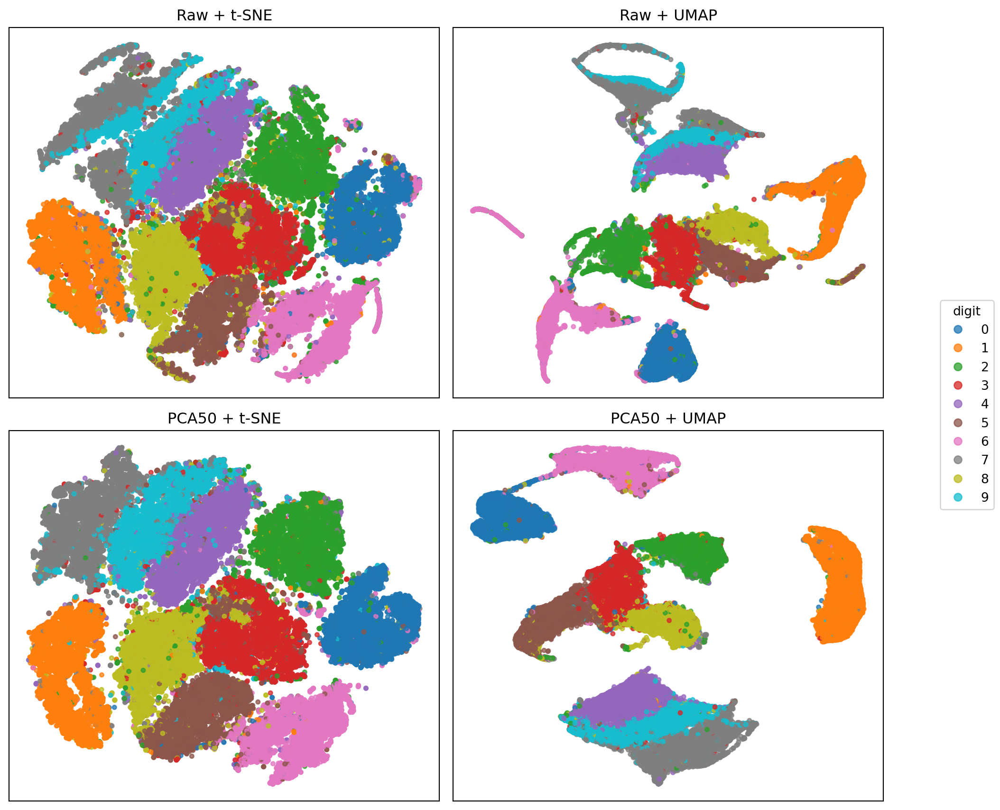
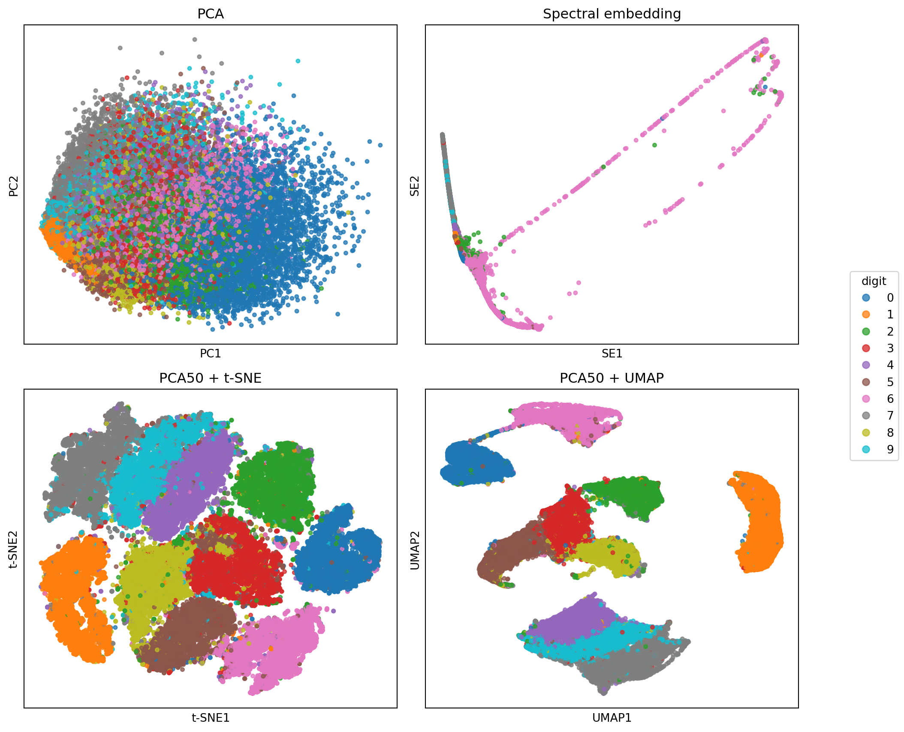

# Embedding and Visualization {#sec-embedding}

The previous chapter treated PCA as a low-rank representation of a data matrix. PCA constructs new coordinates by multiplying the data matrix by loading vectors, $Z=XV_m$.

In this chapter, an **embedding** means a lower-dimensional coordinate representation of the observations:

$$
x_i\in\mathbb R^p \longrightarrow z_i\in\mathbb R^m, \qquad m\ll p.
$$

::: {.callout-note}
## Three uses of the word embedding

- In this chapter, an embedding is a lower-dimensional representation of high-dimensional observations.
- In mathematics, an embedding usually means an injective map that preserves the relevant structure.
- In language models, an embedding is a vector representation of words, sentences, or documents, usually designed so that similar meanings have nearby vectors.

These uses are related in spirit, but they are not the same mathematical object. In this chapter, injectivity or surjectivity is not the main issue. What matters is which relationships among observations the embedding tries to preserve.
:::

PCA is a linear embedding: each coordinate is a feature combination, and the axes can be interpreted through loadings. The methods in this chapter usually build coordinates from distances, neighborhoods, or graphs instead. Their axes are useful for visualization, but they usually do not have direct feature interpretations.

We focus on three methods:

- spectral embedding, which builds coordinates from a similarity graph;
- t-SNE, which matches high-dimensional and low-dimensional neighborhood probabilities;
- UMAP, which builds and matches nearest-neighbor graphs.

The shared goal is not to reconstruct $X$ feature by feature. The goal is to make selected relationships among observations visible in a small number of coordinates, usually two.

::: {.callout-caution}
## Embeddings are task-dependent

In this chapter, embeddings are mainly used for visualization and sometimes for clustering. They can also be useful for other tasks, but not every embedding is useful for every task.

The reason is that different methods preserve different relationships. PCA preserves variance and optimizes linear reconstruction. Spectral embedding, t-SNE, and UMAP preserve neighborhoods or graph structure in different ways. For example, t-SNE is useful for visualizing local neighborhoods, but distances in a t-SNE plot are not reliable enough to automatically use as input to a distance-based method such as KNN. A good embedding plot is therefore a guide for exploration, not a guarantee that the coordinates are appropriate for clustering, prediction, compression, or denoising. We will discuss these later in more details.
:::


<!-- ## Before Constructing an Embedding -->

Because an embedding is built from the rows of $X$, two choices come before the algorithm itself:

- how each observation is represented as a row vector;
- how similarity or distance between rows is defined.

Thus a common workflow is

$$
X
\longrightarrow
\text{row representation}
\longrightarrow
\text{similarity or neighborhood structure}
\longrightarrow
\text{low-dimensional embedding}.
$$

## Spectral Embedding

Spectral embedding starts by replacing the original data matrix with a graph.
The rows $x_i\in\mathbb R^p$ are observations in feature space. Spectral
embedding keeps the same observations, but represents their relationships by
a graph: the vertices are observations, and edges connect observations that
are similar, often nearest neighbors.

The main idea is:

$$
X
\longrightarrow
\text{similarity graph}
\longrightarrow
\text{graph Laplacian}
\longrightarrow
\text{observation-space eigenvector coordinates}.
$$

This is useful when the structure is better described by connectivity than by distance to a single center. Spectral clustering uses the same embedding and then applies a label-assignment method such as K-means.

### Mathematical Idea

Let $W=\mqty[W_{ij}]\in\mathbb R^{n\times n}$ be a symmetric weighted adjacency matrix. A large $W_{ij}$ means observations $i$ and $j$ are strongly connected. Define the degree matrix

$$
D=\operatorname{diag}(d_1,\ldots,d_n),
\qquad
d_i=\sum_j W_{ij}.
$$

The unnormalized graph Laplacian is

$$
L=D-W.
$$

Both $W$ and $L$ are $n\times n$ matrices, so they act on vectors in observation space $\mathbb R^n$. A vector

$$
y=\mqty[y_1,\ldots,y_n]^\top\in\mathbb R^n
$$

assigns one coordinate value to every observation. The entry $y_i$ is the coordinate assigned to observation $i$.

::: {.callout-note}

## What does $L$ do?

The matrix $L$ compares each observation with its neighbors in the graph. If $y\in\mathbb R^n$ assigns one number to each observation, then the $i$-th entry of $Ly$ is

$$
(Ly)_i
=
d_i y_i-\sum_j W_{ij}y_j
=
\sum_j W_{ij}(y_i-y_j).
$$

Thus $(Ly)_i$ is a weighted difference between the coordinate of observation $i$ and the coordinates of its neighbors. 

- If $y_i$ is close to the coordinates of strongly connected neighbors, then $(Ly)_i$ is small. 
- If $y_i$ is very different from strongly connected neighbors, then $(Ly)_i$ is large.

In this sense, $L$ measures how rough or unsmooth the coordinate vector $y$ is over the graph. Smooth coordinates change slowly across strong edges.
:::

The **graph roughness** of an observation-space coordinate vector $y$ is

$$
\operatorname{roughness}_G(y)
=
y^\top Ly
=
\frac12\sum_{i,j}W_{ij}(y_i-y_j)^2.
$$

It measures how much the coordinate values change across graph edges, with larger penalties on stronger edges. This expression is small when strongly connected observations receive similar coordinates. This is exactly the behavior we want from a graph embedding. If $W_{ij}$ is large, then observations $i$ and $j$ are strongly connected, so we want their embedded coordinates to be close:

$$
y_i\approx y_j.
$$

The term $W_{ij}(y_i-y_j)^2$ penalizes the opposite situation: a strong edge with very different coordinates. Therefore minimizing $y^\top Ly$ means finding an observation-space coordinate column that keeps strongly connected observations close together. In other words, we need the eigenvectors corresponding to the smallest nonzero eigenvalues of $L$.


<details>
<summary><strong>Click to expand.</strong></summary>

---

More explicitly, a one-dimensional observation-space coordinate can be described as trying to solve

$$
\min_y y^\top Ly
\qquad
\text{subject to }
\norm{y}^2=1
\text{ and }
y\perp \mathbf 1.
$$

The constraints remove trivial solutions. Without them, $y=0$ minimizes the objective. Even with a nonzero vector, the constant coordinate $y_1=\cdots=y_n$ makes every coordinate difference zero, so it does not separate observations. The constraint $\norm{y}^2=1$ fixes the scale, and $y\perp \mathbf 1$ removes the constant coordinate.

This optimization problem leads to eigenvectors because $L$ is symmetric. Write its orthonormal eigen-decomposition as

$$
L=V\Lambda V^\top.
$$

If $v_1,\ldots,v_n$ are the eigenvectors of $L$, then any unit vector $y$ can be expanded in this eigenbasis:

$$
y=a_1v_1+\cdots+a_nv_n,
\qquad
\sum_{k=1}^n a_k^2=1.
$$

Then

$$
y^\top Ly
=
\sum_{k=1}^n \lambda_k a_k^2.
$$

Thus $y^\top Ly$ is a weighted average of the eigenvalues. To make it small, we put weight on eigenvectors with small eigenvalues. For a graph Laplacian, the smallest eigenvalue is usually $0$, with a constant eigenvector on each connected component. That eigenvector has zero graph roughness, but it gives every observation the same coordinate. After removing this constant direction, the first useful one-dimensional spectral coordinate is the eigenvector corresponding to the smallest positive eigenvalue:

$$
Lv=\lambda v,
\qquad
\lambda
=
\min\{\lambda_k:\lambda_k>0\}.
$$

This eigenvector $v=\mqty[v_1,\ldots,v_n]^\top$ assigns one coordinate value to each observation: the entry $v_i$ becomes the new coordinate of observation $i$. Since

$$
v^\top Lv
=
\lambda v^\top v,
$$

the smallest positive eigenvalue gives the nonconstant coordinate with the smallest graph roughness. Therefore strongly connected observations tend to receive similar values. Additional spectral coordinates come from the next smallest positive eigenvalues.

---

</details>

Consider the eigenvectors of the graph Laplacian $v_1,\ldots, v_n$, ordered by ascending eigenvalues. Each selected eigenvector gives one coordinate column for all observations. For an $m$-dimensional spectral embedding, we place the first $m$ nonconstant eigenvectors side by side:

$$
Z
=
\mqty[v_2 & v_3 & \cdots & v_{m+1}]
\in\mathbb R^{n\times m}.
$$

The embedding is then obtained by reading across rows of this matrix. The $i$-th row of $Z$ gives the embedded coordinate of observation $i$:

$$
z_i^\top
=
\mqty[v_2(i) & v_3(i) & \cdots & v_{m+1}(i)],
$$

where $v_k(i)$ is the $i$-th entry of the $k$-th Laplacian eigenvector. In words, observation $i$ gets its first coordinate from the $i$-th entry of $v_2$, its second coordinate from the $i$-th entry of $v_3$, and so on.

::: {#exm-spectral-four-points}
## A four-point graph

Suppose the original dataset has four observations and any number of predictors:

$$
X\in\mathbb R^{4\times p}.
$$

The value of $p$ does not matter for this example. The spectral embedding starts after those observations have been converted into a similarity matrix. Suppose observations 1 and 2 are strongly connected, observations 3 and 4 are strongly connected, and observations 2 and 3 are weakly connected:

$$
W
=
\mqty[
0 & 1 & 0 & 0\\
1 & 0 & 0.2 & 0\\
0 & 0.2 & 0 & 1\\
0 & 0 & 1 & 0
].
$$

This matrix says that the graph has two strong pairs, $(1,2)$ and $(3,4)$, with a weak bridge between observations 2 and 3. From this matrix we form the graph Laplacian $L=D-W$ and compute the eigenvectors. A small nonconstant Laplacian eigenvector is approximately

$$
v_2
\approx
\mqty[
0.547\\
0.448\\
-0.448\\
-0.547
].
$$

Using $v_2$ as a one-dimensional embedding means the output has dimension

$$
Z\in\mathbb R^{4\times 1}.
$$

The embedding is obtained by reading the entries of $v_2$:

$$
Z
=
v_2
\approx
\mqty[
0.547\\
0.448\\
-0.448\\
-0.547
].
$$

Thus the spectral embedding maps the original observations as follows:

$$
x_1\mapsto 0.547,\qquad
x_2\mapsto 0.448,\qquad
x_3\mapsto -0.448,\qquad
x_4\mapsto -0.547.
$$

The result tells us that observations 1 and 2 are close in the embedding, observations 3 and 4 are close in the embedding, and there is a large gap between the two pairs. This reflects the graph structure encoded in $W$: two strong within-pair connections and one weak bridge. The coordinate is not a feature combination like $Xv$ in PCA, where $v\in\mathbb R^p$ is a loading vector. It is a coordinate read from a Laplacian eigenvector, so its values are determined by graph connectivity.
:::


### Spectral Embedding in Python

We can use `SpectralEmbedding` from `sklearn.manifold` to compute a spectral embedding. The first hyperparameter, `n_components`, specifies the dimension of the embedding. However, it is usually not the most important hyperparameter.

As discussed earlier, spectral embedding starts by constructing a local connectivity graph. There are several ways to construct the connectivity matrix $W$. One of the most common approaches is the nearest neighbors method:

1. Choose the number of nearest neighbors, `n_neighbors`.
2. For each point, find its `n_neighbors` nearest neighbors.
3. Set $W_{ij}=1$ if points $i$ and $j$ are connected, and $W_{ij}=0$ otherwise.

This produces a sparse connectivity matrix $W$, which is then used to compute the graph Laplacian and the spectral embedding.

In `SpectralEmbedding`, this construction is specified by `affinity="nearest_neighbors"` together with the parameter `n_neighbors`. In practice, choosing an appropriate neighborhood size or a different way of constructing the connectivity graph is often more important than choosing the embedding dimension.

The formulas above use the unnormalized graph Laplacian $L=D-W$ for exposition. The `sklearn` implementation uses a normalized graph Laplacian. The interpretation is the same at this level: the embedding favors coordinates that vary smoothly over the graph, but the exact matrix used in the computation is different.

::: {.callout-note}
## `SpectralClustering`

A common use of spectral embedding is to apply a clustering algorithm, such as KMeans, to the embedded coordinates. You can do this manually by combining `SpectralEmbedding` with `KMeans`, or you can use `SpectralClustering` from `sklearn.cluster`, which performs these two steps automatically.

If you want to visualize the embedding itself, however, you should use `SpectralEmbedding` directly and then apply the clustering algorithm manually.

:::


#### Example

We generate a dataset consisting of two concentric circles and add a small number of bridge points connecting them. The outer circle has uneven density, meaning that the point density varies along its perimeter.

Although the bridge points connect the two circles geometrically, we still regard the data as containing two clusters: the inner circle and the outer circle. The bridge points are treated as noise rather than evidence that the two circles belong to the same cluster.

The dataset is generated manually using NumPy because `sklearn.datasets.make_circles` cannot generate circles with non-uniform point density. The dataset is visualized after generating.


```{python}
#| code-fold: true
import numpy as np
import matplotlib.pyplot as plt

n_samples = 900
rng = np.random.default_rng(0)

n_inner = n_samples // 2
n_outer = n_samples - n_inner

# Inner circle
theta = rng.uniform(0, 2 * np.pi, n_inner)
r = rng.normal(1.0, 0.035, n_inner)
x_in = r * np.cos(theta)
y_in = r * np.sin(theta)

# Outer circle with uneven density
theta_out = []
while len(theta_out) < n_outer:
    theta = rng.uniform(0, 2 * np.pi, 6 * n_outer)
    prob = 0.08 + 0.92 * np.sin(2.5 * theta) ** 2
    keep = rng.random(len(theta)) < prob
    theta_out.extend(theta[keep])

theta_out = np.array(theta_out[:n_outer])

r = rng.normal(2.6, 0.04, n_outer)
x_out = r * np.cos(theta_out)
y_out = r * np.sin(theta_out)

X = np.vstack([
    np.column_stack([x_in, y_in]),
    np.column_stack([x_out, y_out]),
])

y = np.array([0] * n_inner + [1] * n_outer)

# Bridge points
n_bridge = 10
theta = rng.normal(0.4, 0.02, n_bridge)
r = np.linspace(1.05, 2.55, n_bridge)
r += rng.normal(0, 0.02, n_bridge)

x = r * np.cos(theta)
y_bridge = r * np.sin(theta)

X_bridge = np.column_stack([x, y_bridge])

# Assign each bridge point to the nearest circle
labels = (np.abs(r - 1.0) > np.abs(r - 2.6)).astype(int)

X = np.vstack([X, X_bridge])
y = np.concatenate([y, labels])

plt.scatter(X[:, 0], X[:, 1], c=y, s=8)
plt.title("Ground Truth")
plt.xticks([])
plt.yticks([])
plt.axis("equal");
```


Now we apply the four clustering methods and compare their results. Since the true labels are available, we use the adjusted Rand index (ARI) to evaluate the clustering performance.

For all methods, the hyperparameters were only tuned lightly rather than exhaustively. Better performance may be achievable with more careful tuning, but the overall conclusions are unlikely to change. The purpose of this example is not to compare the best possible performance of each algorithm, but to illustrate their typical behavior on this dataset.


```{python}
from sklearn.cluster import KMeans, AgglomerativeClustering, DBSCAN
from sklearn.manifold import SpectralEmbedding

kmeans_labels = KMeans(n_clusters=2, n_init=10, random_state=0).fit_predict(X)

ha_labels = AgglomerativeClustering(n_clusters=2, linkage="ward").fit_predict(X)

dbscan_labels = DBSCAN(eps=0.5, min_samples=10).fit_predict(X)

Z = SpectralEmbedding(n_components=2, n_neighbors=15, random_state=0).fit_transform(X)
spectral_labels = KMeans(n_clusters=2, random_state=0, n_init=10).fit_predict(Z)
```


``` {python}
#| code-fold: true
from sklearn.metrics import adjusted_rand_score

labels = {
    "KMeans": kmeans_labels,
    "Agglomerative (Ward)": ha_labels,
    "DBSCAN": dbscan_labels,
    "Spectral Clustering": spectral_labels,
}
results = {
    name: (label, adjusted_rand_score(y, label)) for name, label in labels.items()
}

fig, axes = plt.subplots(2, 2, figsize=(10, 10))
axes = axes.ravel()

for ax, (name, (labels, ari)) in zip(axes, results.items()):
    ax.scatter(X[:, 0], X[:, 1], c=labels, s=8)
    ax.set_title(f"{name}\nARI = {ari:.3f}", fontsize=13)

    ax.set_xticks([])
    ax.set_yticks([])
    ax.set_aspect("equal");
```
The results illustrate the different assumptions made by the clustering algorithms.

- KMeans: Fails. KMeans partitions the data according to the distance to cluster centroids. Since the two circles share the same center, the algorithm cannot separate them into inner and outer circles. Instead, it splits the data into two roughly equal halves.
- Agglomerative (Ward): Performs slightly better but still fails. Ward linkage merges clusters to minimize the increase in within-cluster variance. This favors compact, approximately spherical clusters rather than ring-shaped clusters, so it also tends to cut across the circles instead of preserving their circular structure.
- DBSCAN: Performs reasonably well but is affected by the bridge points. Since DBSCAN defines clusters through density connectivity, the bridge creates a path between the two circles, causing some points to be merged incorrectly. Furthermore, because DBSCAN uses a single density threshold, it struggles with the uneven density of the outer circle and fails to identify it as one cluster.
- Spectral Clustering: Correctly recovers the two circles. Instead of clustering the original coordinates directly, it first constructs a similarity graph and computes a spectral embedding. In this new representation, points belonging to the same circle become much closer, while the weak bridge has little influence. A simple clustering algorithm such as KMeans can then easily separate the two clusters.

The key idea is that spectral clustering does not rely on Euclidean geometry in the original feature space. Instead, it transforms the data into a new space where the cluster structure becomes much easier to identify.

The figure below shows the two-dimensional spectral embedding. Although the circles are not linearly separable in the original space, they become well separated after the embedding, making KMeans sufficient to recover the correct clusters.

```{python}
plt.scatter(Z[:, 0], Z[:, 1], c=y, s=8)
plt.title("Spectral Embedding")
plt.xticks([])
plt.yticks([])
plt.axis("equal");
```


## t-SNE

t-SNE stands for t-distributed Stochastic Neighbor Embedding. It is designed mainly for visualization. It does not try to reconstruct the original features and does not produce interpretable axes. Instead, it tries to preserve local neighborhoods.

The main idea is:

$$
X
\longrightarrow
\text{high-dimensional neighbor probabilities } P
\longrightarrow
\text{low-dimensional coordinates with probabilities } Q.
$$

### Mathematical Idea

The core algorithm is simple:

1. Compute pairwise similarities among the original observations $x_1,\ldots,x_n$. These similarities are converted into a probability matrix $P=(p_{ij})$, where larger $p_{ij}$ means that observations $i$ and $j$ are close neighbors in the original space.
2. Introduce low-dimensional coordinates $z_1,\ldots,z_n$. These coordinates are the unknown variables that t-SNE must solve for.
3. From the distances among the current $z_i$'s, compute another probability matrix $Q=(q_{ij})$. Larger $q_{ij}$ means that points $i$ and $j$ are close in the low-dimensional display. Note that $Q$ is a function of $Z=(z_1,\ldots,z_n)$.
4. Adjust all coordinates $z_1,\ldots,z_n$ so that $Q$ is close to $P$ in the sense of Kullback-Leibler divergence.

Thus t-SNE chooses the plotted coordinates by solving

$$
\min_{z_1,\ldots,z_n}
\operatorname{KL}(P\Vert Q(z_1,\ldots,z_n)),
$$

where

$$
\operatorname{KL}(P\Vert Q)
=
\sum_{i\ne j} p_{ij}\log\qty(\frac{p_{ij}}{q_{ij}}).
$$

In practice, the coordinates are initialized, often randomly or from PCA, and then updated by gradient descent. The next formulas define the two probability matrices $P$ and $Q$ in detail.


::: {.callout-note collapse="true"}
## How t-SNE builds $P$
For each observation $i$, t-SNE defines the probability that $i$ chooses observation $j$ as a neighbor:

$$
p_{j\mid i}
=
\frac{
\exp\qty(-\norm{x_i-x_j}^2/(2\sigma_i^2))
}{
\sum_{k\ne i}
\exp\qty(-\norm{x_i-x_k}^2/(2\sigma_i^2))
},
\qquad j\ne i.
$$


The conditional probabilities are then symmetrized to produce $p_{ij}$, where $n$ is the number of observations:

$$
p_{ij}=\frac{1}{2n}(p_{i\mid j}+p_{j\mid i}).
$$

Geometrically, $p_{ij}$ summarizes the relationship between $x_i$ and $x_j$ in the original high-dimensional space. If $x_i$ and $x_j$ are close relative to the local scale around them, then $p_{ij}$ is large.


:::


::: {.callout-note collapse="true"}
## How t-SNE builds $Q$
For low-dimensional coordinates $z_i$, t-SNE defines similarities using a heavy-tailed Student-$t$ kernel:

$$
q_{ij}
=
\frac{(1+\norm{z_i-z_j}^2)^{-1}}
{\sum_{k\ne \ell}(1+\norm{z_k-z_\ell}^2)^{-1}}.
$$

Geometrically, $q_{ij}$ summarizes the relationship between the plotted points $z_i$ and $z_j$. If the two plotted points are close, then $q_{ij}$ is large; if they are far apart, then $q_{ij}$ is small.

:::


::: {.callout-note}
## Perplexity

`perplexity` can be read as an effective neighborhood size. It controls how many neighbors each point effectively pays attention to.

- Larger `perplexity` means a broader neighborhood. The probability distribution $p_{\cdot\mid i}$ is flatter and spreads mass over more nearby observations. This corresponds to a larger $\sigma_i$.
- Smaller `perplexity` means a more local neighborhood. The probability distribution $p_{\cdot\mid i}$ concentrates more strongly on the closest observations. This corresponds to a smaller $\sigma_i$.

More precisely, for each point $i$, t-SNE chooses $\sigma_i$ so that the entropy of the conditional distribution $p_{\cdot\mid i}$ matches the requested perplexity:

$$
\operatorname{Perp}(p_{\cdot\mid i})
=
2^{H(p_{\cdot\mid i})},
\qquad
H(p_{\cdot\mid i})
=
-\sum_{j\ne i} p_{j\mid i}\log_2 p_{j\mid i}.
$$

Thus the user fixes one common `perplexity` value, while t-SNE solves a separate $\sigma_i$ for each observation. The $\sigma_i$ values can differ, allowing dense and sparse regions to use different local distance scales while keeping the same effective neighborhood size.
:::


### What structure does t-SNE preserve?

t-SNE converts geometry into probabilities.

- The matrix $P=(p_{ij})$ describes neighborhood relationships in the original high-dimensional space: nearby observations have larger $p_{ij}$, and faraway observations have smaller $p_{ij}$.
- The matrix $Q=(q_{ij})$ describes neighborhood relationships in the low-dimensional plot in the same way.

Minimizing $\operatorname{KL}(P\Vert Q)$ tries to make these two probability patterns match.

The direction of the KL divergence matters.

- The term $p_{ij}\log(p_{ij}/q_{ij})$ strongly penalizes the case where $p_{ij}$ is large but $q_{ij}$ is small. Thus, if two observations are close neighbors in the original space, t-SNE tries hard to keep them close in the plot.
- The converse is weaker: if two points appear close in the t-SNE plot, they were not necessarily close in the original space. Pairs with very small $p_{ij}$ contribute little directly to the objective, so t-SNE is less strict about the exact arrangement of points that were already far apart.

Thus t-SNE preserves local neighborhood probabilities, not the original coordinates, not the original Euclidean distances, and not the meanings of the original features. In plain language:

- Original-space neighbors are likely to remain close in the t-SNE plot.
- Points that are close in the t-SNE plot are not guaranteed to have been close in the original space.
- A visible t-SNE patch may contain several real subgroups.
- Distances between separated patches, patch sizes, empty space, orientation, and apparent density should not be used as quantitative evidence.

So t-SNE answers a local question: "which observations are neighbors of which other observations?" It does not faithfully answer global metric questions such as "how far apart are these two groups?" or "which visual cluster is larger or denser?"

::: {.callout-note}
## t-SNE as a diagnostic plot

The main use of t-SNE is visualization after dimension reduction. It is not usually used as a feature representation for a downstream model. Instead, it helps us inspect whether patterns found by other methods are visible in local neighborhood structure.

For example, after fitting a clustering algorithm in the original feature space, we can color a t-SNE plot by the cluster labels. If the colors form well-separated local patches, then the clustering is consistent with the neighborhood structure shown by t-SNE. If the colors are heavily mixed, then the clustering may be failing to capture local structure, or the data may not contain clearly separated groups.

This is a diagnostic check, not a proof. t-SNE can make separation look stronger than it really is, and the apparent distance between colored patches is not a quantitative cluster separation. Quantitative measures such as nearest-neighbor overlap, trustworthiness, silhouette score, or adjusted Rand index should be used when a formal comparison is needed. The plot is useful because it makes possible problems visible quickly.
:::


### t-SNE in Python

We may use `TSNE` from `sklearn.manifold` to compute a t-SNE embedding. Unlike PCA or many other sklearn transformers, standard `sklearn` t-SNE does not provide a `.transform()` method for new observations. The usual workflow is
to fit the embedding and return the plotted coordinates directly with `.fit_transform()`.


```python
from sklearn.manifold import TSNE

tsne = TSNE(
    n_components=2,
    perplexity=30,
    init="pca",
    learning_rate="auto",
    random_state=1
)
Z = tsne.fit_transform(X)
```
The parameter `n_components=2` asks for a two-dimensional display. `perplexity=30` sets the effective neighborhood size used when constructing the high-dimensional probabilities. The argument `init="pca"` specifies how the optimization is initialized. Since t-SNE minimizes its objective by an iterative optimization method, the low-dimensional coordinates must be assigned initial values before the optimization begins. Two common choices are random initialization (`init="random"`) and PCA initialization (`init="pca"`). We set `init="pca"` explicitly here.

With PCA initialization, the optimization starts from the coordinates obtained by projecting the data onto the first `n_components` principal components. In other words, the PCA embedding serves as the initial low-dimensional representation, and t-SNE then refines these coordinates to minimize its own objective. PCA initialization often converges faster and gives more stable results than random initialization. It can also make the early layout reflect some broad linear structure. However, it does not guarantee a better final embedding.

The initialization is not the same as the objective. t-SNE still optimizes the t-SNE loss after initialization. However, because the optimization is nonconvex, different initializations can lead to different local solutions. This is one reason to check whether visible patterns are stable across reasonable settings.


::: {.callout-note}
## PCA initialization vs. PCA preprocessing

Do not confuse `init="pca"` with applying PCA before t-SNE.

- `init="pca"` uses a PCA embedding only as the initial values for gradient descent. The neighborhood probabilities are still computed from the data passed to `TSNE`.
- Applying PCA before t-SNE replaces the original data with a lower-dimensional representation (for example, 50 principal components). In this case, t-SNE computes neighborhood probabilities from the PCA-transformed data.

The latter is often recommended for high-dimensional datasets because it can reduce noise and speed up computation. The idea is to use PCA as a preliminary compression step, often to 30 or 50 dimensions, and then let t-SNE perform the main nonlinear embedding from that cleaner representation.


:::

### Digits example

We use the handwritten digits data from `sklearn` as an example. The data have 64 pixel features. We standardize the features, reduce them to 30 PCA coordinates, and then run t-SNE. The labels are used only for coloring the final plot.

```{python}
from sklearn.datasets import load_digits
from sklearn.preprocessing import StandardScaler
from sklearn.decomposition import PCA
from sklearn.manifold import TSNE

digits = load_digits()
X_digits = StandardScaler().fit_transform(digits.data)
y_digits = digits.target

X_digits_pca = PCA(n_components=30, random_state=1).fit_transform(X_digits)

tsne = TSNE(
    n_components=2,
    perplexity=30,
    init="pca",
    learning_rate="auto",
    random_state=1,
)
Z_tsne = tsne.fit_transform(X_digits_pca)
```

```{python}
#| code-fold: true
import matplotlib.pyplot as plt

fig, ax = plt.subplots(figsize=(8, 6))
scatter = ax.scatter(Z_tsne[:, 0], Z_tsne[:, 1], c=y_digits, cmap="tab10", s=10)
ax.set_xlabel("t-SNE1")
ax.set_ylabel("t-SNE2")
ax.set_title("Digits t-SNE")
ax.legend(*scatter.legend_elements(), title="digit", ncol=2)
```

In this example, we use `perplexity=30`, a common starting point for a moderate-size dataset. This value should be treated as a tuning choice rather than a fixed default.

In practice, choose `perplexity` by comparing several reasonable values. For a moderate-size dataset, values such as `5`, `10`, `30`, and `50` are common candidates. Use smaller values when you want to emphasize very local neighborhoods, and larger values when you want a smoother display based on broader neighborhoods. The chosen `perplexity` should be well below the sample size. The result can also depend on initialization and random seed, so a pattern is more credible when it persists across several reasonable `perplexity` values and random seeds.

### More about `perplexity`

The plots below use the same preprocessed digits data and the same random seed, but change `perplexity`.

```{python}
#| code-fold: true
perplexities = [5, 10, 30, 50]

fig, axs = plt.subplots(2, 2, figsize=(10, 8))
scatter = None

for ax, perplexity in zip(axs.ravel(), perplexities):
    model = TSNE(
        n_components=2,
        perplexity=perplexity,
        init="pca",
        learning_rate="auto",
        random_state=1,
    )
    Z = model.fit_transform(X_digits_pca)
    scatter = ax.scatter(Z[:, 0], Z[:, 1], c=y_digits, cmap="tab10", s=8)
    ax.set_title(f"perplexity = {perplexity}")
    ax.set_xticks([])
    ax.set_yticks([])

fig.legend(
    *scatter.legend_elements(),
    title="digit",
    loc="center right",
)
fig.tight_layout(rect=[0, 0, 0.9, 1]);
```
The figure illustrates how `perplexity` changes the neighborhood scale used by t-SNE. Smaller values emphasize fine local structure, often producing many tight or fragmented clusters. Larger values consider broader neighborhoods, leading to smoother and more stable embeddings.

Some observations from the plots are:

- All `perplexity` values separate most digit classes, indicating that the handwritten digits have meaningful local neighborhood structure in the original high-dimensional space.
- With small `perplexity` (5–10), the embedding focuses on very local neighborhoods. Clusters are more fragmented, and some digit classes appear as multiple disconnected regions. This suggests that some digit classes contain multiple local neighborhoods in the original feature space, although these disconnected regions should not automatically be interpreted as genuine subtypes.
- In this example, increasing `perplexity` (30–50) produces more compact and stable clusters. Samples from the same digit are grouped more consistently, resulting in a cleaner overall layout.
- The embeddings for `perplexity` 30 and 50 are visually similar, suggesting that the recovered local neighborhood structure is relatively stable over this range.
- Some overlap between visually similar digits persists under all settings, possibly reflecting genuine ambiguity in the handwritten digits rather than an inappropriate choice of `perplexity`.
- Although local neighborhoods are largely preserved, the relative positions, sizes, and distances between clusters change noticeably across `perplexity` values. Therefore, these global geometric relationships should not be interpreted quantitatively.

Overall, `perplexity` controls the trade-off between emphasizing fine local neighborhoods and producing a smoother representation of the underlying neighborhood structure, rather than determining the number of clusters.

A useful `perplexity` is one that produces stable local neighborhoods across a reasonable range of parameter values rather than one that gives the most visually appealing plot. Comparing several `perplexity` values is therefore often more informative than selecting a single "best" visualization. When class labels are available, they should be used only after fitting to verify whether nearby points correspond to similar observations. The embedding can then guide further exploration of the original data. For example, overlapping digit classes can be examined in the original images to determine whether the ambiguity reflects genuine variation in handwriting rather than an artifact of the visualization.


## UMAP

UMAP stands for Uniform Manifold Approximation and Projection. Like t-SNE, it is a nonlinear embedding method based on local neighborhoods and is often used for two-dimensional visualization. The main difference is that UMAP builds a weighted nearest-neighbor graph in the original space and then tries to reproduce that graph in a low-dimensional display.

Unlike standard `sklearn` t-SNE, the common Python implementation of UMAP can also transform new observations after fitting. This makes UMAP somewhat easier to reuse in a later workflow, although the first purpose here is still visualization and diagnosis.

The main idea is:

$$
X
\longrightarrow
\text{high-dimensional nearest-neighbor graph } W
\longrightarrow
\text{low-dimensional coordinates with a similar graph}.
$$

### Mathematical Idea

The core algorithm is similar in spirit to t-SNE:

1. For each observation, find its nearest neighbors in the original space.
2. Turn these local neighborhoods into a weighted graph $W=(w_{ij})$. A larger $w_{ij}$ means that observations $i$ and $j$ are strongly connected in the original representation.
3. Introduce low-dimensional coordinates $z_1,\ldots,z_n$.
4. From the distances among the $z_i$'s, build a low-dimensional graph $R(Z)=(r_{ij})$.
5. Move the $z_i$'s so that the low-dimensional graph resembles the original graph.

In other words, UMAP chooses the plotted coordinates by minimizing a graph cross-entropy loss between the original graph $W$ and the low-dimensional graph $R(Z)$:

$$
\min_{z_1,\ldots,z_n}
\operatorname{CE}\qty(W, R(Z)).
$$

Thus UMAP does not try to reconstruct the original features. It tries to preserve a local nearest-neighbor graph. The details use fuzzy-set language, but the practical interpretation is simple: observations that are strongly connected in the original graph should stay close in the display, while weakly connected observations may be placed farther apart.

::: {.callout-note collapse="true"}
## How UMAP builds $W$

UMAP first finds the nearest neighbors of each observation according to the chosen distance metric. The parameter `n_neighbors` controls the size of these local neighborhoods. For each point $x_i$, UMAP uses only its selected nearest neighbors as candidate directed edges from $i$. Points outside this selected neighbor set usually have directed weight $a_{ij}=0$ from the point of view of $i$.

After the candidate neighbors are selected, UMAP assigns a local distance offset $\rho_i$ and a local scale $\sigma_i$ for each point. The offset $\rho_i$ is usually the distance from $x_i$ to its nearest neighbor. This makes the nearest neighbor receive weight $1$. The scale $\sigma_i$ controls how quickly the remaining selected neighbors lose weight as distance increases. Both $\rho_i$ and $\sigma_i$ are chosen automatically by the algorithm for each point; they are not tuning parameters set by the user.

A simplified version of the directed neighbor weight from $i$ to $j$ is

$$
a_{ij}
=
\exp\qty(
-\frac{\max\{0,d(x_i,x_j)-\rho_i\}}{\sigma_i}
).
$$

Thus the construction is

$$
\texttt{n\_neighbors}
\longrightarrow
\text{selected neighbor set}
\longrightarrow
(\rho_i,\sigma_i)
\longrightarrow
a_{ij}
\longrightarrow
W.
$$

The parameter `n_neighbors` decides which points are considered local neighbors. The parameters $\rho_i$ and $\sigma_i$ then decide how strongly those selected neighbors are connected. Thus UMAP, like t-SNE, uses local distance scales instead of one global bandwidth for the whole dataset.

The formula has a simple piecewise interpretation. If $x_j$ is within the local offset of $x_i$, so that

$$
d(x_i,x_j)\le \rho_i,
$$

then $\max\{0,d(x_i,x_j)-\rho_i\}=0$ and therefore $a_{ij}=\exp(0)=1$. If $x_j$ is farther away than $\rho_i$, then

$$
a_{ij}
=
\exp\qty(
-\frac{d(x_i,x_j)-\rho_i}{\sigma_i}
),
$$

so the directed connection strength decays exponentially with distance. For the directed weights $a_{ij}$, the nearest neighbor has weight approximately $1$, selected but farther neighbors receive exponential weights between $0$ and $1$, and points outside the selected `n_neighbors` set have weight $0$ from $i$ to $j$.

The directed weights are then combined into a symmetric graph:

$$
w_{ij}
=
a_{ij}+a_{ji}-a_{ij}a_{ji}.
$$

This produces the high-dimensional graph $W=(w_{ij})$. Formally, $W$ is an $n\times n$ weighted adjacency matrix: $w_{ij}$ measures the strength of the local connection between observations $i$ and $j$ in the original space. It is not a distance matrix. Larger $w_{ij}$ means a stronger neighbor relationship, and most entries are zero or very small because UMAP is based on nearest neighbors.

The final weight $w_{ij}$ is symmetric, so it combines both directions. Even if $x_j$ is not selected as a neighbor of $x_i$, the final $w_{ij}$ can still be positive if $x_i$ is selected as a neighbor of $x_j$.
:::


::: {.callout-note collapse="true"}
## How UMAP builds $R(Z)$ and the cross-entropy

After low-dimensional coordinates $z_1,\ldots,z_n$ are introduced, UMAP defines a low-dimensional graph $R(Z)=(r_{ij})$ from pairwise distances in the plot. A common form is

$$
r_{ij}
=
\frac{1}{1+\alpha\norm{z_i-z_j}^{2\beta}},
$$

Here $\alpha$ and $\beta$ are not usually chosen directly by the user. They are fitted internally from UMAP's display parameters, especially `min_dist`. If two plotted points are close, $r_{ij}$ is large; if they are far apart, $r_{ij}$ is small.

UMAP then moves the coordinates so that $R(Z)$ resembles $W$. This is done by minimizing a cross-entropy loss of the form

$$
\operatorname{CE}(W,R)
=
-\sum_{i\ne j}
\left[
w_{ij}\log r_{ij}
+
(1-w_{ij})\log(1-r_{ij})
\right].
$$

The first term encourages pairs with large $w_{ij}$ to stay close in the plot. The second term discourages weakly connected pairs from all collapsing into the same place. In practice, UMAP optimizes the low-dimensional coordinates by stochastic gradient descent: sampled edges from $W$ pull connected points together, while randomly sampled non-edges push unrelated points apart.
:::

::: {.callout-note}
## What `min_dist` controls

The parameter `min_dist` is the effective minimum distance between nearby points in the low-dimensional embedding. It is not a hard constraint that all plotted points must be at least this far apart. Instead, it defines the distance scale at which the low-dimensional similarity should begin to decay.

UMAP does not usually ask the user to choose $\alpha$ and $\beta$ directly. Instead, it fits $\alpha$ and $\beta$ from `min_dist` so that

$$
\frac{1}{1+\alpha d^{2\beta}}
$$

has a shape similar to a target curve: the curve stays near $1$ for distances below `min_dist`, then decreases after that. Thus the tuning chain is

$$
\texttt{min\_dist}
\longrightarrow
(\alpha,\beta)
\longrightarrow
r_{ij}
=
\frac{1}{1+\alpha\norm{z_i-z_j}^{2\beta}}
\longrightarrow
R(Z).
$$

The practical interpretation is:

- `min_dist` does not define the original nearest-neighbor graph $W$. That graph is mainly determined by `metric` and `n_neighbors`.
- `min_dist` affects the low-dimensional graph $R(Z)$ through the fitted values of $\alpha$ and $\beta$.
- Smaller `min_dist` allows points that are strongly connected in $W$ to be placed closer together in the low-dimensional embedding. This usually produces tighter visual clusters.
- Larger `min_dist` keeps strongly connected points more spread out. This can make continuous structure and within-group variation easier to see, but the plot may look less clustered.
- A tight island in a UMAP plot does not automatically mean that the original data have high density there. It may simply reflect a small `min_dist`.
:::

### What structure does UMAP preserve?

UMAP preserves local nearest-neighbor graph structure, not the original coordinates, not the original feature meanings, and not exact Euclidean distances. The input graph depends on the chosen distance metric and on the neighborhood size `n_neighbors`. These determine the original graph $W$ that UMAP tries to preserve. The parameter `min_dist` does not change $W$; it changes how tightly connected points may be packed in the low-dimensional display.

In plain language:

- If two observations are nearest neighbors in the original representation, UMAP tries to keep them close or connected in the plot.
- If two groups are connected by many nearest-neighbor edges, UMAP may place them near each other even if the original geometry is curved or nonlinear.
- Distances between faraway islands, island sizes, axis directions, and visual densities should not be treated as exact quantitative information.
- Compared with t-SNE, UMAP often keeps a little more broad structure, but this depends strongly on `n_neighbors` and should still be checked.

::: {.callout-note}
## UMAP as a diagnostic plot

UMAP is useful when we want to inspect whether local nearest-neighbor relationships reveal structure that a linear plot such as PCA misses. Like t-SNE, it is mainly a visualization and diagnostic tool: visible groups are hypotheses to investigate, not automatic cluster definitions.

UMAP can also be useful after clustering. If cluster labels form coherent local regions in a UMAP plot, then the clustering is consistent with the nearest-neighbor graph shown by UMAP. If labels are heavily mixed, the clustering may not match local structure, or the data may not contain clearly separated groups. Formal evaluation should still use criteria tied to the analysis goal, such as nearest-neighbor overlap, silhouette score, or adjusted Rand index when labels are available.
:::


### UMAP in Python

The standard implementation is provided by `umap-learn`. If it is not installed, you may install it directly.

```bash
uv add umap-learn
```

We use the same standardized digits data and the same 30-dimensional PCA preprocessing as in the t-SNE example.

```{python}
#| warning: false
import umap

umap_model = umap.UMAP(
    n_neighbors=15,
    min_dist=0.1,
    n_components=2,
    metric="euclidean",
    random_state=1,
)

Z_umap = umap_model.fit_transform(X_digits_pca)
```

In this example, `n_neighbors=15` sets a moderate local neighborhood size, and `min_dist=0.1` allows fairly compact visual groups. These are tuning choices, not universal defaults.

- The parameter `n_neighbors` controls the construction of the high-dimensional graph $W$: it determines how many nearby observations each point uses when UMAP builds the weighted nearest-neighbor graph. A small value, such as `5` or `10`, makes UMAP focus on very local neighborhoods. This can reveal fine structure, but it can also break continuous structure into many small islands. A larger value, such as `30` or `50`, asks UMAP to use broader neighborhoods. This often gives a smoother layout and may preserve more large-scale relationships, but it can hide small local differences.
- The parameter `metric` defines distance in the original feature space, so it determines which observations count as nearest neighbors before UMAP does any embedding. For standardized numeric features, `"euclidean"` is a common starting point. For sparse counts or text-like features, cosine distance is often more appropriate. Changing `metric` can change the graph $W$ itself, so it can change the embedding more fundamentally than changing only the visual display parameters.
- The parameter `min_dist` affects the low-dimensional graph $R(Z)$ rather than the original graph $W$. Smaller values allow tighter visual groups, while larger values keep connected points more spread out. In practice, try several combinations of `n_neighbors` and `min_dist`. Patterns that remain visible across reasonable settings are more credible than patterns that appear only under one parameter choice.

::: {.callout-note}
## Initialization in UMAP

UMAP can use PCA initialization, but it usually does not rely on it. Since UMAP first builds a nearest-neighbor graph $W$, the default initialization is typically graph-based, using spectral initialization from that graph. PCA initialization is possible, but it is not the central idea.
:::

We plot the result from the above code.
```{python}
#| code-fold: true
fig, ax = plt.subplots(figsize=(8, 6))
scatter = ax.scatter(
    Z_umap[:, 0],
    Z_umap[:, 1],
    c=y_digits,
    cmap="tab10",
    s=10,
    alpha=0.75,
)
ax.set_xlabel("UMAP1")
ax.set_ylabel("UMAP2")
ax.set_title("Digits UMAP")
ax.legend(*scatter.legend_elements(), title="digit", ncol=2);
```

We will try different combinations of `n_neighbors` and `min_dist`.


```{python}
#| code-fold: true
#| warning: false
n_neighbors_values = [5, 15, 50]
min_dist_values = [0.05, 0.10, 0.50]

fig, axs = plt.subplots(3, 3, figsize=(12, 10))
scatter = None

for row, n_neighbors in enumerate(n_neighbors_values):
    for col, min_dist in enumerate(min_dist_values):
        ax = axs[row, col]
        model = umap.UMAP(
            n_neighbors=n_neighbors,
            min_dist=min_dist,
            random_state=1,
        )
        embedding = model.fit_transform(X_digits_pca)
        scatter = ax.scatter(
            embedding[:, 0],
            embedding[:, 1],
            c=y_digits,
            cmap="tab10",
            s=6,
        )
        ax.set_title(f"n_neighbors={n_neighbors}, min_dist={min_dist}")
        ax.set_xticks([])
        ax.set_yticks([])

fig.legend(
    *scatter.legend_elements(),
    title="digit",
    loc="center right",
)
fig.tight_layout(rect=[0, 0, 0.9, 1]);
```

Some observations from the plots are:

- The overall class structure is relatively stable across all parameter settings. Most digit classes remain recognizable, indicating that the underlying local neighborhood structure is robust.
- Digits `0` and `6` remain well separated from most other classes in all embeddings, suggesting that these digits have distinctive local pixel patterns.
- Several groups of digits remain in neighboring regions across different parameter settings, although their relative positions change as the hyperparameters vary.
- Some digit classes appear as multiple disconnected regions when `n_neighbors` is small. This suggests that the class may contain several distinct local neighborhoods in the original feature space, although these should not automatically be interpreted as true subtypes.
- Increasing `min_dist` primarily changes the compactness of the embedding. Smaller values produce tighter clusters, whereas larger values spread nearby points farther apart.
- Increasing `n_neighbors` generally produces a smoother and more stable overall layout by incorporating broader neighborhood information during graph construction.
- Although the global layout changes noticeably across parameter settings, the major local neighborhoods remain largely consistent.

These patterns can also guide inspection of the original data. For example, if several digit classes remain connected or neighboring in the UMAP plot, we can examine those images to understand which strokes or handwriting styles make the classes similar.


## Comparing the Methods


The unsupervised methods in this chapter and the previous chapter are related because they all produce lower-dimensional representations of high-dimensional data. For that reason, they may appear to be interchangeable: PCA, spectral embedding, t-SNE, and UMAP can all be used to make a two-dimensional plot.

However, they are not trying to preserve the same structure. PCA preserves linear variance. Spectral embedding preserves connectivity in a chosen graph. t-SNE attempts to preserve neighborhood probabilities. UMAP attempts to preserve the weighted nearest-neighbor graph structure. Therefore, the right method depends on the question we want the visualization to answer.

This section compares the methods in two steps. First, we compare t-SNE and UMAP directly, since both are nonlinear visualization methods based on local neighborhoods. Then we compare all four methods together to show how linear variance, graph connectivity, local neighbor probabilities, and nearest-neighbor graph structure lead to different visual conclusions.

### t-SNE vs UMAP

t-SNE and UMAP are both nonlinear visualization methods based on local relationships. They both start from high-dimensional distances, but they preserve different objects.

For t-SNE, distances are converted into neighbor probabilities. The high-dimensional probability distribution is $P=(p_{ij})$, the low-dimensional probability distribution is $Q=(q_{ij})$, and t-SNE moves the plotted points so that $Q$ matches $P$. The main tuning parameter is `perplexity`, which controls the effective neighborhood size used to construct $P$.

For UMAP, distances are converted into a weighted nearest-neighbor graph. The high-dimensional graph is $W=(w_{ij})$, the low-dimensional graph is $R(Z)=(r_{ij})$, and UMAP moves the plotted points so that $R(Z)$ resembles $W$. The parameter `n_neighbors` controls the neighborhood scale used to build $W$, while `min_dist` controls how tightly connected points may be packed in the display.

This difference affects how we read the plots. In a t-SNE plot, a continuous bridge made of many nearby points is meaningful: it suggests that the original data may contain a chain of local neighbor relationships connecting the two regions. But a large empty distance between two t-SNE islands should not be interpreted as a reliable measurement of how far apart the groups are in the original space. UMAP has a more direct graph interpretation: connected regions in the plot often reflect connections in the nearest-neighbor graph $W$, although that graph still depends on the chosen `metric` and `n_neighbors`.

So t-SNE is especially useful for inspecting very local neighborhoods. UMAP is especially useful for inspecting nearest-neighbor graph structure, comparing neighborhood scales, and sometimes reusing a fitted embedding for new observations. Neither method should be used to make strict claims about global distances, island sizes, densities, or axis meanings.


#### MNIST

We compare the methods on the famous [MNIST handwritten digit](https://www.openml.org/search?type=data&sort=runs&id=554) dataset. MNIST has 70,000 images, and each image is represented by $28\times 28=784$ pixel features. Since the original data are 784-dimensional, we cannot directly visualize the original feature space as a scatter plot. Instead, we first inspect a few raw digit images, and then visualize two-dimensional embeddings.

We use `fetch_openml("mnist_784")` to load the dataset. For speed, the embedding examples below use a fixed random subset of 3000 images.

```{python}
#| warning: false
from sklearn.datasets import fetch_openml
from sklearn.preprocessing import StandardScaler
import numpy as np

mnist = fetch_openml("mnist_784", version=1, as_frame=False)

rng = np.random.default_rng(1)
sample_index = rng.choice(mnist.data.shape[0], size=3000, replace=False)

X_mnist_raw = mnist.data[sample_index]
y_mnist = mnist.target[sample_index].astype(int)

X_mnist = StandardScaler().fit_transform(X_mnist_raw)
```

Here are some sample images from MNIST. As with the `digits` dataset, we use `imshow()` to display each digit as a matrix of pixel intensities.

```{python}
#| code-fold: true
import matplotlib.pyplot as plt

fig, axs = plt.subplots(2, 5, figsize=(7, 3))

for ax, digit in zip(axs.ravel(), range(10)):
    image = X_mnist_raw[y_mnist == digit][0].reshape(28, 28)
    ax.imshow(image, cmap="gray_r")
    ax.set_title(f"digit {digit}")
    ax.axis("off");
```

Now we compare t-SNE and UMAP in two ways on this subset. The first row uses the standardized 784-dimensional pixel features directly. The second row first reduces the data to 50 principal components and then applies t-SNE or UMAP. The colors are the digit labels, used only after fitting to interpret the plots.

```{python}
#| warning: false
#| code-fold: true
from sklearn.manifold import TSNE
from sklearn.decomposition import PCA
import umap

X_mnist_pca50 = PCA(n_components=50, random_state=1).fit_transform(X_mnist)

Z_tsne_raw = TSNE(
    n_components=2, perplexity=50, init="pca", learning_rate="auto", random_state=1
).fit_transform(X_mnist)

Z_umap_raw = umap.UMAP(
    n_components=2, n_neighbors=15, min_dist=0.1, metric="euclidean", random_state=1
).fit_transform(X_mnist)

Z_tsne_compare = TSNE(
    n_components=2, perplexity=50, init="pca", learning_rate="auto", random_state=1
).fit_transform(X_mnist_pca50)

Z_umap_compare = umap.UMAP(
    n_components=2, n_neighbors=15, min_dist=0.1, metric="euclidean", random_state=1
).fit_transform(X_mnist_pca50)

embedding_grid = {
    "Raw + t-SNE": Z_tsne_raw,
    "Raw + UMAP": Z_umap_raw,
    "PCA50 + t-SNE": Z_tsne_compare,
    "PCA50 + UMAP": Z_umap_compare,
}

fig, axs = plt.subplots(2, 2, figsize=(11, 9))

scatter = None
for ax, (name, Z_method) in zip(axs.ravel(), embedding_grid.items()):
    scatter = ax.scatter(
        Z_method[:, 0], Z_method[:, 1], c=y_mnist, cmap="tab10", s=10, alpha=0.75
    )
    ax.set_title(name)
    ax.set_xticks([])
    ax.set_yticks([])

fig.legend(*scatter.legend_elements(), title="digit", loc="center right")
fig.tight_layout(rect=[0, 0, 0.9, 1]);
```

Since neither method aims to preserve global geometry, we focus on the stability of local neighborhoods and on the qualitative differences between the resulting embeddings.

The figure highlights two main comparisons: the effect of PCA preprocessing and the differences between t-SNE and UMAP.

---

Raw versus PCA50

- In this MNIST subset, applying PCA before t-SNE or UMAP changes the exact layout but preserves much of the local neighborhood structure. The PCA50 embeddings therefore produce similar digit neighborhoods while reducing the dimensionality from 784 to 50.
- In this example, the PCA50 embeddings appear slightly cleaner, with fewer scattered points and more coherent local neighborhoods. In practice, PCA preprocessing can improve computational efficiency and reduce low-variance noise while retaining much of the information needed for nonlinear visualization.

---

t-SNE versus UMAP

- Both methods recover clear local neighborhoods for the handwritten digits. Images with the same label tend to occupy nearby regions, although several visually similar digit classes still overlap.
- With these settings, the UMAP embeddings show several groups of similar digits as relatively well-separated neighboring regions. For example, groups of visually similar digits, such as 3, 5, and 8 or 4, 7, and 9, tend to occupy neighboring regions, reflecting similarities in their handwritten shapes.
- With these settings, the t-SNE embeddings connect these similar digit classes through more gradual transitions. Instead of forming clearly separated islands, neighboring classes blend through intermediate handwriting styles, giving the overall layout a more continuous appearance.

These differences should be read as differences in the visualization objectives, not as proof that one method has found the true geometry. UMAP's clearer separation and t-SNE's smoother transitions are both diagnostic patterns to investigate, not final cluster definitions.


### Four-method comparison

PCA, spectral embedding, t-SNE, and UMAP all create low-dimensional coordinates, but they answer different diagnostic questions. PCA is the linear baseline. Spectral embedding is graph-based and focuses on connectivity. t-SNE focuses on local neighbor probabilities. UMAP focuses on a weighted nearest-neighbor graph.

| Method | Mainly preserves | Does not preserve well | Best for checking |
|---|---|---|---|
| PCA | linear variance and large-scale linear directions | nonlinear neighborhoods and curved manifolds | whether a simple linear projection already explains the main variation |
| Spectral embedding | connectivity in a chosen graph | original feature axes and exact Euclidean distances | whether a nearest-neighbor graph separates groups |
| PCA50 + t-SNE | local neighborhood probabilities after PCA preprocessing | global distances, island sizes, densities, axis directions | whether local neighborhoods or clustering labels are visually mixed |
| PCA50 + UMAP | local nearest-neighbor graph after PCA preprocessing, with some broader structure depending on `n_neighbors` | exact distances, densities, and axis meanings | nonlinear local visualization and graph-based neighborhood structure |

We now apply all four methods to the same MNIST subset. PCA and spectral embedding are applied to the standardized pixel features, while t-SNE and UMAP are applied after PCA preprocessing to 50 dimensions.

```{python}
#| warning: false
#| code-fold: true
from sklearn.manifold import SpectralEmbedding
Z_pca2 = PCA(n_components=2, random_state=1).fit_transform(X_mnist)

Z_spectral_mnist = SpectralEmbedding(
    n_components=2,
    affinity="nearest_neighbors",
    n_neighbors=15,
    random_state=1,
).fit_transform(X_mnist)

embeddings = {
    "PCA": (Z_pca2, "PC1", "PC2"),
    "Spectral embedding": (Z_spectral_mnist, "SE1", "SE2"),
    "PCA50 + t-SNE": (Z_tsne_compare, "t-SNE1", "t-SNE2"),
    "PCA50 + UMAP": (Z_umap_compare, "UMAP1", "UMAP2"),
}

fig, axs = plt.subplots(2, 2, figsize=(11, 9))

scatter = None
for ax, (name, (Z_method, xlabel, ylabel)) in zip(axs.ravel(), embeddings.items()):
    scatter = ax.scatter(
        Z_method[:, 0],
        Z_method[:, 1],
        c=y_mnist,
        cmap="tab10",
        s=10,
        alpha=0.75,
    )
    ax.set_title(name)
    ax.set_xlabel(xlabel)
    ax.set_ylabel(ylabel)
    ax.set_xticks([])
    ax.set_yticks([])

fig.legend(*scatter.legend_elements(), title="digit", loc="center right")
fig.tight_layout(rect=[0, 0, 0.9, 1]);
```

The four methods provide different views of the same high-dimensional image subset because they preserve different aspects of the original data. Some observations from the comparison are:

- PCA provides the linear reference view by projecting the images onto two directions of maximum variance. It captures the dominant linear variation but leaves substantial overlap because the digit classes are not linearly separable.
- Spectral embedding reveals nonlinear organization that is not visible in the PCA projection. Because the embedding is constructed from a nearest-neighbor graph, the resulting layout depends strongly on the chosen graph.
- PCA50 + t-SNE and PCA50 + UMAP recover many of the same local neighborhoods, but organize them differently because they optimize different objective functions.

The four methods should therefore be interpreted differently because each is designed to preserve a different aspect of the original data. PCA asks whether a low-dimensional linear projection already captures the dominant variation. Spectral embedding asks whether a neighborhood graph reveals meaningful connected structure. t-SNE asks whether local neighborhoods remain coherent after embedding. UMAP asks whether the nearest-neighbor graph exhibits stable graph-connected regions. None of these methods provides a geometrically faithful map of the original feature space. Their interpretation should therefore always be based on the structure each method is designed to preserve.

::: {.callout-note}
## Using all 70,000 MNIST images

The examples above use a fixed subset of 3,000 images for speed. The next two figures repeat the previous comparisons using the full MNIST dataset with 70,000 images. The first figure compares t-SNE and UMAP, with or without PCA, and the second figure compares PCA, spectral embedding, PCA50 + t-SNE, and PCA50 + UMAP.

{#fig-mnist-70k-tsne-umap}

{#fig-mnist-70k-four-methods}

Compared with the 3,000-image subset:


- The main qualitative conclusions are broadly similar. The 3,000-image subset already captures many of the important neighborhood relationships among the handwritten digits.
- The plots become visually denser with 70,000 images because many more intermediate handwriting styles are included.
- PCA changes the least: the dominant linear directions remain similar, and the larger dataset mainly increases sampling density.
- Spectral embedding becomes smoother because the nearest-neighbor graph is constructed from many more observations, making graph branches more complete and less affected by sampling variability.
- The t-SNE embedding becomes substantially denser. Many apparent gaps between neighboring digit groups are filled by intermediate observations, producing smoother local transitions.
- The UMAP embedding also becomes denser while retaining more clearly segmented graph-connected regions.
- Increasing the sample size improves the completeness and stability of the visualizations, but it does not make global distances, region sizes, or visual densities quantitatively reliable.
- Running t-SNE and UMAP on all 70,000 images is substantially more computationally expensive than using a representative 3,000-image subset.
:::

::: {.callout-caution}
## Apparent clusters are not proof of clusters

Visible separation in an embedding is a diagnostic clue, not a cluster definition by itself. A gap, island, or bridge should be checked against the structure the method is designed to preserve and, when needed, against quantitative criteria tied to the analysis goal.
:::
