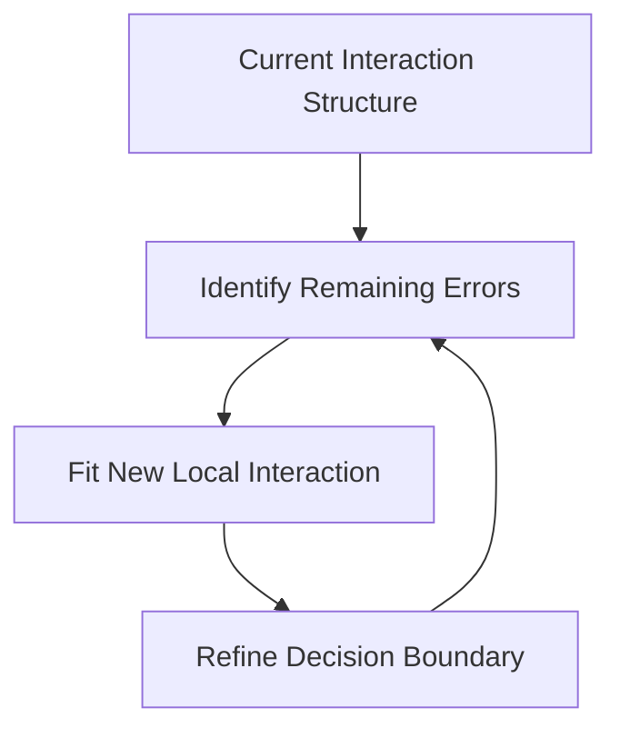

# Tree-Based Methods

A decision tree is a nonparametric method. Instead of assuming a global linear relationship such as $f(x)=\beta_0+\beta_1x_1+\cdots+\beta_px_p$, a tree learns a collection of simple if-then rules directly from the data.

The basic idea is:

1. Split the feature space into regions.
2. Continue splitting each region into smaller regions.
3. Use the observations inside each final region to make predictions.

<!-- A decision tree is called **adaptive** because the regions are learned from the data.

* If a predictor is useful, the tree may split on it many times.
* If a predictor is not useful, the tree may ignore it completely. -->
<!-- 
Unlike linear regression, trees can naturally model nonlinear relationships and complicated interactions between predictors.

--- -->

::: {#exm-}
## Example: A Classification Tree

```{python}
#| echo: false
from sklearn.datasets import load_iris
from sklearn.tree import DecisionTreeClassifier
from sklearn.tree import plot_tree
import matplotlib.pyplot as plt

iris = load_iris()

X = iris.data[:, 2:]
y = iris.target

clf = DecisionTreeClassifier(
    random_state=40,
    max_depth=2
)

clf.fit(X, y)

plt.figure(figsize=(3, 3), dpi=200)
plot_tree(
    clf,
    filled=True,
    impurity=True,
    node_ids=True
);
```

This is a classification tree. The tree repeatedly asks simple questions such as

- Is `x[1] <= 0.8`?
- Is `x[1] <= 1.75`?

Each split divides the feature space into smaller regions.

Notice that a tree may split on the same predictor multiple times. This is very common in practice. This suggests that the feature `x[1]` is more important than other features.
:::

<!-- 
# Why Trees Are Nonlinear

A tree partitions the feature space into regions and predicts separately inside each region.

For example:

* If age < 30, predict salary = $45,000
* Otherwise predict salary = $82,000

This creates a **piecewise prediction rule** instead of one global linear equation.

Therefore trees are naturally nonlinear models.

--- -->

## CART: Classification and Regression Trees

There are many algorithms for constructing decision trees. The most common one is called CART (Classification and Regression Trees).

CART has the following properties:

- It creates only binary splits;
- For classification, common splitting criteria include Gini impurity and Entropy;
- For regression, common splitting criteria include Mean squared error (MSE) and Sum of squared errors (SSE).

### Splitting a Dataset

At each step, CART searches for the best split.

:::{.callout-note}

# Algorithm: Split the Dataset

**Inputs:** A dataset

$$
S={[\text{features},\text{target}]}
$$

**Outputs:** The best split $(k,t)$

1. For each feature $k$:

   1. For each candidate split value $t$:

      1. Split the dataset into two subsets:

      $$
      G_l={x_k\le t},
      \qquad
      G_r={x_k>t}
      $$

      2. Compute the split cost function $J(k,t)$
      3. Compare with the current best split
2. Return the split $(k,t)$ with the smallest cost
:::


The splitting algorithm is applied recursively.

:::{.callout-note}

# Algorithm: CART

**Inputs:**

* A labeled dataset $S$
* A maximal tree depth `max_depth`

**Outputs:**

* A decision tree

1. Start with the original dataset $S$

2. If the node is not pure:

   1. Find the best split
   2. Split the node into:

   $$
   G_l,
   \qquad
   G_r
   $$

3. Apply the same procedure recursively to both child nodes

4. Stop when:

   * the maximal depth is reached, or
   * the node becomes pure, or
   * further splitting is impossible
:::


## Classification Trees

For classification trees, we need a criterion to measure whether a split is good or bad. The two most common choices are:

- Gini impurity
- Entropy

Their performance is usually very similar. In these notes we focus on Gini impurity because it is slightly easier to compute and interpret.

### Gini Impurity

Assume that a node contains $n$ observations divided into $K$ classes.

Let

$$
p_i=\frac{n_i}{n}
$$

be the proportion of class $i$.

If we randomly assign labels according to the class proportions, then:

- the probability an observation belongs to class $i$ is $p_i$
- the probability we incorrectly classify it is $1-p_i$

Therefore the probability of misclassifying an observation from class $i$ is

$$
p_i(1-p_i).
$$

Summing over all classes gives

$$
\sum_{i=1}^K p_i(1-p_i).
$$

Since

$$
\sum_{i=1}^K p_i=1,
$$

we obtain

$$
Gini
=\sum_{i=1}^K p_i(1-p_i)
=1-\sum_{i=1}^K p_i^2.
$$

:::{#def-gini}

## Gini Impurity

The **Gini impurity** of a node is

$$
Gini
=1-\sum_{i=1}^K p_i^2,
$$

where $p_i$ is the proportion of class $i$ inside the node.
:::


::: {#exm-}
## Pure node
Suppose a node contains observations from only one class.

Then one of the probabilities equals 1 and all others equal 0.

Therefore

$$
Gini=1-1^2=0.
$$

This is the minimum possible impurity.

A node with Gini impurity 0 is called a pure node.


:::


::: {#exm-}
## Two-Class Example

Suppose we have two classes.

Let

$$
p_2=1-p_1.
$$

Then

$$
Gini
=1-p_1^2-(1-p_1)^2
=2p_1-2p_1^2.
$$

When:

- $p_1=0$ or $1$, the impurity is 0
- $p_1=0.5$, the impurity is maximized

Therefore impurity is largest when the classes are balanced.
:::


The impurity of a node itself is not enough. CART actually evaluates the quality of a split by examining the impurity of the child nodes after splitting.

Suppose a node $G$ is split into:

$$
G_l,
\qquad
G_r.
$$

The split cost is

$$
J
=\frac{|G_l|}{|G|}Gini(G_l)
+\frac{|G_r|}{|G|}Gini(G_r).
$$

A good split produces child nodes with low impurity.


::: {.callout-note}
# Entropy

Entropy is another popular impurity measure.

Its formula is

$$
Entropy
=-\sum_{i=1}^K p_i\log(p_i).
$$

Entropy and Gini impurity usually produce very similar trees.

Because Gini impurity is slightly simpler computationally and conceptually, we mainly focus on it.

:::

## Regression Trees

Regression trees are used when the response variable is quantitative. Instead of predicting a class label, a regression tree predicts a numerical value.

Suppose a terminal node contains responses

$$
y_1,y_2,\ldots,y_n.
$$

The prediction for that region is usually the sample mean:

$$
\hat y
=\frac{1}{n}\sum_{i=1}^n y_i.
$$

Therefore regression trees approximate the regression function using piecewise constant regions.


### Split Criterion for Regression Trees

For regression trees, CART typically minimizes the residual sum of squares (RSS) or equivalently the mean squared error (MSE).

Suppose a split divides the data into two regions:

$$
G_l,
\qquad
G_r.
$$

The split cost is

$$
RSS
===

\sum_{i\in G_l}(y_i-\bar y_l)^2
+
\sum_{i\in G_r}(y_i-\bar y_r)^2,
$$

where

$$
\bar y_l
\qquad\text{and}\qquad
\bar y_r
$$

are the mean responses inside the two regions.

The best split is the one that minimizes this quantity.


### Interpretation of Regression Trees

A regression tree creates regions with similar response values.

For example:

- If age < 30, predict salary = $45,000
- If age ≥ 30 and education < 16 years, predict salary = $68,000
- Otherwise predict salary = $95,000

Thus a regression tree approximates a complicated nonlinear function using many simple local averages.

## Pros and cons

Decision trees have several important advantages:

- Easy to interpret
- Naturally handle nonlinear relationships
- Automatically detect interactions
- No need for feature scaling
- Can handle both numerical and categorical predictors

Decision trees also have important weaknesses:

- High variance
- Sensitive to small changes in data
- Often less accurate than ensemble methods
- Deep trees may overfit severely

Because of these weaknesses, single trees are often improved using ensemble methods such as:

- Bagging
- Random forests
- Boosting


## Tuning hyperparameters


Building a decision tree is the same as splitting the training dataset. If we are alllowed to keep splitting it, it is possible to get to a case that each end node is pure: the Gini impurity is 0, or every element has the same response variable locally. This means two things:

1. The tree learns too many (unnecessary) details from the training set so it is overfitting. 
2. We could use the number of split to indicate the progress of the learning.

In other words, the finer the splits are, the further the learning is. We need to consider some early stop conditions to prevent the model from overfitting.

Some possible early stop conditions:

- `max_depth`: The max depth of the tree. 
<!-- - The default is `none` which means no limits. -->
- `min_samples_split`: The minimum number of samples required to split an internal node. 
<!-- - The default is 2 which means that we will split a node with as few as 2 elements if needed. -->
- `min_samples_leaf`: The minimum number of samples required to be at a leaf node. 
<!-- - The default is 1 which means that we will still split the node even if one subset only contains 1 element. -->

<!-- If we don't set them (which means that we use the default setting), the dataset will be split untill all subsets are pure. -->


::: {#exm-}
# ALMOST all end nodes are pure

In this example, we let the tree grow as further as possible. It only stops when (almost) all end nodes are pure, even if the end nodes only contain ONE element (like #6 and #11).

```{python}
#| echo: false
clf = DecisionTreeClassifier(random_state=40)
clf.fit(X, y)
plt.figure(figsize=(3, 3), dpi=200)
plot_tree(clf, filled=True, impurity=True, node_ids=True);
```


In this example there is one exception. #13 node is not pure. We could list all data in node #13. 

```{python}
#| echo: false
import pandas as pd

path = clf.decision_path(X)
target_node = 13
nodeids = path[:, target_node].toarray().ravel().nonzero()[0]

pd.DataFrame({"x[0]": X[nodeids, 0], "x[1]": X[nodeids, 1], "y": y[nodeids]})
```
All the data points in this node has the same feature while their labels are different. They cannot be split further purely based on features.


:::


Therefore we could treat these hyperparameters as an indicator about how far the dataset is split. The further the dataset is split, the further the learning goes, the more details are learned. Since we don't want the model to be overfitting, we don't want to split the dataset that far. In this case, we could use the learning curve to help us make the decision.

In this example, let us choose `min_samples_leaf` as the indicator. When `min_samples_leaf` is big, the learning just starts. When `min_samples_leaf=1`, we reach the far most side of learning. We will see how the training and testing accuracy changes along the learning process.


```{python}
from sklearn.model_selection import train_test_split
import matplotlib.pyplot as plt

X_train, X_test, y_train, y_test = train_test_split(X, y, test_size=0.15, random_state=42)
num_leaf = list(range(1, 100))
train_acc = []
test_acc = []
for i in num_leaf:
    clf = DecisionTreeClassifier(random_state=42, min_samples_leaf=i)
    clf.fit(X_train, y_train)
    train_acc.append(clf.score(X_train, y_train))
    test_acc.append(clf.score(X_test, y_test))
plt.plot(num_leaf, train_acc, label='training')
plt.plot(num_leaf, test_acc, label='testing')
plt.gca().set_xlim((max(num_leaf)+1, min(num_leaf)-1))
plt.legend()
```

From this plot, the accuracy has a big jump at `min_sample_leaf=41`. So we could choose this to be our hyperparameter.


## Pruning
Other than tuning hyperparameters, we also want to prune our tree in order to reduce overfitting further. The pruning algorithm introduced together with CART is called **Minimal-Cost-Complexity Pruning** (MCCP). 

The idea is to use the cost-complexity measure to replace Gini impurity to grow the tree. The cost-complexity measure is gotten by adding the total number of end nodes with the coefficent `ccp_alpha` to the Gini impurity. The parameter `ccp_alpha>=0` is known as the **complexity parameter**, and it can help the tree to self-balance the number of end nodes and the Gini impurity.


## Trees in Python

In `sklearn`, we use `cost_complexity_pruning_path` to help us find the effective alphas and the corresponding impurities. 

```{python}
clf = DecisionTreeClassifier(random_state=42)
ccp_path = clf.cost_complexity_pruning_path(X_train, y_train)
ccp_alphas, impurities = ccp_path.ccp_alphas, ccp_path.impurities
```

The list `ccp_alphas` contains all important `ccp_alpha`s. We could train a model for each of them. We could use the argument `ccp_alpha` to control the value when initialize the model. After we train all these tree models for each effective `ccp_alpha`, we evaluate the model and record the results.


```{python}
clfs = []
for ccp_alpha in ccp_alphas:
    clf = DecisionTreeClassifier(random_state=42, ccp_alpha=ccp_alpha)
    clf.fit(X_train, y_train)
    clfs.append(clf)

node_counts = [clf.tree_.node_count for clf in clfs]
depth = [clf.tree_.max_depth for clf in clfs]
train_acc = [clf.score(X_train, y_train) for clf in clfs]
test_acc = [clf.score(X_test, y_test) for clf in clfs]
```
We would like to visualize these info.

```{python}
fig, ax = plt.subplots(3, 1)
ax[0].plot(ccp_alphas, node_counts, marker="o", drawstyle="steps-post")
ax[0].set_xlabel("alpha")
ax[0].set_ylabel("number of nodes")
ax[1].plot(ccp_alphas, depth, marker="o", drawstyle="steps-post")
ax[1].set_xlabel("alpha")
ax[1].set_ylabel("depth of tree")
ax[2].plot(ccp_alphas, train_acc, marker="o", drawstyle="steps-post", label='train')
ax[2].plot(ccp_alphas, test_acc, marker="o", drawstyle="steps-post", label='test')
ax[2].set_xlabel("alpha")
ax[2].set_ylabel("accuracy")
ax[2].legend()
```
Based on the plot, it seems that the fourth dot 0.01534424 is a good fit. So this is the complexity parameter we are going to use.


<details>
<summary>We could combine all the code above into a function.</summary>

```{python}
from sklearn.base import clone
def eval_ccp_alphas(clf, X, y):
    ccp_path = clf.cost_complexity_pruning_path(X, y)
    ccp_alphas, impurities = ccp_path.ccp_alphas, ccp_path.impurities
    clfs = []
    for ccp_alpha in ccp_alphas:
        clf_tmp = clone(clf)
        clf_tmp.set_params(ccp_alpha=ccp_alpha)
        clf_tmp.fit(X, y)
        clfs.append(clf_tmp)

    node_counts = [clf.tree_.node_count for clf in clfs]
    depth = [clf.tree_.max_depth for clf in clfs]
    train_acc = [clf.score(X_train, y_train) for clf in clfs]
    test_acc = [clf.score(X_test, y_test) for clf in clfs]

    fig, ax = plt.subplots(3, 1)
    ax[0].plot(ccp_alphas, node_counts, marker="o", drawstyle="steps-post")
    ax[0].set_xlabel("alpha")
    ax[0].set_ylabel("number of nodes")
    ax[1].plot(ccp_alphas, depth, marker="o", drawstyle="steps-post")
    ax[1].set_xlabel("alpha")
    ax[1].set_ylabel("depth of tree")
    ax[2].plot(ccp_alphas, train_acc, marker="o", drawstyle="steps-post", label='train')
    ax[2].plot(ccp_alphas, test_acc, marker="o", drawstyle="steps-post", label='test')
    ax[2].set_xlabel("alpha")
    ax[2].set_ylabel("accuracy")
    ax[2].legend()

    return ccp_alphas
```


```{python}
eval_ccp_alphas(DecisionTreeClassifier(random_state=42), X_train, y_train)
```


</details>


# Tree


A decision tree is a nonparametric method. Instead of assuming a global linear form such as 
$$
f(x)=\beta_0+\beta_1x_1+\cdots+\beta_px_p,
$$ 
a tree learns a collection of simple if-then rules from the data. A very typical example is shown below.

::: {#exm-}
## Classification Tree example
```{python}
#| echo: false
from sklearn.datasets import load_iris
from sklearn.tree import DecisionTreeClassifier
import matplotlib.pyplot as plt
from sklearn.tree import plot_tree


iris = load_iris()
X = iris.data[:, 2:]
y = iris.target

clf = DecisionTreeClassifier(random_state=40, max_depth=2)
clf.fit(X, y)

plt.figure(figsize=(3, 3), dpi=200)
plot_tree(clf, filled=True, impurity=True, node_ids=True)
```
This is a classficiation tree. In this example there are 3 classes, and we just check the feature `x[1]`. The first time if `x[1]<=0.8`, the data will be classified as orange. If not, the tree will check `x[1]` again and compare it with 1.75. If this time it is `<=1.75`, the data is classified as green, otherwise purple.

:::


In general, a tree learns a collection of simple if-then rules from the data. A tree is called "adaptive" because the regions are learned from the data. If a predictor is useful, the tree may split on it many times. If a predictor is not useful, the tree may ignore it.

There are many algorithms for constructing decision trees. In this chapter, we focus on Classification and Regression Trees (usually called CART).

:::{.callout-note}

# Algorithm: Split the Dataset

**Inputs** Given a dataset $S=\{[features, target]\}$.

**Outputs** A best split $(k, t_k)$.

1. For each feature $k$:
    1. For each value $t$ of the feature:
        1. Split the dataset $S$ into two subsets, one with $k\leq t$ and one with $k>t$.
        2. Compute the cost function $J(k,t)$. 
        3. Compare it with the current smallest cost. If this split has smaller cost, replace the current smallest cost and pair with $(k, t)$.
2. Return the pair $(k,t_k)$ that has the smallest cost function.
:::


We then use this split algorithm recursively to get the decision tree.

:::{.callout-note}
# Classification and Regression Tree, CART

**Inputs** Given a labeled dataset $S=\{[features, label]\}$ and a maximal depth `max_depth`.

**Outputs** A decision tree.

1. Starting from the original dataset $S$. Set the working dataset $G=S$.
2. Consider a dataset $G$. If the cost function $J(G)\neq0$, split $G$ into $G_l$ and $G_r$ to minimize the cost function. Record the split pair $(k, t_k)$.
3. Now set the working dataset $G=G_l$ and $G=G_r$ respectively, and apply the above two steps to each of them.
4. Repeat the above steps, until `max_depth` is reached, or each subset is pure that is impossible to split further.
:::


 CART has the following features:

- It creates only binary splits.
- For classification, common splitting criteria include Gini impurity and entropy.
- For regression, common splitting criteria include mean squared error or sum of squared errors.


## Classification Tree 


### Gini impurity

To split a dataset, we need a metric to tell whether the split is good or not. The two most popular metrics that are used are Gini impurity and Entropy. The two metrics don't have essential differences, that the results obtained by applying each metric are very similar to each other. Therefore we will only focus on Gini impurity since it is slightly easier to compute and slightly easier to explain.

<!-- ### Motivation and Definition -->
Assume that we have a dataset of totally $n$ objects, and these objects are divided into $k$ classes. The $i$-th class has $n_i$ objects. Then if we randomly pick an object, the probability to get an object belonging to the $i$-th class is

$$
p_i=\frac{n_i}{n}
$$

If we then guess the class of the object purely based on the distribution of each class, the probability that our guess is incorrect is 

$$
1-p_i = 1-\frac{n_i}{n}.
$$

Therefore, if we randomly pick an object that belongs to the $i$-th class and randomly guess its class purely based on the distribution but our guess is wrong, the probability that such a thing happens is 

$$
p_i(1-p_i).
$$

Consider all classes. The probability at which any object of the dataset will be mislabelled when it is randomly labeled is the sum of the probability described above:

$$
\sum_{i=1}^kp_i(1-p_i)=\sum_{i=1}^kp_i-\sum_{i=1}^kp_i^2=1-\sum_{i=1}^kp_i^2.
$$

This is the definition formula for the *Gini impurity*. 


::: {#def-gini}
The **Gini impurity** is calculated using the following formula

$$
Gini = \sum_{i=1}^kp_i(1-p_i)=\sum_{i=1}^kp_i-\sum_{i=1}^kp_i^2=1-\sum_{i=1}^kp_i^2,
$$
where $p_i$ is the probability of class $i$.
:::

The way to understand Gini impurity is to consider some extreme examples. 


::: {#exm-}

Assume that we only have one class. Therefore $k=1$, and $p_1=1$. Then the Gini impurity is

$$
Gini = 1-1^2=0.
$$
This is the minimum possible Gini impurity. It means that the dataset is **pure**: all the objects contained are of one unique class. In this case, we won't make any mistakes if we randomly guess the label.

:::


::: {#exm-}
Assume that we have two classes. Therefore $k=2$. Consider the distribution $p_1$ and $p_2$. We know that $p_1+p_2=1$. Therefore $p_2=1-p_1$. Then the Gini impurity is

$$
Gini(p_1) = 1-p_1^2-p_2^2=1-p_1^2-(1-p_1)^2=2p_1-2p_1^2.
$$
When $0\leq p_1\leq 1$, this function $Gini(p_1)$ is between $0$ and $0.5$. 
- It gets $0$ when $p_1=0$ or $1$. In these two cases, the dataset is still a one-class set since the size of one class is $0$. 
- It gets $0.5$ when $p_1=0.5$. This means that the Gini impurity is maximized when the size of different classes are balanced.
:::


::: {.callout-tip}
## Entropy
Other than Gini impurity, entropy is also a popular choice for classification tree. However its performance is very similar to the Gini impurity while the formula for entropy is a little bit more complicated, therefore we only discuss the Gini impurity in this notes.
:::


<!-- ### Algorithm


::: {.callout-note}
# Algorithm: Gini impurity

**Inputs** A dataset $S=\{data=[features, label]\}$ with labels. 

**Outputs** The Gini impurity of the dataset.

1. Get the size $n$ of the dataset.
2. Go through the label list, and find all unique labels: $uniqueLabelList$.
3. Go through each label $l$ in $uniqueLabelList$ and count how many elements belonging to the label, and record them as $n_l$.
4. Use the formula to compute the Gini impurity:

   $$
    Gini = 1-\sum_{l\in uniqueLabelList}\left(\frac{n_l}{n}\right)^2.
   $$
:::
 -->


Suppose the tree divides the feature space into $M$ terminal regions:
$$
R_1,R_2,\ldots,R_M.
$$

These regions are also called leaves or terminal nodes.

For a new observation $x$, the fitted regression tree has the form
$$
\hat f(x)=\sum_{m=1}^M c_m I(x\in R_m),
$$
where $c_m$ is the prediction assigned to region $R_m$.

For squared error loss, the best constant in each region is the sample mean:
$$
\hat c_m
=
\frac{1}{N_m}
\sum_{x_i\in R_m}y_i,
$$
where $N_m$ is the number of training observations in region $R_m$.

Therefore,
$$
\hat f(x)
=
\sum_{m=1}^M
\bar y_{R_m} I(x\in R_m).
$$

This is a piecewise constant approximation to the regression function $f(x)=E(Y\mid X=x)$.

Inside a leaf, every point receives the same prediction. Across a split boundary, the prediction can jump.

## 3. A single split

At a node $\mathcal A$, a binary split is determined by:

- a variable index $j$
- a cutoff value $c$

The split creates two child nodes:
$$
\mathcal A_L(j,c)=\{x\in \mathcal A: x_j\le c\},
$$
and
$$
\mathcal A_R(j,c)=\{x\in \mathcal A: x_j>c\}.
$$

For regression, a good split makes the responses inside each child node more homogeneous.

One way to write the split criterion is the weighted post-split variance:
$$
\frac{N_L}{N_{\mathcal A}}\operatorname{Var}(\mathcal A_L)
+
\frac{N_R}{N_{\mathcal A}}\operatorname{Var}(\mathcal A_R).
$$

We want this quantity to be small.

Equivalently, we maximize the variance reduction:
$$
\operatorname{score}(j,c)
=
\operatorname{Var}(\mathcal A)
-
\left[
\frac{N_L}{N_{\mathcal A}}\operatorname{Var}(\mathcal A_L)
+
\frac{N_R}{N_{\mathcal A}}\operatorname{Var}(\mathcal A_R)
\right].
$$

The best split is
$$
(\hat j,\hat c)
=
\arg\max_{j,c}\operatorname{score}(j,c).
$$

The same idea can be written using residual sum of squares:
$$
\sum_{x_i\in \mathcal A_L}(y_i-\bar y_L)^2
+
\sum_{x_i\in \mathcal A_R}(y_i-\bar y_R)^2.
$$

The split with the smallest post-split RSS is chosen.

## 4. Recursive binary splitting

A regression tree is built greedily.

At each node:

1. Try each predictor $x_j$.
2. Try candidate cutoffs $c$.
3. Compute the split criterion.
4. Choose the split with the largest reduction in RSS.
5. Repeat the same procedure on the two child nodes.

This is called recursive binary splitting.

The procedure is greedy because the best split is chosen locally at each step. The algorithm does not search over all possible trees globally.

This matters because an early split affects all later splits below it. A split that looks best now may not be part of the globally best tree.

Still, recursive binary splitting is fast, simple, and usually effective.

## 5. Candidate cutoffs

For a continuous predictor $x_j$, candidate cutoffs are usually chosen between sorted observed values.

If the unique observed values of $x_j$ are
$$
v_1<v_2<\cdots<v_K,
$$
then possible cutoffs can be taken as midpoints:
$$
c_k=\frac{v_k+v_{k+1}}{2},
\qquad k=1,\ldots,K-1.
$$

For each candidate cutoff, the data in the current node are divided into a left group and a right group.

For categorical predictors, a split divides the categories into two groups. In practice, software handles this differently depending on the implementation. Some implementations require one-hot encoding first.

::: {.callout-note}
## Practical detail

Trees do not require variables to be on the same scale.

A split only compares one variable to one cutoff, so standardization is usually not needed for ordinary tree models.
:::

## 6. Prediction

Once the tree is fitted, prediction is simple.

For a new point $x_0$:

1. Start at the root node.
2. Follow the splitting rules.
3. Drop $x_0$ into a terminal node $R_m$.
4. Predict by the average response in that leaf:

$$
\hat f(x_0)=\bar y_{R_m}.
$$

Equivalently,
$$
\hat f(x_0)
=
\sum_{m=1}^M
\left(
\frac{\sum_{i=1}^n y_i I(x_i\in R_m)}
{\sum_{i=1}^n I(x_i\in R_m)}
\right)
I(x_0\in R_m).
$$

This expression shows that a regression tree is a local averaging estimator.

The neighborhood of $x_0$ is not a ball or a nearest-neighbor set. It is the leaf containing $x_0$.

## 7. Adaptive kernel view

KNN also predicts by local averaging, but its neighborhood is usually determined by distance.

A tree also predicts by averaging nearby training responses, but the neighborhood is defined by the learned terminal node.

Let $R(x_0)$ be the terminal node containing $x_0$.

For a point $x_0$, the tree gives positive weight only to observations that fall in the same terminal node:
$$
w_i(x_0)
=
\frac{I(x_i\in R(x_0))}
{\sum_{l=1}^n I(x_l\in R(x_0))}.
$$

Then
$$
\hat f(x_0)=\sum_{i=1}^n w_i(x_0)y_i.
$$

The important difference is that the tree neighborhood is adaptive.

If only $x_1$ is important, the tree may split mostly on $x_1$ and ignore irrelevant directions. This helps trees avoid some problems of ordinary distance-based local methods.

::: {.callout-note}
## Key idea

KNN uses a fixed notion of distance.

A tree learns the neighborhood from the data.
:::

## 8. Geometry

A regression tree partitions the feature space into axis-aligned rectangles.

For example, in two dimensions, a split such as
$$
x_1\le c
$$
creates a vertical boundary, and a split such as
$$
x_2\le c
$$
creates a horizontal boundary.

After several splits, the feature space becomes a collection of rectangles.

Inside each rectangle, the fitted value is constant:
$$
\hat f(x)=\bar y_R.
$$

Therefore, trees can model nonlinear patterns and interactions, but the fitted function is not smooth.

The function is flat inside each region and jumps across split boundaries.

This is why a single tree often looks rough.

## 9. Interactions

Trees handle interactions naturally.

An interaction means the effect of one variable depends on the value of another variable.

For example, suppose the tree first splits on $x_1$:
$$
x_1\le c_1.
$$

Then, inside the left branch, the tree may split on $x_2$:
$$
x_2\le c_2.
$$

This means the role of $x_2$ is different depending on whether $x_1\le c_1$ or $x_1>c_1$.

No explicit interaction term such as $x_1x_2$ needs to be added.

This is one reason trees are useful exploratory models.


## CART Algorithms 

### Ideas
Consider a labeled dataset $S$ with totally $m$ elements. We use a feature $k$ and a threshold $t_k$ to split it into two subsets: $S_l$ with $m_l$ elements and $S_r$ with $m_r$ elements. Then the cost function of this split is

$$
J(k, t_k)=\frac{m_l}mGini(S_l)+\frac{m_r}{m}Gini(S_r).
$$
It is not hard to see that the more pure the two subsets are the lower the cost function is. Therefore our goal is find a split that can minimize the cost function.


## Decision Tree Project 1: the `iris` dataset

We are going to use the Decision Tree model to study the `iris` dataset. This dataset has already studied previously using k-NN. Again we will only use the first two features for visualization purpose.

### Initial setup

Since the dataset will be splitted, we will put `X` and `y` together as a single variable `S`. In this case when we split the dataset by selecting rows, the features and the labels are still paired correctly. 

We also print the labels and the feature names for our convenience.


```{python}
from sklearn.datasets import load_iris
import numpy as np

iris = load_iris()
X = iris.data[:, 2:]
y = iris.target
y = y.reshape((y.shape[0],1))
S = np.concatenate([X,y], axis=1)

print(iris.target_names)
print(iris.feature_names)
```


### Use package `sklearn`

Now we would like to use the decision tree package provided by `sklearn`. The process is straightforward. The parameter `random_state=40` will be discussed {ref}`later<note-random_state>`, and it is not necessary in most cases.


```{python}
from sklearn.tree import DecisionTreeClassifier

clf = DecisionTreeClassifier(random_state=40, min_samples_split=2)
clf.fit(X, y)
```


`sklearn` provide a way to automatically generate the tree view of the decision tree. The code is as follows. 


```{python}
import matplotlib.pyplot as plt
from sklearn.tree import plot_tree

plt.figure(figsize=(3, 3), dpi=200)
plot_tree(clf, filled=True, impurity=True, node_ids=True)
```


<details>
<summary>Visualize decision boundary is optional.</summary>


Similar to k-NN, we may use `sklearn.inspection.DecisionBoundaryDisplay` to visualize the decision boundary of this decision tree.


```{python}
from sklearn.inspection import DecisionBoundaryDisplay
DecisionBoundaryDisplay.from_estimator(
    clf,
    X,
    cmap='coolwarm',
    response_method="predict",
    xlabel=iris.feature_names[0],
    ylabel=iris.feature_names[1],
)

# Plot the training points
plt.scatter(X[:, 0], X[:, 1], c=y, s=15)
```


</details>


### Tuning hyperparameters


Building a decision tree is the same as splitting the training dataset. If we are alllowed to keep splitting it, it is possible to get to a case that each end node is pure: the Gini impurity is 0. This means two things:

1. The tree learns too many (unnecessary) detailed info from the training set which might not be applied to the test set. This is called *overfitting*. We should prevent a model from overfitting.
2. We could use the number of split to indicate the progress of the learning.

In other words, the finer the splits are, the further the learning is. We need to consider some early stop conditions to prevent the model from overfitting.

Some possible early stop conditions:

- `max_depth`: The max depth of the tree. The default is `none` which means no limits.
- `min_samples_split`: The minimum number of samples required to split an internal node. The default is 2 which means that we will split a node with as few as 2 elements if needed.
- `min_samples_leaf`: The minimum number of samples required to be at a leaf node. The default is 1 which means that we will still split the node even if one subset only contains 1 element.

If we don't set them (which means that we use the default setting), the dataset will be split untill all subsets are pure.


::: {#exm-}
# ALMOST all end nodes are pure

In this example, we let the tree grow as further as possible. It only stops when (almost) all end nodes are pure, even if the end nodes only contain ONE element (like #6 and #11).

```{python}
clf = DecisionTreeClassifier(random_state=40)
clf.fit(X, y)
plt.figure(figsize=(3, 3), dpi=200)
plot_tree(clf, filled=True, impurity=True, node_ids=True)
```


In this example there is one exception. #13 node is not pure. The reason is as follows.

```{python}
X[(X[:, 0]>0.8) & (X[:, 1] >1.75) & (X[:, 0]<=4.85)]
```
All the data points in this node has the same feature while their labels are different. They cannot be split further purely based on features.


:::


Therefore we could treat these hyperparameters as an indicator about how far the dataset is split. The further the dataset is split, the further the learning goes, the more details are learned. Since we don't want the model to be overfitting, we don't want to split the dataset that far. In this case, we could use the learning curve to help us make the decision.

In this example, let us choose `min_samples_leaf` as the indicator. When `min_samples_leaf` is big, the learning just starts. When `min_samples_leaf=1`, we reach the far most side of learning. We will see how the training and testing accuracy changes along the learning process.


```{python}
from sklearn.model_selection import train_test_split
import matplotlib.pyplot as plt

X_train, X_test, y_train, y_test = train_test_split(X, y, test_size=0.15, random_state=42)
num_leaf = list(range(1, 100))
train_acc = []
test_acc = []
for i in num_leaf:
    clf = DecisionTreeClassifier(random_state=42, min_samples_leaf=i)
    clf.fit(X_train, y_train)
    train_acc.append(clf.score(X_train, y_train))
    test_acc.append(clf.score(X_test, y_test))
plt.plot(num_leaf, train_acc, label='training')
plt.plot(num_leaf, test_acc, label='testing')
plt.gca().set_xlim((max(num_leaf)+1, min(num_leaf)-1))
plt.legend()
```

From this plot, the accuracy has a big jump at `min_sample_leaf=41`. So we could choose this to be our hyperparameter.


### Pruning
Other than tuning hyperparameters, we also want to prune our tree in order to reduce overfitting further. The pruning algorithm introduced together with CART is called **Minimal-Cost-Complexity Pruning** (MCCP). 

The idea is to use the cost-complexity measure to replace Gini impurity to grow the tree. The cost-complexity measure is gotten by adding the total number of end nodes with the coefficent `ccp_alpha` to the Gini impurity. The parameter `ccp_alpha>=0` is known as the **complexity parameter**, and it can help the tree to self-balance the number of end nodes and the Gini impurity.


In `sklearn`, we use `cost_complexity_pruning_path` to help us find the effective alphas and the corresponding impurities. 

```{python}
clf = DecisionTreeClassifier(random_state=42)
ccp_path = clf.cost_complexity_pruning_path(X_train, y_train)
ccp_alphas, impurities = ccp_path.ccp_alphas, ccp_path.impurities
```

The list `ccp_alphas` contains all important `ccp_alpha`s. We could train a model for each of them. We could use the argument `ccp_alpha` to control the value when initialize the model. After we train all these tree models for each effective `ccp_alpha`, we evaluate the model and record the results.


```{python}
clfs = []
for ccp_alpha in ccp_alphas:
    clf = DecisionTreeClassifier(random_state=42, ccp_alpha=ccp_alpha)
    clf.fit(X_train, y_train)
    clfs.append(clf)

node_counts = [clf.tree_.node_count for clf in clfs]
depth = [clf.tree_.max_depth for clf in clfs]
train_acc = [clf.score(X_train, y_train) for clf in clfs]
test_acc = [clf.score(X_test, y_test) for clf in clfs]
```
We would like to visualize these info.

```{python}
fig, ax = plt.subplots(3, 1)
ax[0].plot(ccp_alphas, node_counts, marker="o", drawstyle="steps-post")
ax[0].set_xlabel("alpha")
ax[0].set_ylabel("number of nodes")
ax[1].plot(ccp_alphas, depth, marker="o", drawstyle="steps-post")
ax[1].set_xlabel("alpha")
ax[1].set_ylabel("depth of tree")
ax[2].plot(ccp_alphas, train_acc, marker="o", drawstyle="steps-post", label='train')
ax[2].plot(ccp_alphas, test_acc, marker="o", drawstyle="steps-post", label='test')
ax[2].set_xlabel("alpha")
ax[2].set_ylabel("accuracy")
ax[2].legend()
```
Based on the plot, it seems that the fourth dot 0.01534424 is a good fit. So this is the complexity parameter we are going to use.


<details>
<summary>We could combine all the code above into a function.</summary>

```{python}
from sklearn.base import clone
def eval_ccp_alphas(clf, X, y):
    ccp_path = clf.cost_complexity_pruning_path(X, y)
    ccp_alphas, impurities = ccp_path.ccp_alphas, ccp_path.impurities
    clfs = []
    for ccp_alpha in ccp_alphas:
        clf_tmp = clone(clf)
        clf_tmp.set_params(ccp_alpha=ccp_alpha)
        clf_tmp.fit(X, y)
        clfs.append(clf_tmp)

    node_counts = [clf.tree_.node_count for clf in clfs]
    depth = [clf.tree_.max_depth for clf in clfs]
    train_acc = [clf.score(X_train, y_train) for clf in clfs]
    test_acc = [clf.score(X_test, y_test) for clf in clfs]

    fig, ax = plt.subplots(3, 1)
    ax[0].plot(ccp_alphas, node_counts, marker="o", drawstyle="steps-post")
    ax[0].set_xlabel("alpha")
    ax[0].set_ylabel("number of nodes")
    ax[1].plot(ccp_alphas, depth, marker="o", drawstyle="steps-post")
    ax[1].set_xlabel("alpha")
    ax[1].set_ylabel("depth of tree")
    ax[2].plot(ccp_alphas, train_acc, marker="o", drawstyle="steps-post", label='train')
    ax[2].plot(ccp_alphas, test_acc, marker="o", drawstyle="steps-post", label='test')
    ax[2].set_xlabel("alpha")
    ax[2].set_ylabel("accuracy")
    ax[2].legend()

    return ccp_alphas
```


```{python}
eval_ccp_alphas(DecisionTreeClassifier(random_state=42), X_train, y_train)
```


</details>


# Regression Trees

## 1. Why trees?

## 10. Tree complexity

A fully grown tree can fit the training data very closely, but it often overfits.

Important complexity controls include:

- `max_depth`: maximum tree depth
- `min_samples_split`: minimum number of observations required to split a node
- `min_samples_leaf`: minimum number of observations in a terminal node
- `max_leaf_nodes`: maximum number of leaves
- `ccp_alpha`: cost-complexity pruning parameter

Small trees are more stable but may underfit.

Large trees are flexible but may overfit.

The main tuning problem is to choose the right tree size.

::: {.callout-note}
## Rule of thumb

Tree size controls the bias-variance tradeoff.

A larger tree is not automatically better, even if it has smaller training error.
:::

## 11. Stopping rules

Stopping rules decide when the recursive splitting process should stop.

Common stopping rules include:

- stop when the node is too small
- stop when the tree reaches a maximum depth
- stop when the improvement in RSS is too small
- stop when a leaf-size constraint would be violated

These rules are called pre-pruning because they stop the tree before it becomes too large.

Pre-pruning is simple, but it can be too greedy. A split that looks weak now might allow useful splits later.

For this reason, another common strategy is:

1. Grow a large tree.
2. Prune it back.
3. Use validation or cross-validation to choose the final size.

## 12. Cost-complexity pruning

Let $T$ be a subtree, and let $|T|$ be the number of terminal nodes.

For regression, the cost-complexity criterion is
$$
C_\alpha(T)
=
\sum_{m=1}^{|T|}
\sum_{x_i\in R_m}
(y_i-\bar y_{R_m})^2
+
\alpha |T|.
$$

The first term measures training error.

The second term penalizes tree complexity.

- $\alpha=0$: prefer a large tree
- larger $\alpha$: prefer a smaller tree

This has the same structure as regularized regression:
$$
\text{loss}+\text{penalty}.
$$

The tuning parameter $\alpha$ controls how expensive it is to add another leaf.

If a split reduces RSS by only a small amount, it will not be worth keeping when $\alpha$ is large.

::: {.callout-note}
## Interpretation of $\alpha$

The pruning parameter $\alpha$ controls the tradeoff between fit and complexity.

It plays the same conceptual role as a tuning parameter in ridge or lasso.
:::

## 13. Bias-variance tradeoff

Regression trees have a clear bias-variance tradeoff.

A shallow tree:

- has fewer leaves
- gives smoother, more stable predictions
- has higher bias
- has lower variance

A deep tree:

- has many leaves
- adapts strongly to the training data
- has lower bias
- has higher variance

This is one reason a single tree is usually not the final model for high-performance prediction.

Random forests and boosting improve on trees by combining many trees.

The connection is:

- bagging and random forests mainly reduce variance
- boosting often reduces bias by fitting trees sequentially

## 14. Variable importance

Trees can be used to measure variable importance.

A common idea is to add up how much each variable reduces impurity across all splits.

For regression, impurity reduction means reduction in RSS or variance.

If a variable is used often near the top of the tree and creates large reductions in RSS, it receives high importance.

This is useful, but it should be interpreted carefully.

Variable importance can be affected by:

- correlated predictors
- variables with many possible split points
- instability of a single tree
- preprocessing choices

For more reliable importance measures, ensembles and permutation importance are often better.

## 15. Strengths

Regression trees are useful because they:

- are easy to interpret
- automatically handle nonlinear relationships
- automatically capture interactions
- do not require feature scaling
- can handle mixed variable types
- are easy to visualize
- are robust to monotone transformations of predictors
- provide a natural basis for random forests and boosting

The biggest strength is interpretability.

A tree can often be explained as a sequence of simple rules.

## 16. Weaknesses

A single regression tree also has important limitations:

- prediction is piecewise constant
- fitted function is not smooth
- small changes in data can change the tree
- high variance
- often weaker predictive performance than ensembles
- poor extrapolation outside the training range
- axis-aligned splits can be inefficient for diagonal patterns

Poor extrapolation is especially important.

If a test point has a predictor value outside the training range, a tree still predicts using the average of some training leaf. It does not continue a linear trend beyond the observed data.

::: {.callout-caution}
## Important

A single tree is usually better as an interpretable model or as a building block.

For prediction, ensembles of trees are usually much stronger.
:::

## 17. Minimal Python example

```python
from sklearn.model_selection import GridSearchCV, train_test_split
from sklearn.metrics import mean_squared_error
from sklearn.tree import DecisionTreeRegressor

X_train, X_test, y_train, y_test = train_test_split(
    X,
    y,
    test_size=0.3,
    random_state=0,
)

tree = DecisionTreeRegressor(random_state=0)

param_grid = {
    "max_depth": [2, 3, 4, 5, None],
    "min_samples_leaf": [1, 5, 10, 20],
    "ccp_alpha": [0.0, 0.001, 0.01, 0.1],
}

grid = GridSearchCV(
    tree,
    param_grid=param_grid,
    cv=5,
    scoring="neg_mean_squared_error",
)

grid.fit(X_train, y_train)

best_tree = grid.best_estimator_

y_pred = best_tree.predict(X_test)
test_mse = mean_squared_error(y_test, y_pred)

print(grid.best_params_)
print(test_mse)
```

The important point is that tuning should be done using validation data or cross-validation, not by choosing the tree with the smallest training error.

## 18. Cost-complexity pruning path in sklearn

```python
from sklearn.model_selection import cross_val_score
from sklearn.tree import DecisionTreeRegressor
import numpy as np

tree = DecisionTreeRegressor(random_state=0)
path = tree.cost_complexity_pruning_path(X_train, y_train)

ccp_alphas = path.ccp_alphas

cv_mse = []

for alpha in ccp_alphas:
    model = DecisionTreeRegressor(
        random_state=0,
        ccp_alpha=alpha,
    )
    scores = cross_val_score(
        model,
        X_train,
        y_train,
        cv=5,
        scoring="neg_mean_squared_error",
    )
    cv_mse.append(-scores.mean())

best_alpha = ccp_alphas[np.argmin(cv_mse)]

pruned_tree = DecisionTreeRegressor(
    random_state=0,
    ccp_alpha=best_alpha,
)

pruned_tree.fit(X_train, y_train)
```

The pruning path gives a sequence of candidate values for `ccp_alpha`.

Cross-validation chooses which subtree gives the best prediction error.

## 19. Summary

A regression tree is an adaptive partitioning method.

Its fitted model is
$$
\hat f(x)
=
\sum_{m=1}^M
\bar y_{R_m} I(x\in R_m).
$$

The algorithm chooses splits to reduce within-node variation, usually measured by RSS or variance.

The fitted function is piecewise constant.

The main tuning problem is controlling tree size.

A single tree is interpretable, flexible, and useful for discovering structure, but it is often unstable.

This motivates ensemble methods such as bagging, random forests, and boosting.


# Linear Models, Trees, Bagging, Random Forests, and Boosting:
# A Unified View Through Predictor Interactions

## Introduction

One of the most important questions in statistical learning is:

> How does a model combine predictors together?

Different learning methods differ mainly in how they represent and combine predictor effects.

Some methods assume predictors contribute independently and globally. Other methods automatically discover local interactions and hierarchical structures.

This perspective provides a very unified way to understand:

- linear models
- trees
- bagging
- random forests
- boosting

The key idea is:

> Different models differ in how they discover, combine, and refine predictor interactions.

---

# Linear Models

Consider the multiple linear regression model:

$$
f(x)
=
\beta_0+\beta_1x_1+\cdots+\beta_px_p.
$$

This model assumes that predictor effects are additive.

Each predictor contributes independently:

$$
\beta_j x_j.
$$

The overall prediction is simply the sum of these effects.

Thus linear models have a very important structural assumption:

> Predictor effects are global and additive.

For example, suppose the coefficient of income is positive. Then increasing income always increases the prediction by the same amount, regardless of age, region, education, or other variables.

This creates a very smooth and interpretable model.

However, the model cannot automatically discover interactions between predictors.

---

# Interaction Terms in Linear Models

Suppose the effect of one predictor depends on another predictor.

For example:

- income may matter differently for younger and older individuals
- dosage effects may depend on body weight
- advertising effects may depend on region

A linear model cannot automatically discover such interactions.

Instead, the interaction must be manually specified:

$$
y
=
\beta_0
+
\beta_1x_1
+
\beta_2x_2
+
\beta_3x_1x_2.
$$

Thus interaction modeling in linear regression is explicit and manual.

The analyst must decide:

- which interactions exist
- which interaction terms to include

This becomes difficult when the number of predictors is large.

---

# Trees

Decision trees approach interactions very differently.

A tree recursively partitions predictor space into regions.

For example:

```text
if age > 40:
    if income < 50000:
        predict class A
```

A single branch already represents a predictor interaction structure.

This branch corresponds to:

$$
(\text{age}>40)
\cap
(\text{income}<50000).
$$

Thus a root-to-leaf path is essentially:

> a hierarchical combination of predictor conditions.

This is one of the most important conceptual differences between trees and linear models.

Linear models require interaction terms to be specified manually.

Trees discover interactions automatically.

---

# Trees as Interaction Hierarchies

A tree can be viewed as a hierarchy of interactions.

For example:

```text
x1 > 3
    ↓
x2 < 5
    ↓
x7 > 10
```

This means:

- the effect of $x_2$ depends on the region defined by $x_1$
- the effect of $x_7$ depends on both $x_1$ and $x_2$

Thus trees naturally model:

- nonlinear effects
- threshold effects
- conditional relationships
- local interactions

This makes trees extremely flexible.

---

# Advantages of Trees

Because trees automatically discover interactions, they are very powerful for tabular data.

Trees are especially good at handling:

- complicated predictor interactions
- nonlinear relationships
- heterogeneous variables
- mixed data types

In addition, trees do not require:

- feature scaling
- manual interaction engineering
- strict parametric assumptions

---

# Limitations of Trees

Although trees are flexible, a single tree is often unstable.

Small changes in the data may produce very different splits.

As a result:

- tree structures can vary substantially
- prediction variance may be high
- deep trees may overfit

Thus a single tree is often not the best predictive model.

This motivates ensemble methods.

---

# Bagging

Bagging stands for bootstrap aggregation.

The main idea is simple:

1. Draw many bootstrap samples
2. Fit a large tree to each sample
3. Average the predictions

The key insight is that different bootstrap samples produce different trees.

Each tree may discover somewhat different interaction structures.

For example:

Tree A may discover:

```text
income → age → balance
```

while Tree B may discover:

```text
region → debt → income
```

and Tree C may discover:

```text
education → age → loan history
```

Thus bagging averages over many interaction hierarchies.

---

# Bagging as Interaction Averaging

From the interaction perspective, bagging can be viewed as:

> averaging many unstable interaction structures.

This is extremely important.

A single tree may overreact to small fluctuations in the data.

Bagging stabilizes interaction discovery by averaging many trees together.

The averaging process reduces variance and improves stability.

Thus the primary goal of bagging is not to discover increasingly complicated interactions.

Instead, the goal is:

> stabilize interaction discovery through averaging.

---

# Random Forests

Random forests extend bagging.

A random forest still uses:

- bootstrap sampling
- many trees
- averaging

However, random forests introduce an additional source of randomness.

At each split, the algorithm only considers a random subset of predictors.

For example:

```python
max_features = sqrt(p)
```

This changes tree construction substantially.

---

# Why Random Forests Improve Bagging

In ordinary bagging, strong predictors may dominate many trees.

For example, if predictor $x_1$ is extremely important, then many trees will repeatedly split on $x_1$ near the top.

As a result:

- many trees become similar
- interaction structures become correlated
- averaging becomes less effective

Random forests reduce this problem.

Because each split only sees a subset of predictors, different trees are forced to explore different interaction structures.

Thus random forests encourage diversity among trees.

---

# Random Forests as Decorrelated Interaction Averaging

From the interaction viewpoint:

- bagging averages many interaction structures
- random forests average many decorrelated interaction structures

This is the key conceptual improvement.

Random forests intentionally encourage trees to explore different predictor combinations.

This reduces tree correlation and further lowers variance.

---

# Boosting

Boosting uses a completely different philosophy.

Bagging and random forests build trees independently and average them.

Boosting builds trees sequentially.

Each new tree attempts to improve the mistakes made by earlier trees.

Conceptually:



Thus boosting continuously refines the model.

---

# Boosting as Interaction Refinement

From the interaction perspective:

> Boosting sequentially refines interaction structures.

This is fundamentally different from bagging.

Bagging:

- parallel
- independent
- averaging

Boosting:

- sequential
- adaptive
- corrective

Each new tree adds local corrections to the current model.

These corrections often represent increasingly refined interactions.

---

# AdaBoost

AdaBoost focuses on observations that were previously misclassified.

At each stage:

- difficult observations receive larger weights
- the next tree focuses more strongly on those observations

Thus AdaBoost progressively refines difficult regions of predictor space.

The interaction structures become increasingly adaptive and localized.

---

# Gradient Boosting and XGBoost

Gradient boosting generalizes this idea.

Instead of directly emphasizing misclassified observations, gradient boosting fits trees to residuals or gradients.

Each new tree attempts to correct the remaining errors.

Thus boosting gradually builds a highly refined decision boundary.

XGBoost further improves this framework through:

- regularization
- shrinkage
- subsampling
- optimized tree construction

---

# Why Boosting Is So Powerful

Boosting is powerful because it repeatedly adds local interaction corrections.

The final model becomes:

```text
many local interaction refinements
+
many adaptive corrections
+
many nonlinear partitions
```

combined together.

As a result, boosting methods can approximate extremely complicated nonlinear functions.

---

# Comparing the Methods

We may summarize the methods through their interaction philosophies.

---

## Linear Models

```text
global additive effects
```

Interactions must be manually specified.

---

## Trees

```text
discover one interaction hierarchy
```

Interactions are discovered automatically.

---

## Bagging

```text
average many unstable interaction hierarchies
```

Variance reduction through averaging.

---

## Random Forests

```text
average many decorrelated interaction hierarchies
```

Variance reduction through decorrelated averaging.

---

## Boosting

```text
iteratively refine interaction hierarchies
```

Sequential correction and local refinement.

---

# Final Remarks

This interaction-based viewpoint provides a unified understanding of many important statistical learning methods.

Linear models assume simple additive relationships.

Trees automatically discover hierarchical interactions.

Bagging stabilizes interaction discovery through averaging.

Random forests further improve averaging by decorrelating trees.

Boosting continuously refines interaction structures through sequential error correction.

Although these methods appear very different algorithmically, they can all be understood through one central question:

> How does the model discover and combine predictor interactions?


```{python}
import numpy as np
import pandas as pd

from sklearn.model_selection import train_test_split
from sklearn.linear_model import RidgeCV
from sklearn.metrics import mean_squared_error, r2_score
from xgboost import XGBRegressor

# ============================================================
# Simulate a dense linear signal
# ============================================================

rng = np.random.default_rng(42)

n = 600
p = 200

# Correlated predictors
Sigma = 0.7 * np.ones((p, p)) + 0.3 * np.eye(p)

X = rng.multivariate_normal(mean=np.zeros(p), cov=Sigma, size=n)

# Dense linear coefficients:
# many predictors contribute small effects
beta = rng.normal(0, 0.15, size=p)

# Linear signal
y = X @ beta + rng.normal(0, 1.5, size=n)

# ============================================================
# Train / test split
# ============================================================

X_train, X_test, y_train, y_test = train_test_split(
    X, y, test_size=0.3, random_state=1
)

# ============================================================
# Ridge Regression
# ============================================================

ridge = RidgeCV(alphas=np.logspace(-3, 3, 100))

ridge.fit(X_train, y_train)

ridge_pred = ridge.predict(X_test)

# ============================================================
# XGBoost
# ============================================================

xgb = XGBRegressor(
    n_estimators=500,
    learning_rate=0.05,
    max_depth=4,
    subsample=0.8,
    colsample_bytree=0.8,
    random_state=1,
)

xgb.fit(X_train, y_train)

xgb_pred = xgb.predict(X_test)

# ============================================================
# Evaluation
# ============================================================

results = pd.DataFrame(
    {
        "Model": ["Ridge", "XGBoost"],
        "Test MSE": [
            mean_squared_error(y_test, ridge_pred),
            mean_squared_error(y_test, xgb_pred),
        ],
        "Test R2": [r2_score(y_test, ridge_pred), r2_score(y_test, xgb_pred)],
    }
)

print(results)
```


```{python}
import numpy as np
import pandas as pd

from sklearn.model_selection import train_test_split, GridSearchCV
from sklearn.linear_model import Ridge
from sklearn.pipeline import make_pipeline
from sklearn.preprocessing import StandardScaler
from sklearn.metrics import mean_squared_error, r2_score

from xgboost import XGBRegressor


def simulate_dense_linear(n=600, p=200, rho=0.7, noise_sd=1.5, seed=42):
    rng = np.random.default_rng(seed)

    Sigma = rho * np.ones((p, p)) + (1 - rho) * np.eye(p)

    X = rng.multivariate_normal(mean=np.zeros(p), cov=Sigma, size=n)

    # Dense linear signal: many predictors all matter a little
    beta = rng.normal(0, 0.15, size=p)

    y = X @ beta + rng.normal(0, noise_sd, size=n)

    return X, y


def fit_best_models(X_train, y_train):
    ridge_pipe = make_pipeline(StandardScaler(), Ridge())

    ridge_grid = {"ridge__alpha": np.logspace(-3, 4, 30)}

    ridge_cv = GridSearchCV(
        ridge_pipe,
        ridge_grid,
        cv=5,
        scoring="neg_mean_squared_error",
        n_jobs=-1,
    )

    xgb = XGBRegressor(objective="reg:squarederror", random_state=42, n_jobs=-1)

    xgb_grid = {
        "n_estimators": [200, 500, 1000],
        "learning_rate": [0.03, 0.05, 0.1],
        "max_depth": [2, 3, 4],
        "subsample": [0.7, 0.9],
        "colsample_bytree": [0.7, 0.9],
        "reg_lambda": [1, 5, 10],
    }

    xgb_cv = GridSearchCV(
        xgb, xgb_grid, cv=5, scoring="neg_mean_squared_error", n_jobs=-1
    )

    ridge_cv.fit(X_train, y_train)
    xgb_cv.fit(X_train, y_train)

    return ridge_cv, xgb_cv


all_results = []

n_repeats = 1

for seed in range(n_repeats):
    X, y = simulate_dense_linear(seed=seed)

    X_train, X_test, y_train, y_test = train_test_split(
        X, y, test_size=0.3, random_state=seed
    )

    ridge_cv, xgb_cv = fit_best_models(X_train, y_train)

    models = {"Ridge": ridge_cv, "XGBoost": xgb_cv}

    for name, model in models.items():
        pred = model.predict(X_test)

        all_results.append(
            {
                "seed": seed,
                "model": name,
                "test_mse": mean_squared_error(y_test, pred),
                "test_r2": r2_score(y_test, pred),
                "best_params": model.best_params_,
            }
        )


results = pd.DataFrame(all_results)

print(results[["seed", "model", "test_mse", "test_r2"]])

summary = results.groupby("model").agg(
    mean_mse=("test_mse", "mean"),
    sd_mse=("test_mse", "std"),
    mean_r2=("test_r2", "mean"),
    sd_r2=("test_r2", "std"),
)

print("\nSummary:")
print(summary)

print("\nBest parameters by run:")
for _, row in results.iterrows():
    print(row["seed"], row["model"], row["best_params"])
```


```{python}
import numpy as np
import matplotlib.pyplot as plt

from sklearn.datasets import make_moons
from sklearn.model_selection import train_test_split
from sklearn.ensemble import AdaBoostClassifier
from sklearn.tree import DecisionTreeClassifier
from sklearn.metrics import zero_one_loss


# ============================================================
# Clean nonlinear classification dataset
# ============================================================

X, y = make_moons(n_samples=1200, noise=0.08, random_state=2)

X_train, X_test, y_train, y_test = train_test_split(
    X, y, test_size=0.5, stratify=y, random_state=2
)


# ============================================================
# AdaBoost with decision stumps
# ============================================================

ada = AdaBoostClassifier(
    estimator=DecisionTreeClassifier(max_depth=1),
    n_estimators=1000,
    learning_rate=0.1,
    random_state=2,
)

ada.fit(X_train, y_train)


# ============================================================
# Track training/test error and margins
# ============================================================

train_errors = []
test_errors = []

margin_mean = []
margin_10pct = []
margin_min = []

y_train_signed = 2 * y_train - 1

for pred_train, pred_test, F in zip(
    ada.staged_predict(X_train),
    ada.staged_predict(X_test),
    ada.staged_decision_function(X_train),
):
    train_errors.append(zero_one_loss(y_train, pred_train))
    test_errors.append(zero_one_loss(y_test, pred_test))

    margins = y_train_signed * F
    margin_mean.append(np.mean(margins))
    margin_10pct.append(np.quantile(margins, 0.10))
    margin_min.append(np.min(margins))


first_zero = next((i + 1 for i, e in enumerate(train_errors) if e == 0), None)

print("First iteration with training error = 0:", first_zero)
print("Minimum test error:", np.min(test_errors))
print("Iteration of minimum test error:", np.argmin(test_errors) + 1)


# ============================================================
# Plot dataset
# ============================================================

plt.figure(figsize=(6, 5))
plt.scatter(X[y == 0, 0], X[y == 0, 1], alpha=0.7, label="Class 0")
plt.scatter(X[y == 1, 0], X[y == 1, 1], alpha=0.7, label="Class 1")
plt.title("Clean Two-Moons Dataset")
plt.legend()
plt.show()


# ============================================================
# Plot error curves
# ============================================================

plt.figure(figsize=(7, 5))
plt.plot(train_errors, label="Training Error")
plt.plot(test_errors, label="Test Error")

if first_zero is not None:
    plt.axvline(
        first_zero, linestyle="--", label="Training Error First Reaches 0"
    )

plt.xlabel("Boosting Iteration")
plt.ylabel("Classification Error")
plt.title("AdaBoost Error Curves")
plt.legend()
plt.show()


# ============================================================
# Plot margin growth
# ============================================================

plt.figure(figsize=(7, 5))
plt.plot(margin_mean, label="Average Margin")
plt.plot(margin_10pct, label="10th Percentile Margin")
plt.plot(margin_min, label="Minimum Margin")

if first_zero is not None:
    plt.axvline(
        first_zero, linestyle="--", label="Training Error First Reaches 0"
    )

plt.xlabel("Boosting Iteration")
plt.ylabel("Margin")
plt.title("AdaBoost Margin Growth")
plt.legend()
plt.show()
```


```{python}
import numpy as np
import matplotlib.pyplot as plt

from sklearn.ensemble import AdaBoostClassifier
from sklearn.tree import DecisionTreeClassifier
from sklearn.metrics import zero_one_loss
from sklearn.model_selection import train_test_split

# ============================================================
# Generate a simple nonlinear binary classification dataset
# ============================================================

rng = np.random.default_rng(42)

n = 500

X = rng.uniform(-2, 2, size=(n, 2))

# Smooth nonlinear boundary
y = (X[:, 0] ** 2 + 0.8 * X[:, 1] + 0.3 * np.sin(3 * X[:, 0]) > 1).astype(int)

# Add small label noise
flip_idx = rng.choice(n, size=20, replace=False)
y[flip_idx] = 1 - y[flip_idx]

X_train, X_test, y_train, y_test = train_test_split(
    X, y, test_size=0.3, random_state=1
)

# ============================================================
# AdaBoost with decision stumps
# ============================================================

ada = AdaBoostClassifier(
    estimator=DecisionTreeClassifier(max_depth=1),
    n_estimators=5000,
    learning_rate=0.05,
    random_state=1,
)

ada.fit(X_train, y_train)

# ============================================================
# Track training/test error over boosting rounds
# ============================================================

train_errors = []
test_errors = []

for pred_train, pred_test in zip(
    ada.staged_predict(X_train), ada.staged_predict(X_test)
):
    train_errors.append(zero_one_loss(y_train, pred_train))

    test_errors.append(zero_one_loss(y_test, pred_test))

# ============================================================
# Compute margins
# ============================================================

# AdaBoost uses labels {-1,+1} internally
y_train_signed = 2 * y_train - 1

# staged_decision_function gives F(x)
margins = []

for F in ada.staged_decision_function(X_train):
    margin = np.mean(y_train_signed * F)
    margins.append(margin)

# ============================================================
# Plot classification data
# ============================================================

plt.figure(figsize=(6, 5))

plt.scatter(X[y == 0, 0], X[y == 0, 1], alpha=0.7, label="Class 0")

plt.scatter(X[y == 1, 0], X[y == 1, 1], alpha=0.7, label="Class 1")

plt.title("Synthetic Dataset")
plt.legend()
plt.show()

# ============================================================
# Plot train/test error
# ============================================================

plt.figure(figsize=(7, 5))

plt.plot(train_errors, label="Training Error")
plt.plot(test_errors, label="Test Error")

plt.xlabel("Boosting Iteration")
plt.ylabel("Classification Error")
plt.title("AdaBoost Error Curves")

plt.legend()
plt.show()

# ============================================================
# Plot margins
# ============================================================

plt.figure(figsize=(7, 5))

plt.plot(margins)

plt.xlabel("Boosting Iteration")
plt.ylabel("Average Margin")

plt.title("Margin Growth in AdaBoost")

plt.show()
```
