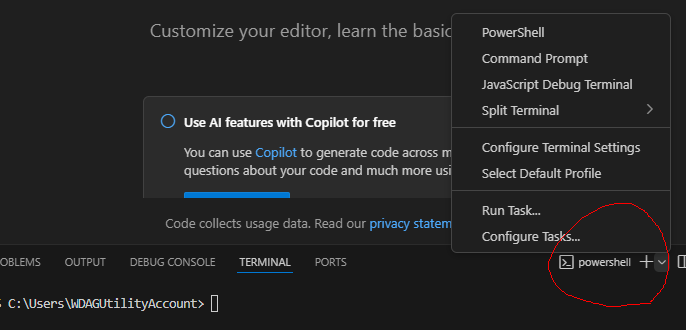
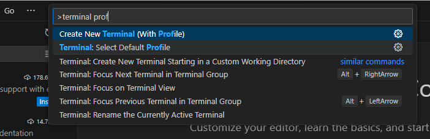
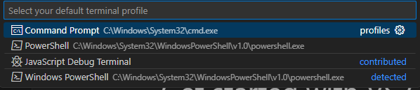
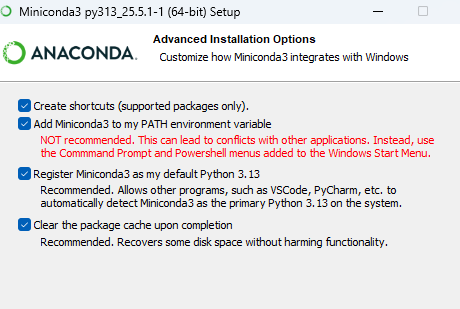
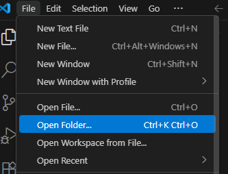
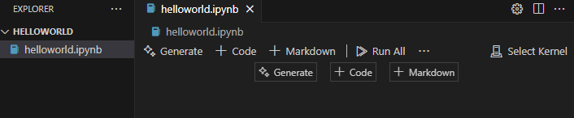
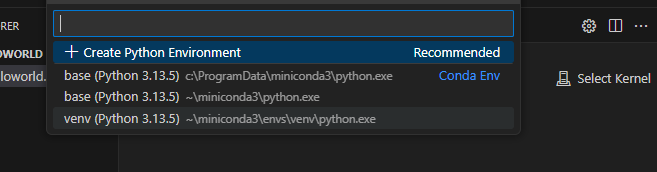
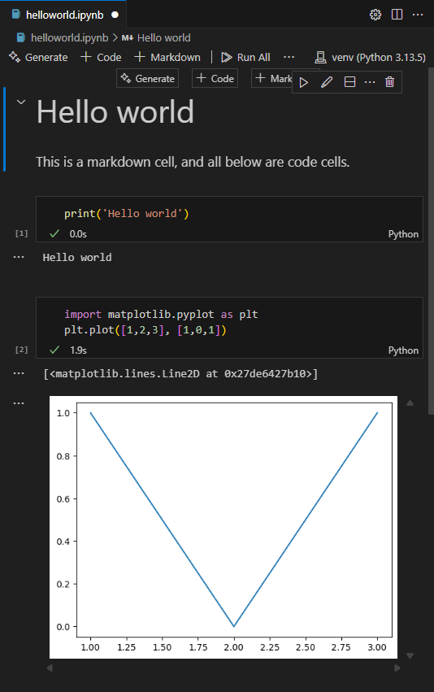

# Python IDE Setup

There are so many different ways to setup Python develop environment. Each has its own pros and cons. In this tuturial we are going to cover one of the most popular setups, which is VS Code + `uv`. 


## VS Code {#sec-vscode}

We choose VS Code as our IDE for Python. The installation is straightforward starting from the [Official website](https://code.visualstudio.com/). After installation, we need to do a few configurations to make the experience better.

1.  For development of Python, the essential plugins are the Python plugin and Jupyter plugin. You only need to install the two main ones, and all related plugins will be installed automatically.


2.  You may start the terminal from top menu. Note that there are many different choices of terminals. After you start the first default terminal, you may start any new terminals using the small `+`.



::: {.callout-caution collapse="true"}
## Change Terminal default profile

In Windows the default terminal is Powershell when you first install VS Code. In the past it had bugs with `conda` (and I don't know whether it is fixed now). In order to avoid headaches due to the bugs, we simply switch to other terminals, like Command Prompt. You may change the default terminal by

1.  Press `Ctrl+Shift+P` or `F1` to open the top prompt menu.
2.  Find the `Terminal: Select Default Profile` command.



3.  Select the desired terminal as the default one.


:::

3.  Since many Python functionalities in VS Code depends on Python itself, we should turn to install Python now.

## Python Virtual Environment installation

We have three choices here: `conda`, `pip` and `uv`. Each tool has its pros and cons. After setting up, for this course they shouldn't have any major differences.

::: {.callout-note collapse="true"}
## `conda`

First go to the [Official website](https://www.anaconda.com/docs/getting-started/miniconda/install#quickstart-install-instructions) to download and install `conda`. I recommand using `miniconda` instead of `anaconda` to avoid installing tons of unnecessary packages.

When installing, please choose `Just Me` and `Add Miniconda3 to my Path environment variable`. (If you choose `All users` it is possible that `Add to Path var` won't show up.) The `Add to Path var` is not recommended because it might be complicated in some situation, but if this is your first installation of Python or you want to mainly use `conda` it is completely fine.



You may need to restart VS Code after the installation. Then open a terminal and use `conda --version` to test whether the installation is successful.

Then use the following command to setup the first virtual environment for this course.

1. Create a new virtual environment. Note that your name can be anything and is not limited to `venv`:
```
conda create --name venv
```
2. Activate the virtual environment.
```
conda activate venv
```
3.  Install packages.
    -   `pandas`, `matplotlib` and `scikit-learn` are packages for the course.
    -   `jupyter` is a package used to power Jupyter notebook as well as the VS Code interative window. It is essential for homework for the course.

```
conda install pandas matplotlib scikit-learn jupyter
```
:::

::: {.callout-note collapse="true"}
## `venv`
This is the default Python virtual environment tools. It is definitely not as good as the other tools, but in many situations that you cannot freely install applications this is your only choice. To use it, you should first have a Python installed. This Python can be from anywhere. For example, we could install it from the [Official website](https://www.python.org/downloads/).

Unlike `conda`, `venv` by default creates local environmnet. It creates a folder in your working folder, and install packages inside this folder.

1. Create a new virtual environment. Here the last `venv` is the name of the virtual environment, as well as the name of the environment folder. You can freely change it to anything.
```
python -m venv venv
```
2. Activate the environment by `venv\scripts\activate` in Windows Command Prompt or `source venv/bin/activate` in Linux Bash.
3. Install packages.
    -   `pandas`, `matplotlib` and `scikit-learn` are packages for the course.
    -   `jupyter` is a package used to power Jupyter notebook as well as the VS Code interative window. It is essential for homework for the course.

```
pip install pandas matplotlib scikit-learn jupyter
```


:::

::: {.callout-note collapse="true"}
## `uv`

`uv` is a new tool that can be used to manage Python virtual environments and packages. Its idea is very similar to the Python built-in tools and it can be used as a drop-in replacement of `pip`. With `uv` you don't need to have any Python installed (just like `conda`). You may go to the [Official website](https://docs.astral.sh/uv/getting-started/installation/) to download and install `uv`.

1. Create a new virtual environment. Here the last `venv` is the name of the virtual environment, as well as the name of the environment folder. You can freely change it to anything.
```
uv venv venv
```
2. Activate the environment by `venv\scripts\activate` in Windows Command Prompt or `source venv/bin/activate` in Linux Bash.
3. Install packages.
    -   `pandas`, `matplotlib` and `scikit-learn` are packages for the course.
    -   `jupyter` is a package used to power Jupyter notebook as well as the VS Code interative window. It is essential for homework for the course.

```
uv pip install pandas matplotlib scikit-learn jupyter
```
:::

## Back to VS Code and start Jupyter notebook

After Python is installed and virtual environment is set up, we could start to do a Hello World project.

The way VS Code organizes projects is through folders by default. So we first start a new folder (called the working folder) and all project related files should be put inside this folder. (There are ways to work with files outside the working folder, but you don't need it in most cases.)



Then you may create new files/folders or copy files/folders into this working folder. For demonstration a new file called `helloworld.ipynb` is created.

`ipynb` means this is a Jupyter notebook file (which is short for `interactive Python notebook`). This is the format for this course's homework assignment.

This is the appearance of an empty notebook file.



Before using we need to attach the virtual environment we just created to this notebook. Click the `Select Kernel` on the right upper corner and select the environment we want. 




::: {.callout-caution collapse="true"}
## Expose kernels
By default `conda` creates global virtual environment while `pip`/`uv` creates local virtual environment. You may always use the following method to expose your environments to other projects when necessary.

1. Make sure `ipykernel` package is installed.
2. In the desired environment, run the command `python -m ipykernel install --user --name venv --display-name "Python (myenv)"`. 
3. Then you may find it in VS Code as the name "Python (myenv)".
:::

Now we could start using a notebook. The best part about the notebook is that it can acommendate codes and narratives and outputs together in one file.




::: {.callout-note collapse="true"}
## Quick Markdown syntax
Markdown is a light weight text format. For this course we only use the most basic syntax.

1. Text Formatting

+-----------------------------------------+-----------------------------------------+
| Markdown Syntax                         | Output                                  |
+=========================================+=========================================+
| ``` markdown                            | *italics*, **bold**, ***bold italics*** |
| *italics*, **bold**, ***bold italics*** |                                         |
| ```                                     |                                         |
+-----------------------------------------+-----------------------------------------+
| ``` markdown                            | superscript^2^ / subscript~2~           |
| superscript^2^ / subscript~2~           |                                         |
| ```                                     |                                         |
+-----------------------------------------+-----------------------------------------+
| ``` markdown                            | ~~strikethrough~~                       |
| ~~strikethrough~~                       |                                         |
| ```                                     |                                         |
+-----------------------------------------+-----------------------------------------+
| ``` markdown                            | `verbatim code`                         |
| `verbatim code`                         |                                         |
| ```                                     |                                         |
+-----------------------------------------+-----------------------------------------+
: {tbl-colwidths="[50, 50]"}

2. Headings {#headings}

+------------------+-----------------------------------+
| Markdown Syntax  | Output                            |
+==================+===================================+
| ``` markdown     | # Heading 1 {-}                   |
| # Heading 1      |                                   |
| ```              |                                   |
+------------------+-----------------------------------+
| ``` markdown     | ## Heading 2 {-}                  |
| ## Heading 2     |                                   |
| ```              |                                   |
+------------------+-----------------------------------+
| ``` markdown     | ### Heading 3 {-}                 |
| ### Heading 3    |                                   |
| ```              |                                   |
+------------------+-----------------------------------+

: {tbl-colwidths="[50, 50]"}


3. Lists

+-----------------------------------+---------------------------------+
| Markdown Syntax                   | Output                          |
+===================================+=================================+
| ``` markdown                      |                                 |
| * unordered list                  | * unordered list                |
|   + sub-item 1                    |   + sub-item 1                  |
|   + sub-item 2                    |   + sub-item 2                  |
|     - sub-sub-item 1              |     - sub-sub-item 1            |
| ```                               |                                 |
+-----------------------------------+---------------------------------+
| ``` markdown                      |                                 |
| 1. ordered list                   |  1. ordered list                |
| 2. item 2                         |  2. item 2                      |
|    i) sub-item 1                  |     i) sub-item 1               |
|       A.  sub-sub-item 1          |        A.  sub-sub-item 1       |
| ```                               |                                 |
+-----------------------------------+---------------------------------+
: {tbl-colwidths="[50, 50]"}

:::

<!-- 
## Google Colab {#sec-googlecolab}

Google Colab is a product from Google Research, that allows anybody to write and execute arbitrary Python code through the browser, and is especially well suited to machine learning, data analysis and education.

Here is the link to [Google Colab](https://research.google.com/colaboratory/). To use it you should have a Google account. Otherwise it is very simple to start, since a lot of packages for our course are already installed.

### Install packages

If you would like to install more packages, you can type the following code in a code cell and execute it.

``` bash
%pip install <pkg name>
```

``` bash
%conda install <pkg name>
```

The drawback here is that Google Colab can only stay for 24 hours. After that, all additionaly installed packages will be earsed. However you may put the installation code mentioned above at the beginning of your notebook and these packages will be installed every time you run the notebook.

### Upload files

You may directly upload files to the working directory of Google Colab. This has to be done in the browser. When working with these files, you may just use relative paths.

The drawback here is that Google Colab can only stay for 24 hours. After that, although your `.ipynb` files will be stores, all other files will be earsed.

### Mount Google Drive

One way to let the uploaded files stay in cloud is to upload them to Google Drive, and then load your Google Drive contents from Google Colab.

Goole Drive is a cloud storage service provided by Google. When you register a Google account you will be automatically assigned a Google Drive account. You may get access to it from [this link](https://www.google.com/drive/).

Here are the steps to mount Google Drive:

1.  Upload your files to your Google Drive.
2.  Run the following codes in Colab code cells before you are loading the uploaded files:

```{python}
#| eval: false
from google.colab import drive
drive.mount('/content/gdrive')
```

3.  A window pop up asking you about the permission. Authorize and the drive is mounted.
4.  To work in directories, the most popular commands are
    -   `%ls`: list all files and folders in the working directory.
    -   `%cd` + folder name: Get into a specific folder.
    -   `%cd..`: Get into the parent folder. Then use these commands to find the files your just uploaded.
5.  Finally you may directly get access to those files just like they are in the working directory.
6.  

 -->


## Writing Jupyter Notebooks

A Jupyter notebook usually alternates between **code cells** and **Markdown cells**.

- Use code cells for Python code.
- Use Markdown cells for explanations, formulas, section titles, and short interpretations.

Good notebooks should explain what the code is doing and what the output means. Do not submit only code.

### Essential Markdown

Headings:

``` markdown
# Main title
## Section title
### Subsection title
```

Emphasis and inline code:

``` markdown
Use **bold** for important words.
Use `inline code` for variable names such as `X_train` or `model`.
```

Lists:

``` markdown
- first item
- second item
- third item
```

### Essential LaTeX

Use single dollar signs for inline math:

``` markdown
The fitted value is $\hat y_i$.
```

Use double dollar signs for displayed equations:

``` markdown
$$
Y = \beta_0 + \beta_1 X + \epsilon.
$$
```

Common symbols:

``` markdown
$\hat y$        predicted value
$\bar x$        sample mean
$\beta_0$       coefficient
$X^\top X$      transpose
$\sum_{i=1}^n$  summation
```

In homework, write a short sentence before or after each important formula explaining what it represents.
