# Python IDE Setup
There are many ways to set up a Python development environment, and each has its own advantages and disadvantages. In this tutorial, we will cover one of the most popular current setups: VS Code + `uv`.

For now, we will focus only on the practical setup steps. The underlying concepts will be discussed in the later appendices.


This tutorial uses Windows 11. If you use another operating system, the steps are very similar, but you may need to make some minor but straightforward modifications. If you encounter major issues, please contact me.

## VS Code {#sec-vscode}

We choose VS Code as our IDE for Python. The installation is straightforward starting from the [Official website](https://code.visualstudio.com/). After installation, we need to do a few configurations to make the experience better.

1. For development of Python, the essential plugins are the Python plugin and Jupyter plugin. You only need to install the two main ones, and all related plugins will be installed automatically. 

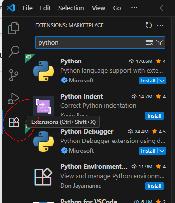

You may either search the extensions directly from VS Code extension tab (which is usually located on the left side bar), or you may install it from the link [python](https://marketplace.visualstudio.com/items?itemName=ms-python.python) and [jupyter](https://marketplace.visualstudio.com/items?itemName=ms-toolsai.jupyter).

2. Sometimes you may need to use the terminal inside VS Code. You may start the terminal from top menu (whose hotkey is by default ``ctrl+shift+` ``). 


Note that there are many different choices of terminals. After you start the first default terminal, you may start any new terminals using the small `+` and the `v` mark on the right.


::: {.callout-caution collapse="true"}
## Change Terminal default profile

In Windows the default terminal is Powershell when you first install VS Code. In the past it had bugs with `conda` (and I don't know whether it is fixed now). In order to avoid headaches due to the bugs, we simply switch to other terminals, like Command Prompt. You may change the default terminal by

1.  Press `Ctrl+Shift+P` or `F1` to open the top prompt menu.
2.  Find the `Terminal: Select Default Profile` command.


3.  Select the desired terminal as the default one.


:::


<!-- Since many Python functionalities in VS Code depends on Python itself, we should turn to install Python now. -->


## Python Virtual Environment installation

There are many tools available for managing Python environments and packages. As of Summer 2026, `uv` has become one of the most popular choices.

`uv` is an all-in-one tool for managing Python installations, virtual environments, and project dependencies. With `uv`, you do not need to install Python separately, as it can download and manage Python versions for you. You may visit the [official documentation](https://docs.astral.sh/uv/getting-started/installation/) to install `uv`. 


::: {.callout-caution collapse="true"}
## Windows headache


There is a possibility that Smart App Control (SAC) or other Application Control policies in Windows 11 may block the execution of `uv.exe`. In this case, you may see a message similar to

```text
'C:\Users\WDAGUtilityAccount\.local\bin\uv.exe'
was blocked by your organization's Device Guard policy.
Contact your support person for more info.
```

This may occur because Windows does not yet consider the executable sufficiently trusted under its application-control policies.

If this happens, note that the exact cause and solution can vary across machines, Windows versions, and security configurations. In addition, both Windows and `uv` are evolving rapidly, so solutions that work today may change in the future.

You are encouraged to search for the solution that best fits your situation. For this course, one workaround is to use WSL (see @sec-wsl).

:::

After installation (and you may need to restart VS Code or open a new terminal window so that the `uv` command becomes available), you can use the following commands to verify that `uv` is working correctly.

| Command | Purpose | Example Output |
|----------|----------|----------|
| `uv --version` | Display the installed `uv` version. Useful for verifying that `uv` is installed correctly. | `uv 0.11.17` |
| `uv self update` | Update `uv` itself to the latest available version. Similar to updating package managers such as `pip` or `cargo`. | `Upgraded uv from v0.11.4 to v0.11.17!` |
| `uv python list` | Show all Python versions available locally and those that can be installed through `uv`. | Lists installed and downloadable Python versions. |


### Install the first Python
Since VS Code often expects to discover at least one Python interpreter before it can fully initialize its Python and Jupyter services, we first install a Python version managed by `uv`.

```bash
uv python install
```

This Python installation is managed entirely by `uv`; it is not intended to be used directly for course work. Instead, it serves as a bootstrap interpreter that allows VS Code to detect Python correctly and manage project-specific virtual environments more reliably. You can verify the installed Python versions using `uv python list` as mentioned above.

If you skip this step and directly jump into the virtual environment, there is a possibility that Python in VS Code doesn't work well.


### Setup the environment for the course

To set up the environment for this course, we provide the [toml file](../../pyproject.toml) and [python version file](../../.python-version) for this course.

```toml
 
```
The python version file only contains the version number `3.13` inside since this is the version of Python I use when I wrote the notes. You may either download the file and put it inside the folder or create a file with the name `.python-version` and write `3.13` inside. 

::: {.callout-warning}
## Autosave
Before proceeding, make sure the file is saved.

By default, VS Code does not enable Auto Save. If you see a small dot next to the file name, the file contains unsaved changes.

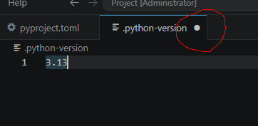

Many beginner problems occur because they modify a file but forget to save it before running commands.
:::


1. Create a new folder. The folder name is irrelevant. Put the files `pyproject.toml` and `.python-version` in the folder.
2. Open a terminal (no matter whether within VS Code or not) and enter the folder. Use the command `uv sync`.

After the command finishes, `uv` creates a virtual environment named `.venv` and installs all required packages specified in `pyproject.toml`. The resulting environment should closely match the one used to prepare these notes.

Now it is possible to start using the virtual environment for the course. In case that you need to modify the virtual environment, please continue the read the following optional part.


::: {.callout-note}
## Modifying the Environment

To install a package and update the project configuration, use `uv add <package-name>`. 

For example, you may need `openpyxl` to read and write Excel files: 

```bash
uv add openpyxl
```
This command updates the project configuration in `pyproject.toml` and installs the package into the project's virtual environment `.venv`.

Most package management tasks can be handled through `uv add`.
:::


::: {.callout-note collapse="true"}
## Jupyter kernels and modifying venv

A Jupyter kernel is the Python environment used by a notebook. When a notebook cell is executed, the code runs inside the selected kernel. Therefore, it is important to connect the notebook to the kernel associated with your course environment.

Modern versions of VS Code can usually detect a project managed by `uv` and use it directly as a notebook kernel. In many cases, no manual kernel registration is required. If VS Code does not automatically detect the environment, you can create a dedicated Jupyter kernel:

```bash
uv run python -m ipykernel install --user --name stat432 --display-name "(STAT432)"
```

The option `--name stat432` specifies the kernel identifier. In this example the identifier is `stat432`, but you may choose any name that is easy for you to recognize. This identifier is used internally by Jupyter and should be unique on your system.

The option `--display-name "(STAT432)"` specifies the name shown in VS Code and Jupyter when selecting a kernel. Unlike the identifier, the display name does not need to be unique, although a descriptive name is recommended.


:::


## Back to VS Code and start Jupyter notebook

After Python is installed and virtual environment is set up, we could start to do a Hello World project.

The way VS Code organizes projects is through folders by default. So we first start a new folder (called the working folder) and all project related files should be put inside this folder. (There are ways to work with files outside the working folder, but you don't need it in most cases.)

Since we already set up a folder (with a virtual environment), we open it as our working folder.


The folder already contains the project files and the environment files. You may see them from the file explorer.

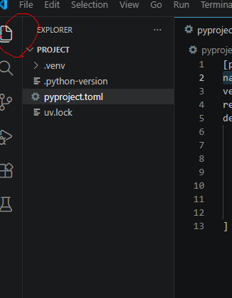

Then you may create new files/folders or copy files/folders into this working folder. For demonstration a new file called `helloworld.ipynb` is created.

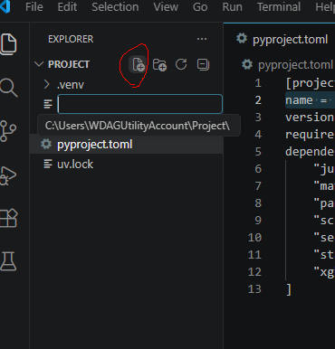

`ipynb` means this is a Jupyter notebook file (which is short for `interactive Python notebook`). This is the format for this course's homework assignment.

This is the appearance of an empty notebook file.

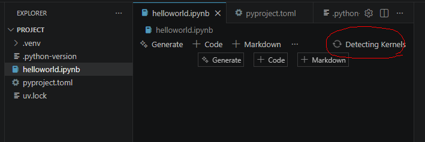

We attach the kernel we just created to this notebook. Click the `Select Kernel` / `Detecting Kernels` on the right upper corner and select the environment we want. 

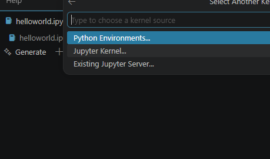

- If you created a new Jupyter kernel, you can find it from `Jupyter kernel...`.
- If not, you can find your virtual environement in the working folder from `Python Environments...`.

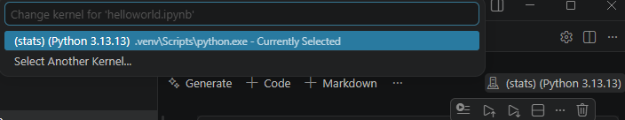

After the kernel is selected, we could start using the notebook. I prefer to use the following code as hello world. It can also tell us whether the correct python is used.


```{python}
#| eval: false
import sys
print(sys.executable)
```


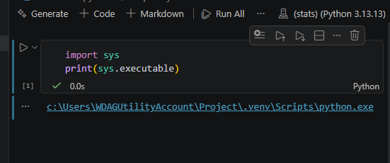

### Output to html and pdf

After finishing your Jupyter Notebook, you need to generate a PDF version for assignment submission.

Since we do not want to spend too much time on document formatting, we will use a simple workflow. Although there are many more sophisticated tools available (such as Pandoc, Quarto, and LaTeX-based workflows), the approach below is completely sufficient for this course.

Our workflow is:

0. Restart the kernel and run all.
1. Export the notebook to HTML using VS Code.
2. Open the HTML file in a web browser.
3. Print the page to a PDF file.

First, locate the notebook toolbar and click the `...` button on the right side. From the expanded menu, select `Export`.

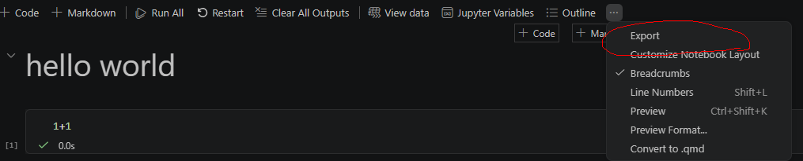


Then choose `HTML`.

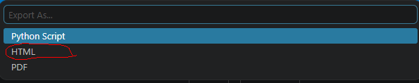


This will create an HTML file. Open the file in your preferred web browser and print it to PDF. Most modern browsers (such as Chrome, Edge, and Firefox) support printing directly to PDF.

For assignment submission, submit both the PDF file and the notebook file. Grading will be based primarily on the PDF file, while the notebook file serves as a backup source in case I need to inspect the code or verify specific parts of the submission.


::: {.callout-note}

## Restart and Run All

A Jupyter notebook keeps its internal state in memory while you work. As a result, cells can be executed in different orders, making it possible for the notebook contents and the actual execution state to become inconsistent.

For example, a variable may exist because it was created in an earlier session, even though the cell that creates it has been deleted and no longer appears before its first use in the notebook. Such notebooks may appear to run correctly during editing but fail when executed from scratch.

To avoid these issues, you are required to restart the kernel and run all cells before creating your submission PDF. Any errors that occur during this process must be fixed before submission.

Although notebook workflows have several well-known limitations, Jupyter notebooks remain the dominant platform for data science, machine learning, and scientific computing. New alternatives such as `marimo` have attracted considerable attention in recent years, but they are still relatively young and may require several more years to reach the level of adoption enjoyed by Jupyter — if they ever do.
:::


## WSL {#sec-wsl}

WSL stands for Windows subsystem for Linux. It allows you to run a Linux environment directly inside Windows without installing a separate operating system.

To install WSL, please follow the [official Microsoft guide](https://learn.microsoft.com/en-us/windows/wsl/install).

After installation, you will have a Linux system (usually Ubuntu) running alongside Windows. The Linux file system is separate from the Windows file system, although you can access it through File Explorer to copy / move files back and forth.

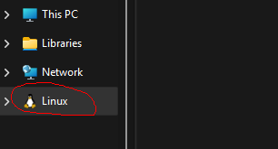


VS Code provides excellent support for WSL through the Remote WSL extension. To open a WSL window, you may:

- Click the button in the lower-left corner of VS Code

- Or open the Command Palette (`Ctrl+Shift+P` or `F1`), search for `WSL`, and select one of the available options. For most situations, `Connect to WSL in New Window` is the easiest choice.
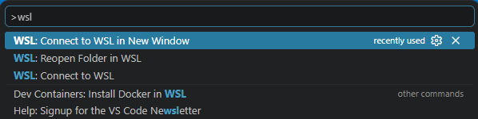


Once connected to WSL, you are working inside a Linux environment rather than Windows.

Because WSL is a separate system, you will need to:

- Open your project folder again.
- Install `uv`, Python and other tools inside WSL.
- Create virtual environments inside WSL.
- Install packages inside WSL.

You may follow the same instructions presented earlier to install `uv` and set up your Python environment. The overall process is the same, although the commands will be the Linux versions rather than the Windows versions.

Note that if you install `uv` in Windows, it is not automatically available inside WSL. Similarly, software installed inside WSL is generally not available in Windows.

In practice, it is usually easiest to keep an entire project inside WSL and perform all Python-related work there.


::: {.callout-tip}
Avoid storing virtual environments inside the Windows file system when working primarily in WSL. For best performance and compatibility, create your project folders inside your Linux home directory (for example, `~/Project`) rather than in mounted Windows directories (for example, `/mnt/c/...`).
:::