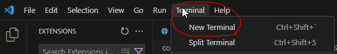

# Python IDE Setup
There are many ways to set up a Python development environment, and each has its own advantages and disadvantages. In this tutorial, we will cover one of the most popular current setups: VS Code + `uv`.

For now, we will focus only on the practical setup steps. The underlying concepts will be discussed in the later appendices.


This tutorial uses Windows 11. If you use another operating system, the steps are very similar, but you may need to make some minor but straightforward modifications. If you encounter major issues, please contact me.

## VS Code {#sec-vscode}

We choose VS Code as our IDE for Python. The installation is straightforward starting from the [Official website](https://code.visualstudio.com/). After installation, we need to do a few configurations to make the experience better.

1. For development of Python, the essential plugins are the Python plugin and Jupyter plugin. You only need to install the two main ones, and all related plugins will be installed automatically. 


You may either search the extensions directly from VS Code extension tab (which is usually located on the left side bar), or you may install it from the link [python](https://marketplace.visualstudio.com/items?itemName=ms-python.python) and [jupyter](https://marketplace.visualstudio.com/items?itemName=ms-toolsai.jupyter).

2. Sometimes you may need to use the terminal inside VS Code. You may start the terminal from top menu (whose hotkey is by default ``ctrl+shift+` ``). 



Note that there are many different choices of terminals. After you start the first default terminal, you may start any new terminals using the small `+` and the `v` mark on the right.


::: {.callout-caution collapse="true"}
## Change Terminal default profile

In Windows the default terminal is Powershell when you first install VS Code. In the past it had bugs with `conda` (and I don't know whether it is fixed now). In order to avoid headaches due to the bugs, we simply switch to other terminals, like Command Prompt. You may change the default terminal by

1.  Press `Ctrl+Shift+P` or `F1` to open the top prompt menu.
2.  Find the `Terminal: Select Default Profile` command.


3.  Select the desired terminal as the default one.


:::


<!-- Since many Python functionalities in VS Code depends on Python itself, we should turn to install Python now. -->


## Python Virtual Environment installation

There are many tools available for managing Python environments and packages. As of Summer 2026, `uv` has become one of the most popular choices.

`uv` is an all-in-one tool for managing Python installations, virtual environments, and project dependencies. With `uv`, you do not need to install Python separately, as it can download and manage Python versions for you. You may visit the [official documentation](https://docs.astral.sh/uv/getting-started/installation/) to install `uv`. 

After installation (and you may need to restart VS Code or open a new terminal window so that the `uv` command becomes available), you can use the following commands to verify that `uv` is working correctly.

| Command | Purpose | Example Output |
|----------|----------|----------|
| `uv --version` | Display the installed `uv` version. Useful for verifying that `uv` is installed correctly. | `uv 0.11.17` |
| `uv self update` | Update `uv` itself to the latest available version. Similar to updating package managers such as `pip` or `cargo`. | `Upgraded uv from v0.11.4 to v0.11.17!` |
| `uv python list` | Show all Python versions available locally and those that can be installed through `uv`. | Lists installed and downloadable Python versions. |

Since VS Code often expects to discover at least one Python interpreter before it can fully initialize its Python and Jupyter services, we first install a Python version managed by `uv`.

```bash
uv python install
```

This Python installation is managed entirely by `uv`; it is not intended to be used directly for course work. Instead, it serves as a bootstrap interpreter that allows VS Code to detect Python correctly and manage project-specific virtual environments more reliably. You can verify the installed Python versions using `uv python list` as mentioned above.


### Setup the environment for the course

To set up the environment for this course, we provide the [toml file](../../pyproject.toml) and [python version file](../../.python-version) for this course.

```toml
 
```
The python version file only contains the version number `3.13` inside since this is the version of Python I use when I wrote the notes. You may either download the file and put it inside the folder or create a file with the name `.python-version` and write `3.13` inside. 

::: {.callout-warning}
## Autosave
Before proceeding, make sure the file is saved.

By default, VS Code does not enable Auto Save. If you see a small dot next to the file name, the file contains unsaved changes.


Many beginner problems occur because they modify a file but forget to save it before running commands.
:::


1. Create a new folder. The folder name is irrelevant. Put the files `pyproject.toml` and `.python-version` in the folder.
2. Open a terminal (no matter whether within VS Code or not) and enter the folder. Use the command `uv sync`.

After the command finishes, `uv` creates a virtual environment named `.venv` and installs all required packages specified in `pyproject.toml`. The resulting environment should closely match the one used to prepare these notes.

Now it is possible to start using the virtual environment for the course. In case that you need to modify the virtual environment, please continue the read the following optional part.

::: {.callout-note collapse="true"}
## Jupyter kernels and modifying venv
A Jupyter kernel is the Python environment used by a notebook. When a notebook cell is executed, the code runs inside the selected kernel. For this reason, it is important to connect the notebook to the kernel associated with your course virtual environment. 

Modern versions of VS Code can often detect a virtual environment automatically and use it directly as a notebook kernel without requiring you to manually register a Jupyter kernel using `ipykernel` install. Therefore if everything works well the actions before this note is enough. 

However, there are situations in which you may need to create a dedicated Jupyter kernel manually. In addition, you may occasionally need to modify the virtual environment by installing additional packages. Therefore, it is useful to understand these operations.


1. Activate the virvutal environment.

```bash
# Windows
.venv\Scripts\activate

# Linux / macOS
source .venv/bin/activate
```

2. After activation, your terminal prompt will typically change to something like indicating that the virtual environment is active:
```bash
# Windows
(stat432) C:\Users\yourname\project>

# Linux / macOS
(stat432) user@computer:~/project$
```
Note that the name `stat432` is indicated in the `pyproject.toml` that `name = "STAT432"`. It doesn't do anything special if you don't publish this environment. It is different from the jupyter kernel name.

3. You may use `where python` (Windows) or `which python` (Linux / macOS) to see whether the correct python version is activated. The path should be `.venv` in the current folder.
4. To install an additional package and update the project configuration, use

```bash
uv add <package name>
```
More commands can be found in [`uv` official document](https://docs.astral.sh/uv/getting-started/).

5. If you need to create a dedicated Jupyter kernel, run
   
```bash
python -m ipykernel install --user --name stats --display-name "(stats)"
```
Note that `--name stats` specifies the kernel identifier. In this example the identifier is `stats`, but you may choose any name that is easy for you to recognize. Later, when selecting a kernel in Jupyter or VS Code, this identifier is used internally to distinguish one kernel from another, so it should be unique on your system.

The option `--display-name "(stats)"` specifies the name displayed in Jupyter and VS Code when selecting a kernel. Unlike `--name`, the display name does not need to be unique, although choosing a descriptive name is recommended.

:::


## Back to VS Code and start Jupyter notebook

After Python is installed and virtual environment is set up, we could start to do a Hello World project.

The way VS Code organizes projects is through folders by default. So we first start a new folder (called the working folder) and all project related files should be put inside this folder. (There are ways to work with files outside the working folder, but you don't need it in most cases.)

Since we already set up a folder (with a virtual environment), we open it as our working folder.


The folder already contains the project files and the environment files. You may see them from the file explorer.


Then you may create new files/folders or copy files/folders into this working folder. For demonstration a new file called `helloworld.ipynb` is created.


`ipynb` means this is a Jupyter notebook file (which is short for `interactive Python notebook`). This is the format for this course's homework assignment.

This is the appearance of an empty notebook file.


We attach the kernel we just created to this notebook. Click the `Select Kernel` / `Detecting Kernels` on the right upper corner and select the environment we want. 


- If you created a new Jupyter kernel, you can find it from `Jupyter kernel...`.
- If not, you can find your virtual environement in the working folder from `Python Environments...`.


After the kernel is selected, we could start using the notebook. I prefer to use the following code as hello world. It can also tell us whether the correct python is used.


```{python}
#| eval: false
import sys
print(sys.executable)
```


## Quick Markdown syntax


Now we can start using a notebook. One of the best features of a notebook is that it can combine code, narrative text, and output in a single file. 

There are two types of cells in a notebook: Code cells and Markdown cells.

- Code cells are used to run Python code.
- Markdown cells are used to write text, explanations, equations, and documentation.

In statistical learning, code cells are typically used for data analysis, model fitting, and computations, while Markdown cells are used to explain the methods, interpret the results, and document the workflow.


A notebook combines code, output, and narrative in a single document, making it an ideal environment for data science and machine learning.

::: {.callout-tip}
You can always click the small `Edit` / `Stop Editing` button to preview how your text will be rendered.
:::


Markdown is a lightweight text format. In this course, we will use only the most basic Markdown syntax.

### Text Formatting

+-----------------------------------------+-----------------------------------------+
| Markdown Syntax                         | Output                                  |
+=========================================+=========================================+
| ``` markdown                            | *italics*, **bold**, ***bold italics*** |
| *italics*, **bold**, ***bold italics*** |                                         |
| ```                                     |                                         |
+-----------------------------------------+-----------------------------------------+
| ``` markdown                            | superscript^2^ / subscript~2~           |
| superscript^2^ / subscript~2~           |                                         |
| ```                                     |                                         |
+-----------------------------------------+-----------------------------------------+
| ``` markdown                            | ~~strikethrough~~                       |
| ~~strikethrough~~                       |                                         |
| ```                                     |                                         |
+-----------------------------------------+-----------------------------------------+
| ``` markdown                            | `verbatim code`                         |
| `verbatim code`                         |                                         |
| ```                                     |                                         |
+-----------------------------------------+-----------------------------------------+
: {tbl-colwidths="[50, 50]"}

### Headings {#headings}

+------------------+-----------------------------------+
| Markdown Syntax  | Output                            |
+==================+===================================+
| ``` markdown     | # Heading 1 {-}                   |
| # Heading 1      |                                   |
| ```              |                                   |
+------------------+-----------------------------------+
| ``` markdown     | ## Heading 2 {-}                  |
| ## Heading 2     |                                   |
| ```              |                                   |
+------------------+-----------------------------------+
| ``` markdown     | ### Heading 3 {-}                 |
| ### Heading 3    |                                   |
| ```              |                                   |
+------------------+-----------------------------------+

: {tbl-colwidths="[50, 50]"}


::: {.callout-tip}
Note that for heading, there is a space after `#`.
:::


### Lists

+-----------------------------------+---------------------------------+
| Markdown Syntax                   | Output                          |
+===================================+=================================+
| ``` markdown                      |                                 |
| * unordered list                  | * unordered list                |
|   + sub-item 1                    |   + sub-item 1                  |
|   + sub-item 2                    |   + sub-item 2                  |
|     - sub-sub-item 1              |     - sub-sub-item 1            |
| ```                               |                                 |
+-----------------------------------+---------------------------------+
| ``` markdown                      |                                 |
| 1. ordered list                   |  1. ordered list                |
| 2. item 2                         |  2. item 2                      |
|    i) sub-item 1                  |     i) sub-item 1               |
|       A.  sub-sub-item 1          |        A.  sub-sub-item 1       |
| ```                               |                                 |
+-----------------------------------+---------------------------------+
: {tbl-colwidths="[50, 50]"}


::: {.callout-tip}
Note that for lists, there is a space after `.`.
:::

### Essential LaTeX

Use single dollar signs for inline math:

``` markdown
The fitted value is $\hat y_i$.
```

> The fitted value is $\hat y_i$.

Use double dollar signs for displayed equations:

``` markdown
$$
Y = \beta_0 + \beta_1 X + \epsilon.
$$
```
$$
Y = \beta_0 + \beta_1 X + \epsilon.
$$


Common symbols:

``` markdown
$\hat y$        predicted value
$\bar x$        sample mean
$\beta_0$       coefficient
$X^\top X$      transpose
$\sum_{i=1}^n$  summation
```

> $\hat y$: predicted value
>
> $\bar x$: sample mean
>
> $\beta_0$: coefficient
>
> $X^\top X$: transpose
>
> $\sum_{i=1}^n$: summation


LaTeX supports a wide range of mathematical notation, but the basic symbols introduced here will be enough for all of the work in this course.