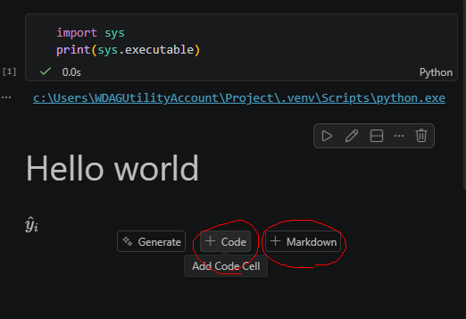
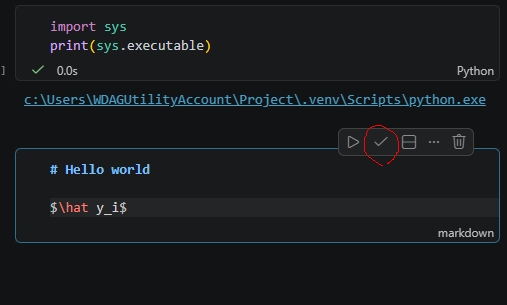
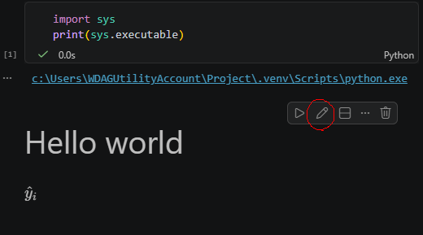

# Jupyter Notebook and Markdown


One of the best features of a Jupyter Notebook is that it can combine code, narrative text, and output in a single file. 

There are two types of cells in a notebook: Code cells and Markdown cells.

- Code cells are used to run Python code.
- Markdown cells are used to write text, explanations, equations, and documentation.

In statistical learning, code cells are typically used for data analysis, model fitting, and computations, while Markdown cells are used to explain the methods, interpret the results, and document the workflow.




A notebook combines code, output, and narrative in a single document, making it an ideal environment for data science and machine learning.

::: {.callout-tip}
You can always click the small `Edit` / `Stop Editing` button to preview how your Markdown text will be rendered.
:::






Markdown is a lightweight text format. In this course, we will use only the most basic Markdown syntax.

## Text Formatting

+-----------------------------------------+-----------------------------------------+
| Markdown Syntax                         | Output                                  |
+=========================================+=========================================+
| ``` markdown                            | *italics*, **bold**, ***bold italics*** |
| *italics*, **bold**, ***bold italics*** |                                         |
| ```                                     |                                         |
+-----------------------------------------+-----------------------------------------+
| ``` markdown                            | superscript^2^ / subscript~2~           |
| superscript^2^ / subscript~2~           |                                         |
| ```                                     |                                         |
+-----------------------------------------+-----------------------------------------+
| ``` markdown                            | ~~strikethrough~~                       |
| ~~strikethrough~~                       |                                         |
| ```                                     |                                         |
+-----------------------------------------+-----------------------------------------+
| ``` markdown                            | `verbatim code`                         |
| `verbatim code`                         |                                         |
| ```                                     |                                         |
+-----------------------------------------+-----------------------------------------+
: {tbl-colwidths="[50, 50]"}

## Headings {#headings}

| Markdown Syntax | Output |
|---|---|
| `# Heading 1` | $\Large\textbf{Heading 1}$|
| `## Heading 2` | $\large\textbf{Heading 2}$ |
| `### Heading 3` | $\normalsize\textbf{Heading 3}$ |


::: {.callout-tip}
Note that for heading, there is a space after `#`.
:::


## Lists

+-----------------------------------+---------------------------------+
| Markdown Syntax                   | Output                          |
+===================================+=================================+
| ``` markdown                      |                                 |
| * unordered list                  | * unordered list                |
|   + sub-item 1                    |   + sub-item 1                  |
|   + sub-item 2                    |   + sub-item 2                  |
|     - sub-sub-item 1              |     - sub-sub-item 1            |
| ```                               |                                 |
+-----------------------------------+---------------------------------+
| ``` markdown                      |                                 |
| 1. ordered list                   |  1. ordered list                |
| 2. item 2                         |  2. item 2                      |
|    i) sub-item 1                  |     i) sub-item 1               |
|       A.  sub-sub-item 1          |        A.  sub-sub-item 1       |
| ```                               |                                 |
+-----------------------------------+---------------------------------+
: {tbl-colwidths="[50, 50]"}


::: {.callout-tip}
Note that for lists, there is a space after `.`.
:::

## Essential LaTeX

Use single dollar signs for inline math:

``` markdown
The fitted value is $\hat y_i$.
```

> The fitted value is $\hat y_i$.

Use double dollar signs for displayed equations:

``` markdown
$$
Y = \beta_0 + \beta_1 X + \epsilon.
$$
```
$$
Y = \beta_0 + \beta_1 X + \epsilon.
$$


Common symbols:

``` markdown
$\hat y$        predicted value
$\bar x$        sample mean
$\beta_0$       coefficient
$X^\top X$      transpose
$\sum_{i=1}^n$  summation
```

> $\hat y$: predicted value
>
> $\bar x$: sample mean
>
> $\beta_0$: coefficient
>
> $X^\top X$: transpose
>
> $\sum_{i=1}^n$: summation


LaTeX supports a wide range of mathematical notation, but the basic symbols introduced here will be enough for all of the work in this course.

